# Neural Audio Codecs

## Introduction

Neural audio codecs are a new generation of audio compression tools powered by deep learning. Unlike traditional codecs, which rely on hand-crafted signal processing, neural codecs learn to compress and reconstruct audio directly from data, achieving much higher quality at lower bitrates. In this guide, we’ll explore three leading neural audio codecs—SoundStream, EnCodec, and HILCodec—highlighting what makes each unique. You’ll also find practical code examples showing how to use neural audio codecs to compress and reconstruct audio, so you can experience their capabilities firsthand.

## Traditional Audio Codecs

Traditional audio codecs rely on signal processing techniques rooted in psychoacoustic models, which discard imperceptible audio components to reduce file sizes. Traditional audio codecs fall into two main camps, 

### Waveform Codecs

- **Goal:** Reproduce the original audio as closely as possible, sample by sample.
- **How They Work:** 
  - They take the audio signal (which is a waveform in the time domain) and convert it into another form, usually the time-frequency domain, using a mathematical process called a *transform*.
  - After transformation, they compress the data by quantizing (rounding off) the numbers and encoding them efficiently.
  - When you want to listen to the audio, the codec reverses the process to get back to the time-domain waveform.
- **Features:**
  - They don't make many assumptions about what kind of audio they're compressing, so they work for all types of sounds—music, speech, noise, etc.
  - They sound great at medium to high bitrates (more data per second), but at low bitrates (less data), you might hear strange artifacts or loss of quality.
- **Examples:** MP3, Opus, AAC.

### Parametric Codecs

- **Goal:** Reproduce audio that *sounds* like the original, even if it's not identical sample by sample.
- **How They Work:**
  - They assume the audio is of a specific type (usually speech).
  - Instead of saving the whole waveform, they analyze the audio and extract important features or parameters (like pitch, tone, speed).
  - Only these parameters are compressed and sent.
  - The decoder then uses a model to *synthesize* (recreate) the audio using the parameters.
- **Features:**
  - They are very efficient at low bitrates and can produce understandable speech with very little data.
  - They don't try to perfectly recreate every detail, just make the audio sound similar to the original to our ears.
  - They usually work best for speech and may not be suitable for music or complex sounds.
- **Examples:** Some VoIP codecs, like EVS or MELP.

Both approaches rely on hand-crafted signal processing pipelines, which limit their flexibility and performance—especially as we demand better quality at lower bitrates, and for more diverse content (music, ambient sounds, etc.).

!!! info "Did you know?"

    The Opus codec, standardized in 2012, is the audio engine behind popular apps like Zoom, Microsoft Teams, Google Meet, and even YouTube streaming! Its widespread adoption means that hundreds of millions of people use Opus every day—often without even realizing it. Meanwhile, the Enhanced Voice Services (EVS) codec, designed for Voice over LTE (VoLTE), is taking over as the new standard for mobile calls, offering improved quality and full compatibility with older systems.

## Neural Audio Codecs

Neural audio codecs use deep learning to learn efficient, perceptually meaningful representations of audio directly from data. This opens the door to higher quality, lower bitrates, and new features like joint enhancement and compression. These systems typically consist of three components:  

1. An **encoder** that converts raw audio into a compressed latent representation.  

2. A **quantizer** that maps continuous latent vectors to discrete symbols for efficient storage/transmission.  

3. A **decoder** that reconstructs audio from the quantized representation.  

<figure markdown> 
    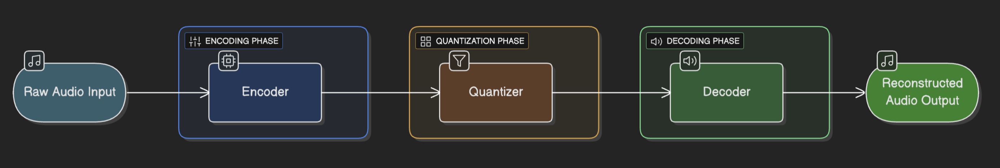
    <figcaption> Neural Audio Codecs Architecture</figcaption>
</figure>

The key advantage lies in their end-to-end training process, where all components are optimized jointly to minimize perceptual differences between original and reconstructed audio. This data-driven approach allows neural codecs to adapt to complex audio patterns that challenge rule-based systems, particularly at ultra-low bitrates (<6 kbps).  

## SoundStream: End-to-End Neural Audio Coding  

SoundStream is a fully end-to-end neural audio codec that can compress speech, music, and general audio at bitrates as low as 3 kbps—outperforming traditional codecs at much higher bitrates.

### Key Innovations
- **End-to-End Training:** The entire pipeline—encoder, quantizer, and decoder—is trained jointly, optimizing for both reconstruction accuracy and perceptual quality via adversarial losses.

- **Residual Vector Quantization (RVQ):** Instead of a single quantization step, SoundStream uses a multi-stage (residual) vector quantizer. This allows it to represent audio more efficiently and enables bitrate scalability.

- **Bitrate Scalability:** Thanks to a novel "quantizer dropout" during training, a single SoundStream model can operate at different bitrates (3–18 kbps) with minimal quality loss.

- **Low Latency & Real-Time:** The model is fully convolutional and causal, making it suitable for low-latency, real-time applications—even on a smartphone CPU.

- **Joint Compression and Enhancement:** SoundStream can simultaneously compress and enhance audio (e.g., denoise speech) with no extra latency.

<figure markdown> 
    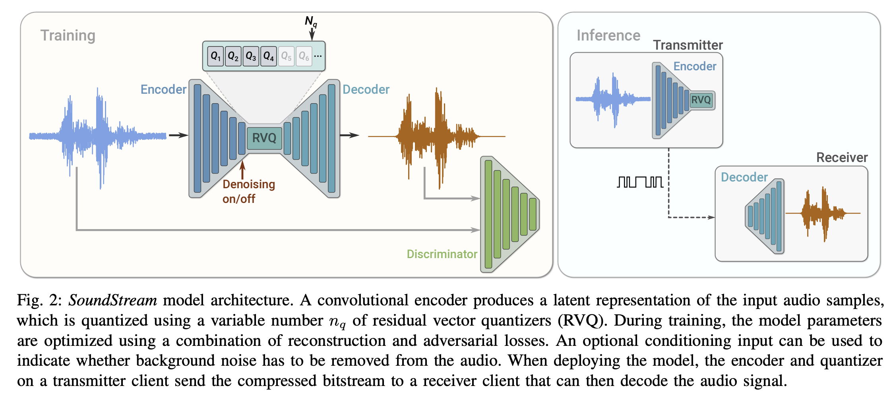
    <figcaption>SoundStream Architecture. Source: [1]</figcaption>
</figure>

### Architectural Design  

The system uses a fully convolutional U-Net structure with strided convolutions for downsampling and transposed convolutions for upsampling. A residual vector quantizer (RVQ) between encoder and decoder discretizes the latent space while maintaining reconstruction fidelity. Crucially, SoundStream introduced structured dropout during training, enabling a single model to operate across multiple bitrates (3-18 kbps) without quality degradation.  

<figure markdown> 
    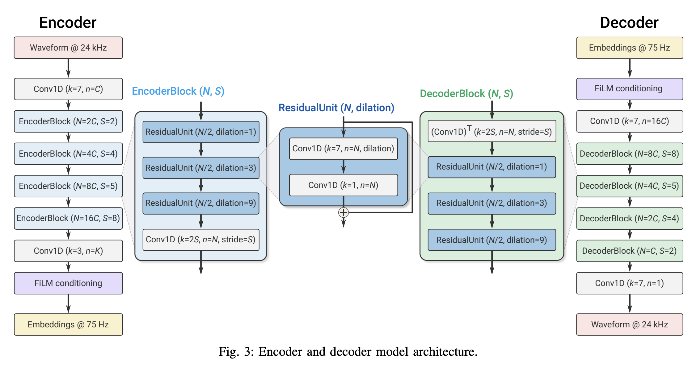
    <figcaption>SoundStream Encoder-Decoder Architecture. Source: [1]</figcaption>
</figure>


### Training Methodology  

SoundStream combines adversarial training with multi-resolution spectral losses:  

- A **GAN discriminator** distinguishes real/fake audio samples, forcing the decoder to generate perceptually convincing outputs.  

- **Multi-scale spectrogram losses** ensure accurate frequency domain reconstruction.  

- **Feature matching losses** align intermediate layer activations between original and reconstructed audio.  

<figure markdown> 
    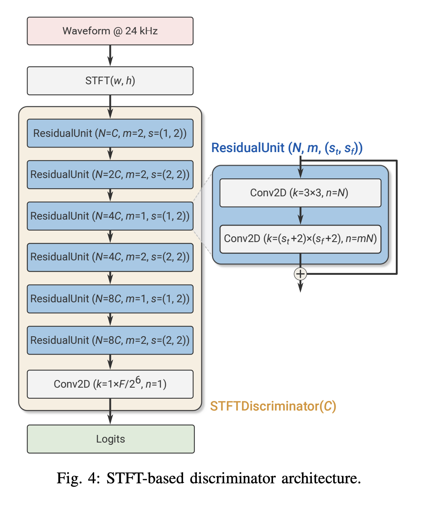{ width="500" }
    <figcaption>SoundStream Discriminator Architecture. Source: [1]</figcaption>
</figure>

### Results

The results are impressive:

- At 3 kbps, SoundStream outperforms Opus at 12 kbps and approaches the quality of EVS at 9.6 kbps.

- It works for speech, music, and general audio—not just speech.

- Subjective tests (MUSHRA) show that listeners prefer SoundStream's output at low bitrates over traditional codecs.

<figure markdown> 
    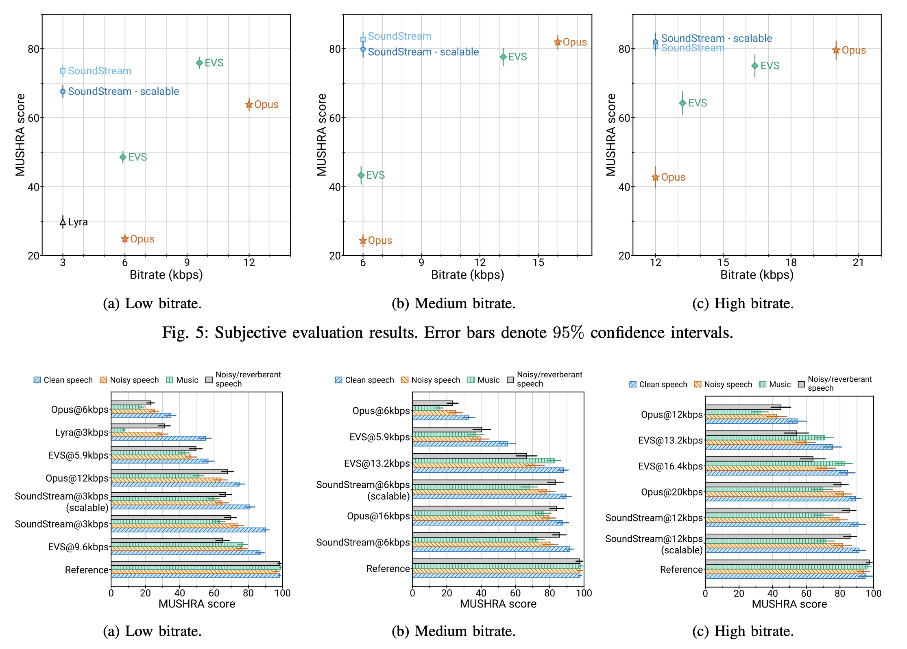
    <figcaption>SoundStream Performance Results. Source: [1]</figcaption>
</figure>

## EnCodec: High-Fidelity Neural Compression  

Meta's EnCodec (2022) builds on SoundStream's foundation while addressing scalability and stability challenges. 

<figure markdown> 
    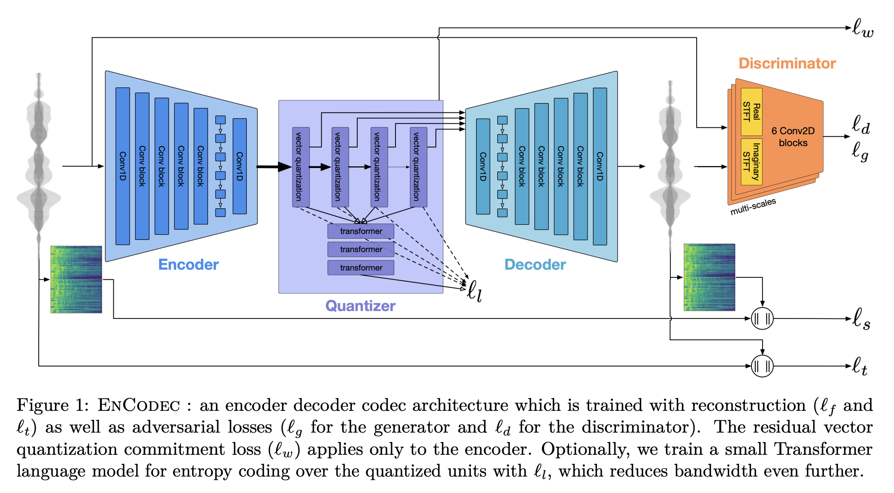
    <figcaption>EnCodec Architecture. Source: [2]</figcaption>
</figure>

### Key Innovations

- **Spectrogram Adversary**: EnCodec replaces SoundStream's waveform discriminator with a **multi-scale spectrogram discriminator**, which analyzes audio at different time-frequency resolutions. This modification:  

  - Reduces artifacts caused by phase inconsistencies in waveform-based GANs  

  - Improves training stability through better gradient signals  

  - Enables effective handling of stereo audio at 48 kHz sampling rates

    <figure markdown> 
        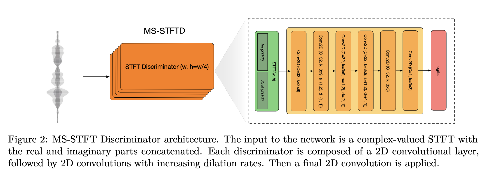
        <figcaption>EnCodec's Multi-scale Spectrogram Discriminator. Source: [2]</figcaption>
    </figure>


- **Loss Balancing Mechanism**: The authors introduced a **gradient-balancing** technique that dynamically adjusts loss weights based on their contribution to the total gradient magnitude. This innovation decouples hyperparameter tuning from loss function scales, significantly simplifying training.  

- **Latent Space Compression**: EnCodec demonstrates how lightweight Transformer models can further compress the quantized latent representation by 40%, enabling variable-rate compression without retraining. Subjective evaluations show EnCodec outperforming EVS at 16.4 kbps while operating at 9 kbps, with particularly strong performance on music and noisy speech.  


### Results

EnCodec was rigorously evaluated across a range of bitrates and content types (speech, music, noisy and reverberant speech). Key findings include:

- **Superior Quality:** At all tested bitrates (1.5, 3, 6, 12 kbps for 24 kHz; 6, 12, 24 kbps for 48 kHz), EnCodec outperformed traditional codecs and previous neural models in both objective and subjective (MUSHRA) tests.

- **Versatility:** Works seamlessly for both speech and music, and robustly handles challenging conditions like noise and reverberation.

- **Efficiency:** Achieves real-time encoding and decoding on a single CPU core, making it practical for large-scale deployment.

<figure markdown> 
    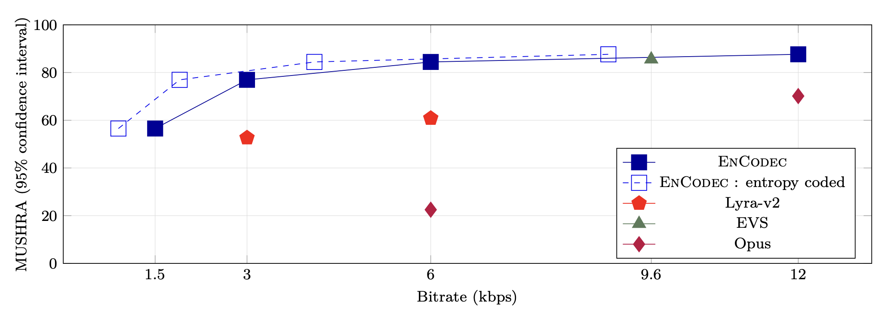
    <figcaption>EnCodec Performance Results. Source: [2]</figcaption>
</figure>

## HILCodec: Lightweight and Efficient Streaming  

The 2024 HILCodec paper addresses critical limitations in prior neural codecs—model complexity and streaming efficiency [3].

<figure markdown> 
    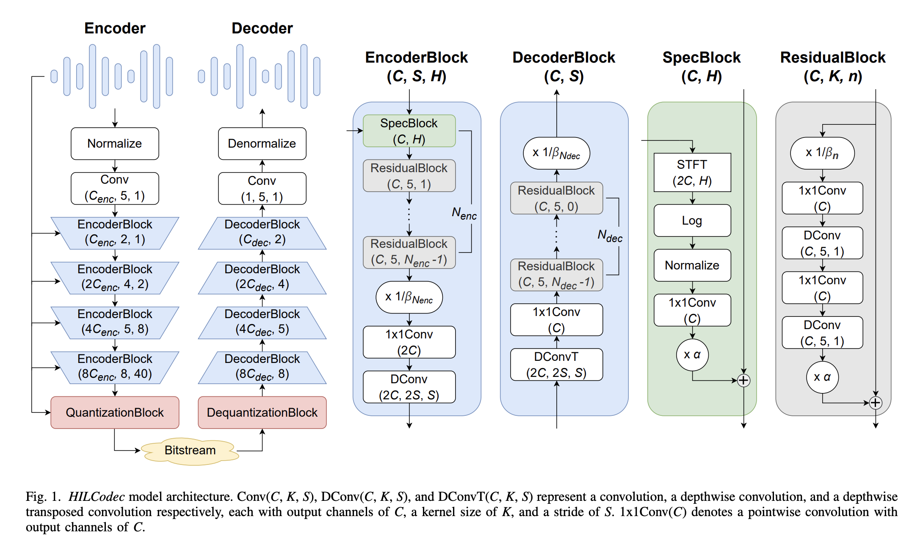
    <figcaption>HILCodec Architecture. Source: [3]</figcaption>
</figure>

### Key Innovations

- **Variance-Constrained Wave-U-Net** Through theoretical analysis, the authors identified that standard Wave-U-Net architectures suffer from **exponential variance growth** in deeper layers, leading to unstable training and performance degradation. HILCodec introduces:  

  - **L2-normalization** after each residual block to control activation scales  

  - **Depthwise separable convolutions** to maintain receptive field while reducing parameters  

  - **Causal convolutions** with 20ms latency for real-time streaming 

- **Distortion-Free Discriminator** Traditional waveform discriminators introduce spectral distortions by prioritizing time-domain accuracy. HILCodec's discriminator uses **parallel filter banks** analyzing different frequency bands, ensuring artifact-free reconstructions across the audible spectrum.  

    <figure markdown> 
        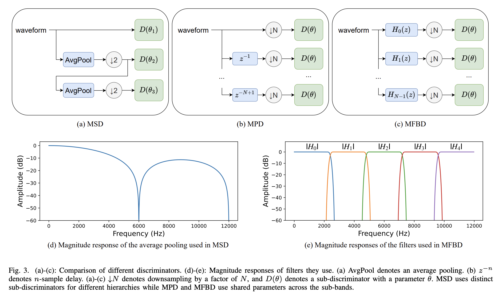
        <figcaption>HILCodec's Distortion-Free Discriminator. Source: [3]</figcaption>
    </figure>


### Results

HILCodec matches or outperforms both traditional and leading neural codecs (like SoundStream, EnCodec, and HiFi-Codec) in subjective and objective tests, across various audio types (speech, music, environmental sounds) and bitrates (1.5–9 kbps). It achieves this with:

- **Lower computational complexity**: Real-time on a single CPU thread

- **Superior or comparable perceptual quality**: Especially at very low bitrates

- **Streamable design**: Suitable for live audio and embedded applications

<figure markdown> 
    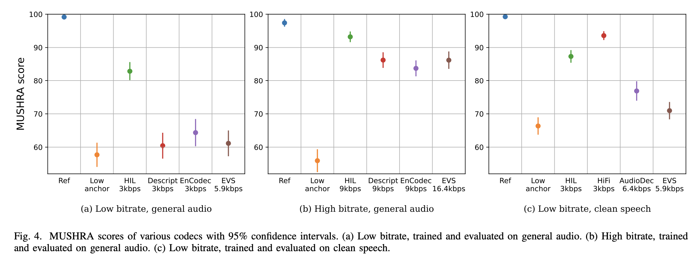
    <figcaption>HILCodec Performance Results. Source: [3]</figcaption>
</figure>

## Code

Let's walk through a hands-on example to see how to use one of these neural audio codecs in practice. Here, we will use EnCodec [2], but the fundamental steps are similar for other codecs like SoundStream or HILCodec.

```python linenums="1"
# Load the required packages
from audiotools import AudioSignal
from transformers import EncodecModel, AutoProcessor

# Step 1: load the EnCodec model and processor
model = EncodecModel.from_pretrained("facebook/encodec_24khz")
processor = AutoProcessor.from_pretrained("facebook/encodec_24khz")
# Note: you can also use "facebook/encodec_48khz" for higher sampling rates

# Step 2: load an audio file
audio_file = "samples/neural_codec_input.wav" # replace with your audio file path
audio = AudioSignal(audio_file)
audio = audio.resample(24000) # resample to 24kHz
audio = audio.to_mono() # convert to mono
frame_rate = audio.sample_rate # get the sample rate
audio_sample = audio.audio_data.reshape(-1) # get the reshaped audio samples

# Step 3: Preprocess the audio
inputs = processor(raw_audio=audio_sample, 
                    sampling_rate=frame_rate, 
                    return_tensors="pt")

# Step 4: Encode the audio
encoder_outputs = model.encode(inputs["input_values"], 
                                inputs["padding_mask"])

# Step 5: Decode the audio
audio_values = model.decode(encoder_outputs.audio_codes, 
                            encoder_outputs.audio_scales, 
                            inputs["padding_mask"])[0]

# OR replace Step 4 and 5: Forward pass on the input
audio_values = model(inputs["input_values"], inputs["padding_mask"]).audio_values 
```
Let's go through the important code steps:

### Load the EnCodec Model and Processor 

We use the `facebook/encodec_24khz` model, optimized for 24 kHz audio. The processor handles audio preprocessing, including splitting audio for batch operations and creating the `padding_mask`, that indicates which positions in the input are real audio (1) and which are padding (0) to be ignored by the model. 

!!! Hint
    You can also use `facebook/encodec_48khz` for higher sampling rates, but in this example, we will stick to 24 kHz for simplicity.

### Loading and Preprocessing the Audio

We load an audio file, resample it to 24 kHz, and convert it to mono. The audio data is reshaped into a 1D array for processing. In this example, we use a sample audio file named `neural_codec_input.wav` *(listen to it below)* that is 10 seconds long and after resampling, has the shape of `torch.Size([240000])` and looks like `tensor([0.0088, 0.0117, 0.0194,  ..., 0.0390, 0.0460, 0.0213])`

Original Audio:
<audio controls>
  <source src="../../audio/neural_codec_input.wav" type="audio/wav">
Your browser does not support the audio element.
</audio>

### Preprocessing the Audio

The audio is processed using the EnCodec processor, which prepares it for encoding by creating input tensors and a padding mask. The padding mask is crucial for handling variable-length audio inputs, ensuring that the model only processes valid audio samples. The `inputs` looks like `{'input_values': tensor([[ 0.0088,  0.0117,  0.0194,  ...,  0.0390,  0.0460,  0.0213]]), 'padding_mask': tensor([[1, 1, 1, ..., 1, 1, 1]])}`. If you notice, the `input_values` tensor contains the audio samples exactly as we have loaded, and the `padding_mask` indicates that all positions are valid (1) since we have a single audio sample without padding.

### Encoding the Audio

The `encode` method processes the input audio, producing quantized latent representations (`audio_codes`) and scales for decoding. This step compresses the audio into a more compact form. One important aspect here is the bandwidth -  this is how much data the compressed audio will use per second. Lower bandwidth means smaller files but lower audio quality; higher bandwidth means better quality but larger files. Bandwidth is correlated to the codebooks used in the quantization step, the relation is shown below, *(for Encodec 24kHz model)*:

| Bandwidth (kbps) | Number of Codebooks (n_q) |
|------------------|--------------------------|
| 1.5              | 2                        |
| 3                | 4                        |
| 6                | 8                        |
| 12               | 16                       |
| 24               | 32                       |

So, `bandwidth = 1.5` will use 2 codebooks, while `bandwidth = 24` will use 32 codebooks. The number of codebooks directly affects the quality and size of the compressed audio. If we try with `bandwidth = 1.5`, the `audio_codes` will have shape `torch.Size([1, 1, 2, 750])` and looks like 

```
tensor([[[[727, 407, 906,  ..., 561, 424, 925],
        [946, 734, 949,  ..., 673, 769, 987]]]])
```

But in case of `bandwidth = 24`, the `audio_codes` will have shape `torch.Size([1, 1, 32, 750])` and looks like 

```
tensor([[[[ 727,  407,  906,  ...,  561,  424,  925],
        [ 946,  734,  949,  ...,  673,  769,  987],
        [ 988,   21,  623,  ...,  870, 1023,  452],
        ...,
        [ 792,  792,  220,  ...,  419, 1011,  422],
        [ 502,  550,  893,  ...,  328,  832,  450],
        [ 681,  906,  872,  ...,  820,  601,  658]]]])
```

!!! Hint
    If you're wondering how bandwidth relates to the number of codebooks in EnCodec, here's how it works: The encoder produces 75 steps per second of audio. So, for a 10-second clip, there are 750 steps. At each step, the model outputs one code per codebook (`N_q`). For example, with `bandwidth = 1.5`, there are 2 codebooks, so you get a total of 2 × 750 = 1500 codes, which corresponds to 1.5 kbps. With `bandwidth = 24`, there are 32 codebooks, resulting in 32 × 750 = 24,000 codes, or 24 kbps. In summary: more codebooks mean higher bandwidth and better quality, but also larger compressed files.

Notice one thing, an audio of 10 seconds that used 240k samples is now compressed into (N_q, 750) where N_q is the number of codebooks used. For `bandwidth = 1.5`, the shape is (2, 750) and the compression ratio is 160x and for `bandwidth = 24`, the shape is (32, 750) and the compression ratio is 10x! Quite impressive, right?

### Decoding the Audio

The `decode` method reconstructs the audio from the quantized codes and scales. The output is a tensor of audio samples, which can be saved as a WAV file or played directly. The shape of the output audio tensor will be `(1, 240000)` for 10 seconds of audio at 24 kHz.

If you play the audio file `neural_codec_input.wav`, you will hear the original audio. After running the code, you can listen to the output generated by EnCodec. Both are presented below, 

Original Audio: (48KHz)
<audio controls>
  <source src="../../audio/neural_codec_input.wav" type="audio/wav">
Your browser does not support the audio element.
</audio>

Encodec Output: (24KHz; Bandwidth: 1.5 kbps)
<audio controls>
  <source src="../../audio/neural_codec_encodec_output_bandwidth1.5.wav" type="audio/wav">
Your browser does not support the audio element.
</audio>

Encodec Output: (24KHz; Bandwidth: 24 kbps)
<audio controls>
  <source src="../../audio/neural_codec_encodec_output_bandwidth24.wav" type="audio/wav">
Your browser does not support the audio element.
</audio>

As you can hear, while there are some distortions, the output is audible and is able to maintain the speech of the original audio.  This demonstrates the effectiveness of neural codecs in audio compression. 

## Comparative Analysis  

The evolution of neural codecs reveals several key trends:  

| Characteristic       | SoundStream[1] | EnCodec[2]     | HILCodec[3] |  
|-----------------------|----------------|---------------|-------------|  
| Max Sampling Rate     | 24 kHz         | 48 kHz        | 24 kHz      |  
| Real-Time Streaming   | Yes            | Yes           | Yes         |  
| Model Size (Params)   | 18M            | 32M           | 9M          |  
| Music Handling        | Moderate       | Excellent     | Excellent   |  
| Quantization Scheme   | RVQ (8-32 dim) | RVQ (32 dim)  | RVQ (64 dim)|  


## Challenges and Future Directions  

While neural codecs demonstrate remarkable capabilities, several open challenges remain:  

- **Computational Complexity**: Even lightweight models like HILCodec require 1-2 GFLOPS, posing deployment challenges on ultra-low-power devices.  

- **Generalization**: Most models are trained on specific audio types (speech/music), struggling with uncommon sounds like ultrasonic frequencies or simultaneous overlapping sources.  

- **Standardization**: Unlike traditional codecs with well-defined bitstream formats, neural codecs lack interoperability standards, hindering widespread adoption.  

Emerging research directions include:  

- **Few-shot Adaptation**: Allowing codecs to dynamically adjust to new speaker voices or musical instruments without retraining  

- **Neural Post-Processing**: Combining traditional codecs with neural enhancers for backward compatibility

- **Energy-Efficient Architectures**: Exploring sparsity and quantization-aware training for edge deployment  

## Conclusion  

Neural audio codecs represent a paradigm shift in audio compression, offering unprecedented quality/bitrate ratios through data-driven learning. From SoundStream's foundational architecture to HILCodec's efficient streaming design, each iteration brings us closer to practical applications in telecommunication, media streaming, and immersive audio. As research addresses current limitations in complexity and generalization, these AI-powered codecs are poised to become the new standard for audio compression across industries.

## References

[1] SoundStream: An End-to-End Neural Audio Codec - [Paper](https://arxiv.org/abs/2107.03312) | [Video](https://www.youtube.com/watch?v=V4jj-yhiclk&ab_channel=RISEResearchInstitutesofSweden)

[2] EnCodec: High Fidelity Neural Audio Compression - [Paper](https://arxiv.org/abs/2210.13438) | [Code](https://github.com/facebookresearch/encodec)

[3] [HILCodec: High Fidelity and Lightweight Neural Audio Codec](https://arxiv.org/pdf/2405.04752v1)