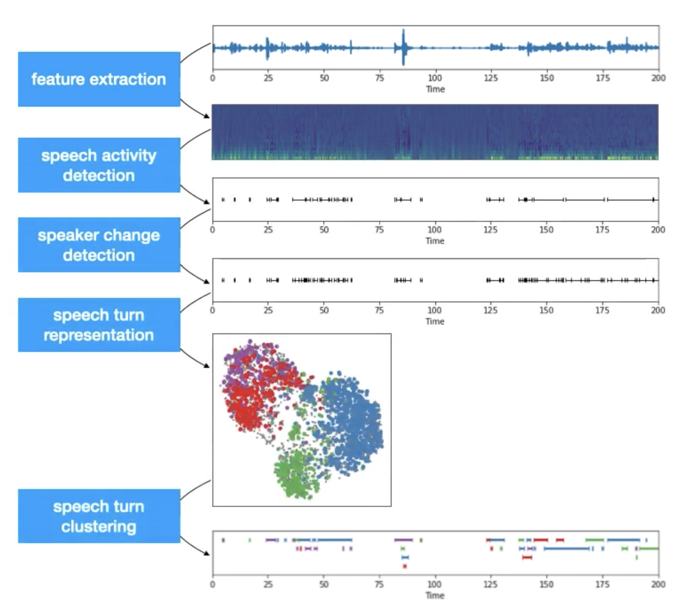

## Introduction

- Speaker Diarization is the process of segregating different speakers from an audio stream. It is used to answer the question "who spoke when?". So if the input is a audio stream with 5 speakers, the output will contain the timestamp in audio when different speakers spoke.
- A sample output for a conversation between 3 people (differers) could be,  

```
start=0.2s stop=1.5s speaker_A
start=1.8s stop=3.9s speaker_B
start=4.2s stop=5.7s speaker_A
start=6.2s stop=7.8s speaker_C
...
```
!!! Note
    In speaker diarization we separate the speakers (cluster) and not identify them (classify). Hence the output contains anonymous identifiers like `speaker_A`, `speaker_B`, etc and not the actual names of the persons.

<!-- ## Types of Speaker Diarization Solutions

- As per the review paper on Speaker Diarization [3], these types of solutions can be divided into multiple groups based on two pairs of factors.
  - **Training objective:** 
  - **Optimization Type:** 

<figure markdown> 
    { width="500" }
    <figcaption>Taxonomy of Speaker Diarization Systems [3]</figcaption>
</figure> -->


## Traditional Diarization Approach

<figure markdown> 
    { width="500" }
    <figcaption>The generic approach for Speaker Diarization [1]</figcaption>
</figure>

- Traditional Speaker Diarization systems can be generalised into a 5 step process. These are, 
  - **Feature extraction**: here we transform the raw waveform into audio features like mel spectrogram. 
  - **Voice activity detection**: here we identify the chunks in the audio where some voice activity was observed. As we are not interested in silence and noise, we ignore those irrelevant chunks.  
  - **Speaker change detection**: here we identify the speaker changepoints in the conversation present in the audio. It is either capture by heuristic approach, classical algorithms or modern neural blocks. It will further divide the chunks from last step into subchunks.
  - **Speech turn representation**: here we encode each subchunk by creating feature representations. Recent trends gives preference to neural approach where subchunks are encoded into context aware vector representation. 
  !!! Hint
      We can use any audio representation algorithm or model for this task. Recently d or x vectors are preferred. One example using `speechbrain` package is 

      ```python linenums="1"
      # import
      import torch
      from speechbrain.pretrained import EncoderClassifier
      # load the model
      encoder = EncoderClassifier.from_hparams(source="speechbrain/spkrec-ecapa-voxceleb")
      # encode the audio chunk
      embedding = encoder.encode_batch(torch.from_numpy(chunk))
      ```
  - **Speech turn clustering**: here we cluster the subchunks based on their vector representation. Different clustering algorithms could be applied based on availability of cluster count (`k`) and embedding process of the previous step.
  !!! Hint
      - While Kmeans is the defacto clustering algorithm, it might create some problems if we use it for speaker diarization. Here are a few problem cases mentioned in [5]
        - **Non-gaussian data:** speech data are often non-gaussian
        - **Imbalanced data:** one person may speak more than the other
        - **Gender/Age/Racial effects:** inter-gender difference is large but intra-gender differences are small.
        - **Overlapping speech:** overlapping speech creates connections between clusters
      - Kmeans algorithms will not be able to handle these issues of the audio data and will perform incorrect clustering. Hence we can use Spectral Clustering that can overcome all of the mentioned issues!

- The final output will be the clusters of different subchunks from the audio stream. Each cluster can be given an anonymous identifier *(speaker_a, ..)* and then it can be mapped with the audio stream to create the speaker aware audio timeline.

## Metrics

### Diarization Error Rate (DER)

- Diarization error rate (DER) provides an estimation *(O is good, higher is bad; max may exceed 100%)* of diarization performance by calculating the sum of following individual metrics, [2]
  1. **Speaker error:** percentage of scored time for which the wrong speaker id is assigned within a speech region
  2. **False alarm speech:** percentage of scored time for which a nonspeech region is incorrectly marked as containing speech
  3. **Missed speech:** percentage of scored time for which a speech region is incorrectly marked as not containing speech

$$\text{DER} = \frac{(\text{Speaker error} + \text{False alarm speech} + \text{Missed speech})}{\text{Total Duration}}$$

!!! Note
    Many literature may only report the speaker error in DER. Be aware of such usage.

- To better understand the individual metrics we can refer an example call timeline that is shown below, 

<figure markdown> 
    { width="700" }
    <figcaption>Example timeline of an audio with two speakers A and B. We have the original and predicted diarization timeline for the complete duration of call denoted in green for A and pink for B. For each segment, we have mapping of 0, 1, 2, 3 and tick for overlap, speaker error, false alarm, missed speech and correct segment respectively. </figcaption>
</figure>

!!! Note
    Here we assumed that the mapping of speakers A to A and B to B between the original and predicted transcript is available. But this doesn't happen many times. As diarization is a clustering task, the grouping might be correct but the naming of the groups could be different. One example is where the speaking order in original could be `A, B, A, C, D` but in predicted it could be `X, Y, X, Z, M`. While the diarization is correct, the naming is different which should be handeled separately. For this, we can use [Hungarian Algorithm](https://en.wikipedia.org/wiki/Hungarian_algorithm) to find the optimal map between the speakers in original and predicted before computing the DER.

!!! Hint
    Some packages like [1] and [2] may request the data *(both original and predicted timeline)* in Rich Transcription Time Marked (RTTM) file format. It is a space-delimited text file that contains one line for each segment with details like start time, duration and speaker name. Refer [this](https://github.com/nryant/dscore#rttm) for more details. Here is the code to convert RTTM file to CSV file using `pandas`:

    ```python linenums="1"
    def convert_rttm_to_csv(file):
    """
    Inputs:
    file: str
        file path of the rttm file to be converted

    Outputs:
    df: dataframe
        Dataframe containing the extracted information from the rttm file
    """
    # read the file
    df = pd.read_csv(file, delimiter=" ", header=None)
    df = df[[3, 4, 7]]
    df.columns = ['start_time', 'duration', 'speaker_name']
    # compute the end time
    df['end_time'] = df['start_time'] + df['duration']
    # convert time to miliseconds
    df['start_time'] *= 1000
    df['end_time'] *= 1000
    # sort the df based on the start_time
    df.sort_values(by=['start_time'], inplace=True)
    # return
    return df
    ```

### Jaccard Error Rate (JER)

- While DER is estimated on whole utterance, in JER, per-speaker error rates are computed and then averaged. In this way, JER tries to give equal weightage to each speaker. Below is the formulation of JER,
  
$$\text{JER} = \frac{1}{N} \sum_{i}^{N_{ref}} \frac{(\text{Speaker Error}_i + \text{False alarm speech}_i + \text{Missed speech}_i)}{Total_i}$$

- Here, $Total_i$ is the union of ith speaker's speaking time in reference and predicted transcript. $N_{ref}$ is the number of speakers in reference script. Note, contrary to DER, JER never exceed 100%. 
## Code

### PyAnnote

- [Pyannote Audio](https://github.com/pyannote/pyannote-audio) provides readymade models and neural building blocks for Speaker diarization and other speech related tasks. While the models are also available on [HuggingFace](https://huggingface.co/pyannote/speaker-diarization), Pyannote is super easy to use. Below is an example from the github repository of the package:

``` python linenums="1"
# Install pyannote
!pip install pyannote.audio
# for mac if you get "OSError: sndfile library not found"
# !conda install -c conda-forge libsndfile 

# instantiate pretrained speaker diarization pipeline
from pyannote.audio import Pipeline
pipeline = Pipeline.from_pretrained("pyannote/speaker-diarization")

# apply pretrained pipeline
diarization = pipeline("audio.wav")

# print the result
for turn, _, speaker in diarization.itertracks(yield_label=True):
    print(f"start={turn.start:.1f}s stop={turn.end:.1f}s speaker_{speaker}")
# start=0.2s stop=1.5s speaker_A
# start=1.8s stop=3.9s speaker_B
# start=4.2s stop=5.7s speaker_A
# ...
```

!!! Hint
    As per my observation, PyAnnote is quite slow on CPU. Keep this in mind while experimenting with the package.
## References

[1] PyAnnoteAudio - [Code](https://github.com/pyannote/pyannote-audio) | [Paper](https://arxiv.org/abs/1911.01255)

[2] Dscore - [Code](https://github.com/nryant/dscore)

[3] A Review of Speaker Diarization: Recent Advances with Deep Learning - [Paper](https://arxiv.org/abs/2101.09624)

[4] Low-dimensional speech representation based on Factor Analysis and its applications - [Slides](http://people.csail.mit.edu/sshum/talks/ivector_tutorial_interspeech_27Aug2011.pdf)

[5] Speaker Diarization with LSTM - [Paper](https://arxiv.org/abs/1710.10468) | [Code](https://github.com/wq2012/SpectralCluster) | [Video](https://www.youtube.com/watch?v=pjxGPZQeeO4)