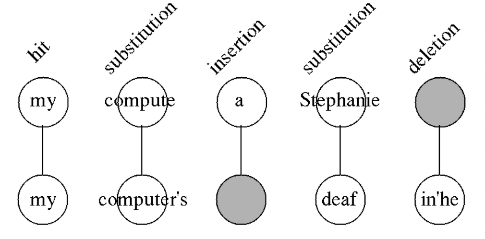

!!! warning
    This page is still under progress. Please check back after some time or [contact me](mailto:mohitmayank1@gmail.com)

## Introduction

- Speech to text task is known by many names, be it Audio Transcription or Automatic Speech Recognition (ASR). Basically, it's the process of generating textual transcription of a conversation, where speech is provided as input and we get text as output.
- The task is quite complex as it has depedency on several other modules like Voice activity detection and speaker diarization. On top of this, the core transcription module should be able to handle multiple languages, accents and domain specific keywords. 
- We can perform transcriptions in either of the two ways,
  - `Online transcription`: this is for live use cases where you want to stream ongoing data and perform transcription on the go. For example, an ongoing sales or customer support call or news event, etc. Usually a smaller and faster (hence less accurate) model is used for this.
  - `Offline transcription`: this is delayed transcription that happens after the call or recording is over. For example, recorded telecast or OTT series's caption, etc. Usually a relatively bigger and more accurate (hence slower) model is used for this.


<figure markdown> 
    { width="500" }
    <figcaption>*a painting of a woman hand to ear listening to some speech and writing it down in a paper; (Generated by DallE)*</figcaption>
</figure>

## Available Solutions (Paid)

- There are a lot of ASR services available online. In fact, there are several startups that only does ASR 🤯. We will try to go through some paid as well as open source options for ASR, so that you are ready to use ASR from day zero using paid option or built an inhouse option using the open source ones.

- Some of the most popular, widely used but paid ones are as follows, *(by any means not the complete list)*
  - [Amazon Transcribe](https://aws.amazon.com/transcribe/)
  - [Google Speech to text](https://cloud.google.com/speech-to-text)
  - [Azure Speech to text](https://azure.microsoft.com/en-us/services/cognitive-services/speech-to-text/#overview):
  - [AssemblyAI](https://www.assemblyai.com/)
  - [Deepgram](https://deepgram.com/)

!!! Note
    Please consider accuracy, additional features and cost before selecting any of the above services for your use case. The accuracy of each of the above services are arguably on par, but may vary based on specific domain. For example, one may perform better for healthcare domain, while the other on sales. Be sure to try them out before selecting one. 

- There are several advantages of using paid ASR services, 
  - They take care of the major headache in the transcription space like support for multiple languages and accents. Their model is constantly fine-tuned to improve the performance on existing language and even to add support for new ones. 
  - They take care of output formatting like adding punctuations, sentence breaks, speaker diarization etc. Otherwise for a inhouse ASR system, we will have to build these as well.
  - They take care of hosting the ASR models. Depending on the use case *(for example if you want live transcription which needs to be super fast)*, we may end up spending substantially on GPU computes and hardware management. 
  - Finally, there has been a trend of providing audio intelligence features on top of core transcription services. For example, [AssemblyAI provides add on services like sentiment analysis, entity detection, Auto Chapters, etc.](https://www.assemblyai.com/products/audio-intelligence)
- The one and the major con of these services, as you might have guessed, is cost 💲 

## Available Solutions (Open Source)

- Apart from the paid services, there are a lot of open source ASR services available. They are available in form of packages, frameworks or even trained AI models. One major advantage of these models *(apart for beign free)* is that we can further finetune them for our usecase *(ex: domain and accent)*. But this comes at a cost of having to deploy and maintain  the model yourself. 
- Some of the widely used open-source ASR systems are, 
  - 📦 [TensorFlowASR](https://github.com/TensorSpeech/TensorFlowASR)
  - 📦 [DeepSpeech](https://github.com/mozilla/DeepSpeech)
  - 🧠 [Wav2Vec2](wav2vec2.md)
  - 🧠 [HuBERT](https://huggingface.co/facebook/hubert-large-ls960-ft)
## Evaluation Metrics

- While there are multiple options for ASR, it is important to know how to quantitively compare different ASR systems. To begin, we need the data -- (1) golden transcripts i.e. the source of truth generated by some efficient model or human annotators, and (2) system outputs i.e. output of the model you want to test.
- Comparing golden transcripts against system output, at word level, we can observe following scenarios -- (1) hit ($H$): word matching in both, (2) insertion ($I$): words only present in system output but not in golden transcripts, (3) deletion ($D$): words only present in golden transcripts but not in system output, (4) substitution ($S$): words substitued in the system output. 

<figure markdown> 
    { width="500" }
    <figcaption>Word classification of golden transcription (below) “my computer’s deaf in’he?” against the system output (above)[1]</figcaption>
</figure>

- To evaluate the performance, we need to align the two sentences such that it minimised the errors i.e $S+D+I$. For this usually Viterbi alignment is used. Once done, we just need to use any metric to quantify the performance. They could be, 

### WER (Word error rate)

- WER is the proportion of the word errors to the words processed. It's formula is as follows, 

$$WER = \frac{S+D+I}{H+S+D}$$

!!! Note
    The upper range of WER is not bounded by 1, but by $max(N_1, N_2)/N_1$ where $N_1$ is the number of words in the golden transcription and $N_2$ is the number of words in the system output. So don't be suprised if you get WER > 1, it means that the system output is generating doing a lot more insertions than required.

### MER (Match error rate)

- MER normalizes the WER by considerig the insertions in the denominator. It's formula is as follows,

$$MER = \frac{S+D+I}{H+S+D+I}$$

!!! Note
    If for some transcription, $MER = WER$, it means there are 0 insertions.


## Code

- Recent advances in artificial intelligence and specially transfer learning has lead to release of several pre-trained ASR models that are ready to use from day one. In case you want to improve the accuracy for your domain, we can even fine tune the model further!
- One of the most famous models right now is Facebook's [Wav2Vec2](https://huggingface.co/facebook/wav2vec2-base-960h). We will use this model for coding purposes. More models can be [found here](https://huggingface.co/models?pipeline_tag=automatic-speech-recognition&sort=downloads).

### Offline transcription using Wav2Vec2 (CTC)

- Here is the code to perform offline transcription using Wav2Vec2 model with `transformer` package.

``` python linenums="1"
# import 
import torch
import librosa
from transformers import Wav2Vec2ForCTC, Wav2Vec2Tokenizer

# load the tokenizer and model
tokenizer = Wav2Vec2Tokenizer.from_pretrained("facebook/wav2vec2-large-960h")
model = Wav2Vec2ForCTC.from_pretrained("facebook/wav2vec2-large-960h")

# load the audio data (use your own wav file here!)
input_audio, sr = librosa.load('my_wav_file.wav', sr=16000)

# tokenize
input_values = tokenizer(input_audio, return_tensors="pt", padding="longest").input_values

# retrieve logits
logits = model(input_values).logits

# take argmax and decode
predicted_ids = torch.argmax(logits, dim=-1)
transcription = tokenizer.batch_decode(predicted_ids)

# print the output
print(transcription)
```

### Online transcription using Wav2Vec2 (CTC)

- For live transcription using Wav2Vec2, we can utilize [wav2vec2-live](https://github.com/oliverguhr/wav2vec2-live) package. 
- Once you have cloned the repo and installed the packages from `requirements.txt`, the live transcription can be started with *(taken from the package readme and modified)*, 

``` python linenums="1"
# import
from live_asr import LiveWav2Vec2

# load model
english_model = "facebook/wav2vec2-large-960h-lv60-self"
asr = LiveWav2Vec2(english_model,device_name="default")

# start the live ASR
asr.start()

try:        
    while True:
        text,sample_length,inference_time = asr.get_last_text()                        
        print(f"Duration: {sample_length:.3f}s\tSpeed: {inference_time:.3f}s\t{text}")
        
except KeyboardInterrupt:   
    asr.stop()  
```

- This starts the Live ASR on your terminal. The code listen to the audio in your microphone, identifies the chunks with voice using VAD and then pass the voiced chunks to Wave2Vec2 for transcription. One sample output is shown below, 

``` shell 
listening to your voice

Duration: 0.780s	Speed: 0.205s	hello
Duration: 0.780s	Speed: 0.190s	hello
Duration: 0.960s	Speed: 0.223s	my name
....
```

## References

[1] [From WER and RIL to MER and WIL: improved evaluation measures for connected speech recognition](https://www.isca-speech.org/archive_v0/archive_papers/interspeech_2004/i04_2765.pdf)

Cheers :wave: 