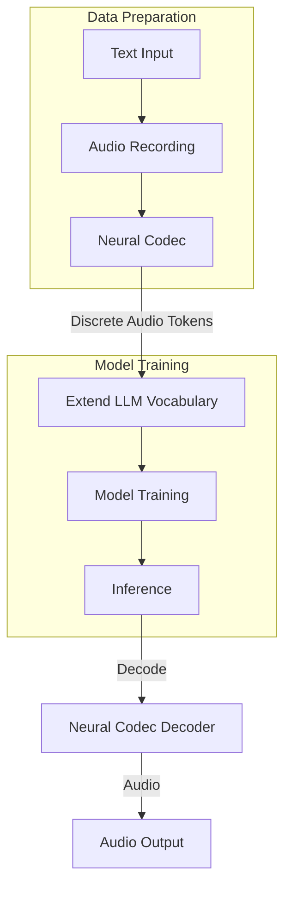

# Training LLM-Based + Neural Codec TTS Models

## Introduction

Training [Text-to-Speech (TTS)](tts.md) models from scratch can be approached in multiple ways, each with its own advantages and trade-offs. The most common approaches include:

- **End-to-End Neural TTS**: Training models like VITS or FastSpeech 2s that directly generate mel-spectrograms or waveforms from text
- **LLM-Based + Neural Codec**: Leveraging pretrained language models to generate discrete audio tokens from neural codecs, then decoding them to audio

In this guide, we'll focus on the **LLM-based + Neural Codec** approach, which has gained significant traction due to its ability to leverage powerful pretrained language models and achieve high-quality speech synthesis. This method treats audio generation as a sequence-to-sequence problem, where the model learns to predict discrete audio tokens (from neural codecs like [SNAC](neural_audio_codecs.md#snac-multi-scale-neural-audio-codec) or [EnCodec](neural_audio_codecs.md#encodec-high-fidelity-neural-compression)) given text input.

!!! info "Why LLM + Neural Codec?"

    This approach benefits from:

    - **Transfer Learning**: Leveraging knowledge from large pretrained language models
    - **Discrete Tokenization**: Converting audio to discrete tokens makes it compatible with language model architectures
    - **Scalability**: Can handle long audio sequences efficiently
    - **Flexibility**: Easy to extend to multi-speaker or multilingual scenarios

## Overview of the Approach

The LLM-based TTS training pipeline consists of several key steps:

1. **Audio Tokenization**: Convert audio waveforms into discrete tokens using a neural codec (e.g., SNAC, EnCodec)
2. **Vocabulary Extension**: Add audio tokens to the language model's vocabulary
3. **Data Preparation**: Format training data as text-audio token pairs
4. **Model Training**: Fine-tune the language model to predict audio tokens given text
5. **Inference**: Generate audio tokens from text, then decode them back to audio using the neural codec



## Main Concepts

Let's understand the key concepts of this approach in detail. We will start with a dataset where we have (audio, text) pairs.

``` python linenums="1"
# import  
import os
from datasets import load_dataset, Audio
# load the dataset
dataset = load_dataset("MrDragonFox/Elise", split="train")
# print the dataset
print(dataset)
# Output:
# Dataset({
#     features: ['audio', 'text'],
#     num_rows: 1195
# })

# print one sample
print(dataset[0])
# Output:
# {'audio': {'path': 'eaa31ab9.wav',
#   'array': array([ 0.        ,  0.        ,  0.        , ..., -0.00469971,
#          -0.00558472, -0.00915527]),
#   'sampling_rate': 22050},
#  'text': 'Please have mercy on my dainty, frail body. Your coils are so strong and powerful, and I am powerless to resist.'}
```

As you can see, we have [MrDragonFox/Elise](https://huggingface.co/datasets/MrDragonFox/Elise) dataset 1195 samples with (audio, text) pairs along with metadata like `sampling_rate`. Now let's pick one random sample and play the audio.

``` python linenums="1"
# import
import random
# let's pick one random sample and set the index
index = random.randint(0, len(dataset))
# extract the audio and sampling rate
audio = dataset[index]['audio']['array']
sampling_rate = dataset[index]['audio']['sampling_rate']
# play the audio, use idisplay to display the audio
AudioPlayer(audio, rate=sampling_rate)
```

Here is the audio *(which has size of 182133 elements at 22050 Hz sampling rate)*:

<audio controls>
  <source src="../../audio/sample_audio_from_elise_dataset.wav" type="audio/wav">
Your browser does not support the audio element.
</audio>

Now let's convert the audio to SNAC codes.

``` python linenums="1"
# import torch and SNAC codec
import torch
from snac import SNAC

# load the model
snac_model = SNAC.from_pretrained("hubertsiuzdak/snac_24khz")

# as we are loading a 24Hz model, let's convert all the audio to 24000 Hz
dataset = dataset.cast_column("audio", Audio(sampling_rate=24000))

# now let's pick the sample audio again
audio = dataset[index]['audio']['array']
sampling_rate = dataset[index]['audio']['sampling_rate'] # this time it will be 24000 Hz

# convert the audio to tensor
audio_tensor = torch.tensor(audio, dtype=torch.float32)

# For single audio file: [1, 1, time_samples]
audio_tensor = audio_tensor.unsqueeze(0).unsqueeze(0)  # Shape: ~[1, 1, 241664]

# encode the audio using snac
encoded = snac_model.encode(audio_tensor)

# print the encoded shape
print(encoded[0].shape)
print(encoded[1].shape)
print(encoded[2].shape)
# Output:
# torch.Size([1, 97])
# torch.Size([1, 194])
# torch.Size([1, 388])
```

This returns a list 3 tensors denoting the SNAC codes for the 3 layers. This means we have transformed the audio from 180k samples to just 97 + 194 + 388 = 679 tokens. This is a significant reduction in the size of the data! To double check, we can decode the codec into audio and listen to match with the original audio.

``` python linenums="1"
# decode the audio using snac
decoded = snac_model.decode(encoded)
# play the audio
AudioPlayer(decoded.detach().cpu().numpy().squeeze(), rate=sampling_rate)
```
Here is the decoded audio:

<audio controls>
  <source src="../../audio/sample_audio_from_elise_dataset.wav" type="audio/wav">
Your browser does not support the audio element.
</audio>

Perfect! 

Now, as we can see, we already have a model that can convert any audio to significantly smaller number of tokens, i.e. `Audio --> Code` and then convert the codes back to audio i.e. `Code --> Audio`.  But the requirement of TTS is that we need to convert text to audio, i.e. `Text --> Audio`. This is where we can leverage the power of pretrained language models to convert text to audio tokens, i.e. `Text --> Code` and then use the neural codec to go from `Code --> Audio`. This is the approach we will be taking in this guide.


## Code Walkthrough

Let's walk through a complete implementation for training a TTS model using Gemma-3 and SNAC codec. We'll break down the code into logical sections and explain each component. I have created a [complete implementation](https://gist.github.com/imohitmayank/1a9adc10a5721be943fdf7fd4f408568) of this approach that you can use as a reference.

### Setup and Imports

```python linenums="1"
import os
import logging
import wandb
import torch
import numpy as np
from typing import Dict, List, Optional, Tuple
from dataclasses import dataclass, field
from datasets import load_dataset, Dataset
from transformers import (
    AutoTokenizer,
    AutoModelForCausalLM,
    TrainingArguments,
    Trainer,
    DataCollatorForLanguageModeling,
    EarlyStoppingCallback,
    TrainerCallback
)
from transformers.trainer_utils import get_last_checkpoint
from trl import SFTTrainer
```

The code imports necessary libraries. The `SFTTrainer` from the `trl` library is used for supervised fine-tuning, which is well-suited for causal language modeling tasks.

### Configuration Classes

```python linenums="1"
@dataclass
class ModelArguments:
    """Arguments pertaining to model configuration."""
    model_name_or_path: str = field(
        default="google/gemma-3-270m",
        metadata={"help": "Path to pretrained model or model identifier from huggingface.co/models"}
    )
    cache_dir: Optional[str] = field(
        default=None,
        metadata={"help": "Where to store the pretrained models downloaded from huggingface.co/models"}
    )
    use_fast_tokenizer: bool = field(
        default=True,
        metadata={"help": "Whether to use one of the fast tokenizer (backed by the tokenizers library) or not."}
    )
    torch_dtype: Optional[str] = field(
        default=None,
        metadata={"help": "Override the default `torch.dtype` and load the model under this dtype."}
    )

@dataclass
class DataArguments:
    """Arguments pertaining to data configuration."""
    dataset_name: str = field(
        default="mohitmayank/elise_text_snac_codes",
        metadata={"help": "The name of the dataset to use (via the datasets library)."}
    )
    max_seq_length: int = field(
        default=900,
        metadata={"help": "The maximum total input sequence length after tokenization."}
    )
    preprocessing_num_workers: Optional[int] = field(
        default=None,
        metadata={"help": "The number of processes to use for the preprocessing."}
    )
    overwrite_cache: bool = field(
        default=False,
        metadata={"help": "Overwrite the cached training and evaluation sets"}
    )
    validation_split_percentage: int = field(
        default=10,
        metadata={"help": "Percentage of the dataset to use for validation"}
    )
```

These dataclasses define configuration arguments for the model and data. The `ModelArguments` specifies which pretrained model to use (Gemma-3-270m), while `DataArguments` defines dataset parameters including the maximum sequence length (here, 900 tokens) and validation split percentage.

### SNAC Codec Configuration

```python linenums="1"
SNAC_CONFIG = {
    "num_layers": 3,
    "codes_per_layer": 4096,  # Each layer has codes 0-4095
    "total_snac_tokens": 4096 * 3,  # 12,288 additional tokens
    "layer_names": ["snac_l1", "snac_l2", "snac_l3"],
    "special_tokens": {
        "audio_start": "<audio_start>",
        "audio_end": "<audio_end>",
        "layer_sep": "<layer_sep>",
        "pad_token": "<snac_pad>"
    }
}
```

SNAC uses a multi-scale quantization approach with 3 layers. Each layer has 4096 possible code values (0-4095), resulting in 12,288 total SNAC tokens. The configuration also defines special tokens to mark the start/end of audio sequences and layer separators.

!!! note "SNAC Multi-Scale Structure"

    SNAC quantizes audio at different temporal resolutions:
    
    - **Layer 1**: Coarse temporal structure (lower frame rate)
    - **Layer 2**: Medium temporal structure  
    - **Layer 3**: Fine acoustic details (higher frame rate)
    
    This hierarchical approach captures both long-term patterns (prosody, semantics) and short-term details (phonetic features).

### Dataset Loading

```python linenums="1"
def load_snac_dataset(data_args: DataArguments) -> Tuple[Dataset, Dataset]:
    """Load and split the SNAC dataset."""
    
    print(f"Loading dataset: {data_args.dataset_name}")
    
    # Load the full dataset
    dataset = load_dataset(data_args.dataset_name, split="train")
    print(f"Loaded {len(dataset)} samples")
    
    # Add special tokens to the SNAC_CONFIG
    special_words = []
    for i in range(len(dataset)):
        text = dataset[i]['text']
        special_words.extend([word for word in text.split() if word.startswith('<') and word.endswith('>')])
    # Find the unique special words
    unique_special_words = list(set(special_words))
    SNAC_CONFIG["special_tokens"].update({word: word for word in unique_special_words})
    
    train_dataset = dataset
    eval_dataset = dataset
    
    print(f"Train samples: {len(train_dataset)}")
    print(f"Eval samples: {len(eval_dataset)}")
    
    return train_dataset, eval_dataset
```

This function basically performs two things, 

- loads the dataset from Hugging Face Hub. While you can start from a dataset with `(audio, text)` pairs like [MrDragonFox/Elise](https://huggingface.co/datasets/MrDragonFox/Elise), I have already transformed the dataset to `(text, SNAC code)` pairs that you can use here [mohitmayank/elise_text_snac_codes](https://huggingface.co/datasets/mohitmayank/elise_text_snac_codes). We will download and use this dataset for training. 
- dynamically discovers any additional special tokens present in the dataset text and adds them to the configuration. This is important because the dataset may contain special tokens that are not part of the SNAC configuration, such as `<giggling>`, `<laughter>`, `<sigh>`, etc.

### SNAC Code to Token Conversion

```python linenums="1"
def convert_snac_codes_to_tokens(snac_codes: List[List[List[int]]], tokenizer: AutoTokenizer) -> List[str]:
    """Convert SNAC codes to token strings."""
    
    tokens = [SNAC_CONFIG["special_tokens"]["audio_start"]]
    
    # Iterate over the codes
    for i in range(len(snac_codes[0][0])):
        # Add the tokens from layer 1 (1 token)
        tokens.append(f"<{SNAC_CONFIG['layer_names'][0]}_{snac_codes[0][0][i]}>")
        # Add the tokens from layer 2 (2 tokens)
        tokens.extend([f"<{SNAC_CONFIG['layer_names'][1]}_{code_val}>" 
                      for code_val in snac_codes[1][0][(i*2):(i*2)+2]])
        # Add the tokens from layer 3 (4 tokens)
        tokens.extend([f"<{SNAC_CONFIG['layer_names'][2]}_{code_val}>" 
                      for code_val in snac_codes[2][0][(i*4):(i*4)+4]])
    
    tokens.append(SNAC_CONFIG["special_tokens"]["audio_end"])
    
    return tokens
```

This function converts SNAC codes (which are integers) into token strings that can be added to the language model vocabulary. In a way, we are transforming the audio tokens (which were 3 lists of tensors) into a single string of tokens. This is done by assuming the SNAC codec follow a time frame, where each frame consist of 7 elements. Each time frame will contain codes from all the 3 layers in following manner, 

- First element of the frame is code from layer 1
- Second and third elements of the frame are codes from layer 2
- Fourth to seventh elements of the frame are codes from layer 3

One sample time frame will look like this:
```
<snac_l1_123> <snac_l2_456> <snac_l2_478> <snac_l3_789><snac_l3_1123><snac_l3_100><snac_l3_54> 
```

We do it for the complete audio sequence till we exhaust all the time frames or the SNAC codes, and the encapsulate the audio within the special tokens `<audio_start>` and `<audio_end>`, so that the complete sequence looks like this:

```
<audio_start> <snac_l1_123> ...<snac_l3_54> <audio_end>
```

!!! Note "Why follow this complex format?"

    This format is chosen because it is easy to parse and decode back to audio. It is also easy to train a language model on this format. On the plus side, this format can help with real-time streaming application in future, as we get generation output in timeframe manner.

### Data Preprocessing

```python linenums="1"
def preprocess_function(examples: Dict[str, List], tokenizer: AutoTokenizer, max_length: int):
    """Preprocess examples for training."""
    
    batch_size = len(examples["text"])
    processed_texts = []
    
    for i in range(batch_size):
        text = examples["text"][i]
        snac_codes = examples["snac_codes"][i]
        
        # Convert SNAC codes to tokens
        snac_tokens = convert_snac_codes_to_tokens_v2(snac_codes, tokenizer)
        snac_text = "".join(snac_tokens)
        
        # Create input in format: "Text: {text} Audio: {snac_tokens}"
        input_text = f"{text} {snac_text}"
        processed_texts.append(input_text)
    
    # Tokenize the processed texts
    tokenized = tokenizer(
        processed_texts,
        truncation=True,
        padding='max_length',
        max_length=max_length,
        return_tensors=None
    )
    
    # Set labels equal to input_ids for causal language modeling
    tokenized["labels"] = tokenized["input_ids"].copy()
    
    return tokenized
```

The preprocessing function combines text and SNAC tokens into a single sequence. The format is: `"{text} {snac_tokens}"`, where the model learns to predict the SNAC tokens given the text. For causal language modeling, labels are set equal to `input_ids`, meaning the model learns to predict the next token in the sequence (including both text and audio tokens). One example of the output of the preprocessing function will look like this:

``` text
Please have mercy on my dainty, frail body. Your coils are so strong and powerful, and I am powerless to resist <audio_start> <snac_l1_123> ... <snac_l3_54> <audio_end>
```

This is the format that the model will learn to predict.

!!! hint "Training Format"

    The model is trained to predict the entire sequence autoregressively. During inference, you provide only the text, and the model generates the SNAC tokens that follow, which can then be decoded back to audio.

### Model and Tokenizer Setup

```python linenums="1"
def setup_model_and_tokenizer(model_args: ModelArguments) -> Tuple[AutoModelForCausalLM, AutoTokenizer]:
    """Setup and extend the Gemma model and tokenizer for SNAC tokens."""

    print(f"Loading model and tokenizer from {model_args.model_name_or_path}")
    
    # Load tokenizer
    tokenizer = AutoTokenizer.from_pretrained(
        model_args.model_name_or_path,
        cache_dir=model_args.cache_dir,
        use_fast=model_args.use_fast_tokenizer,
        trust_remote_code=True
    )
    
    # Add padding token if not present
    if tokenizer.pad_token is None:
        tokenizer.pad_token = tokenizer.eos_token
        tokenizer.pad_token_id = tokenizer.eos_token_id
    
    tokenizer.padding_side = "right"
    
    # Store original vocab size
    original_vocab_size = len(tokenizer)
    print(f"Original vocabulary size: {original_vocab_size}")
    
    # Add SNAC special tokens
    special_tokens_list = list(SNAC_CONFIG["special_tokens"].values())
    num_added_special = tokenizer.add_special_tokens({
        "additional_special_tokens": special_tokens_list
    })
    print(f"Added {num_added_special} special tokens")
    
    # Add SNAC code tokens
    snac_tokens = []
    for layer_idx in range(SNAC_CONFIG["num_layers"]):
        layer_name = SNAC_CONFIG["layer_names"][layer_idx]
        for code_val in range(SNAC_CONFIG["codes_per_layer"]):
            token = f"<{layer_name}_{code_val}>"
            snac_tokens.append(token)
    
    # Add all SNAC tokens to the tokenizer
    num_added_snac = tokenizer.add_tokens(snac_tokens)
    print(f"Added {num_added_snac} SNAC code tokens")
    
    # Verify total tokens added
    total_added = num_added_special + num_added_snac
    expected_total = len(special_tokens_list) + SNAC_CONFIG["total_snac_tokens"]
    assert total_added == expected_total, f"Expected {expected_total} tokens, got {total_added}"
    
    print(f"New vocabulary size: {len(tokenizer)}")
    
    # Load model
    model = AutoModelForCausalLM.from_pretrained(
        model_args.model_name_or_path,
        cache_dir=model_args.cache_dir,
        torch_dtype=torch.bfloat16,
        trust_remote_code=True,
        attn_implementation='eager'
    )
    
    # Resize model embeddings to accommodate new tokens
    print(f"Resizing model embeddings to {len(tokenizer)} tokens")
    model.resize_token_embeddings(len(tokenizer))
    
    return model, tokenizer, original_vocab_size
```

This is a critical function that extends the language model vocabulary to include SNAC tokens:

1. **Load Base Model**: Loads the pretrained Gemma-3-270m model and tokenizer
2. **Add Special Tokens**: Adds SNAC special tokens (`<audio_start>`, `<audio_end>`, etc.)
3. **Add SNAC Code Tokens**: Creates tokens for all possible SNAC codes (e.g., `<snac_l1_0>` through `<snac_l1_4095>` for each layer)
4. **Resize Embeddings**: Expands the model's embedding layer to accommodate the new tokens

!!! important "Embedding Resizing"

    When new tokens are added, the model's embedding matrix must be resized. The new token embeddings are typically initialized randomly or copied from similar existing tokens. This is crucial for the model to learn meaningful representations of the audio tokens.

### Training Configuration

```python linenums="1"
@dataclass
class TrainingArgumentsCustom(TrainingArguments):
    output_dir="output_dir"
    overwrite_output_dir: bool = field(default=False)
    do_train: bool = field(default=True)
    do_eval: bool = field(default=False)
    
    # Logging & Verbosity
    logging_steps: int = field(default=10)
    logging_first_step: bool = field(default=True)
    disable_tqdm: bool = field(default=False)
    report_to: str = field(default="wandb")
    
    # Training params
    per_device_train_batch_size: int = field(default=2)
    per_device_eval_batch_size: int = field(default=1)
    gradient_accumulation_steps: int = field(default=4)
    learning_rate: float = field(default=2e-4)
    weight_decay: float = field(default=0.01)
    num_train_epochs: float = field(default=20)
    lr_scheduler_type: str = field(default="cosine")
    warmup_ratio: float = field(default=0.1)
    save_total_limit: int = field(default=5)
    save_strategy: str = field(default="steps")
    save_steps: int = field(default=10)
    
    # Dataloader
    dataloader_num_workers: int = field(default=0)
    dataloader_pin_memory: bool = field(default=False)
    
    # Mixed precision
    fp16: bool = field(default=False)
    bf16: bool = field(default=False)
    
    # Other
    remove_unused_columns: bool = field(default=False)
    include_inputs_for_metrics: bool = field(default=True)
    prediction_loss_only: bool = field(default=False)
```

The training arguments configure the fine-tuning process:

- **Batch Size**: `per_device_train_batch_size=2` with `gradient_accumulation_steps=4` gives an effective batch size of 8
- **Learning Rate**: `2e-4` is a common starting point for fine-tuning language models
- **Scheduler**: Cosine learning rate schedule with 10% warmup
- **Mixed Precision**: Can use `bf16` or `fp16` for faster training and lower memory usage

!!! hint "Experimentation"

    You are invited to experiment with different learning rates, batch sizes, gradient accumulation steps, number of training epochs, etc. to get the best performance.

### Training Execution

```python linenums="1"
# Initialize configurations
model_args = ModelArguments()
data_args = DataArguments()
training_args = TrainingArgumentsCustom()

# Load datasets
train_dataset, eval_dataset = load_snac_dataset(data_args)

# Setup model and tokenizer
model, tokenizer, original_vocab_size = setup_model_and_tokenizer(model_args)

# Prepare datasets
train_dataset, eval_dataset = prepare_datasets(train_dataset, eval_dataset, tokenizer, data_args)

# Data collator for language modeling
data_collator = DataCollatorForLanguageModeling(
    tokenizer=tokenizer,
    mlm=False,  # We're doing causal LM, not masked LM
    pad_to_multiple_of=8 if training_args.fp16 or training_args.bf16 else None,
    return_tensors="pt"
)

# Initialize the SFTTrainer
trainer = SFTTrainer(
    model=model,
    train_dataset=train_dataset,
    args=training_args,
    data_collator=data_collator,
)

# Start training
print("Starting model training...")
trainer.train()
print("Training finished.")
```

The training pipeline:

1. **Load Data**: Loads text-SNAC code pairs from the dataset
2. **Setup Model**: Extends the vocabulary and resizes embeddings
3. **Preprocess**: Converts SNAC codes to tokens and formats training sequences
4. **Data Collator**: Handles batching and padding for causal language modeling
5. **Train**: Uses `SFTTrainer` to fine-tune the model

The `DataCollatorForLanguageModeling` with `mlm=False` is configured for causal language modeling, where the model predicts the next token in the sequence. 

And we are done! Once you perform the training, you should see a training log like shown below:

<figure>
  
  <figcaption>Training Log for LLM + Neural Codec TTS Model</figcaption>
</figure>

!!! Notes "But Mohit, it's overfitting!"

    Yes, sir! This is expected because we are using a very small dataset, and training for multiple epochs. This tutorial is meant to give you a starting point and a reference implementation. 
    
    Head over to the [conclusion section](#conclusion) for next steps and my comments. We are just getting started. :wink:

## Inference

After training, inference involves:

1. **Text Input**: Provide text to the model
2. **Token Generation**: Model generates SNAC tokens autoregressively
3. **Token Parsing**: Extract SNAC codes from generated tokens
4. **Audio Decoding**: Use SNAC decoder to convert codes back to audio waveform

Here's a complete inference implementation:

```python linenums="1"
import torch
from snac import SNAC

# assuming the model and tokenizer are already loaded

# Prepare text input
text = "Please have mercy on my dainty, frail body. Your coils are so strong and powerful, and I am powerless to resist. <audio_start>"
input_ids = tokenizer.encode(text, return_tensors="pt")

# Generate SNAC tokens (model generates token IDs)
with torch.no_grad():
    outputs = model.generate(
        **inputs,
        max_new_tokens=900,
        temperature=0.7,
        top_k=50,
        top_p=0.90,
        num_return_sequences=1,
        eos_token_id=262146, # this is the end of audio token id
        use_cache=True
    )

# Parse SNAC codes from the generated token IDs
def parse_snac_codes(output):
    """Extract SNAC codes from model output token IDs."""
    codes = [[], [], []]
    
    # Filter tokens that are SNAC tokens (token IDs >= 262173)
    # This threshold corresponds to the start of SNAC token vocabulary
    tokens = [x for x in output if x >= 262173]
    
    # Process tokens in batches of 7 (1 from layer 1, 2 from layer 2, 4 from layer 3)
    for frame_i in range(len(tokens) // 7):
        # Extract code for layer 1 (first token in frame)
        codes[0].extend([(tokens[frame_i * 7] - 262173) % 4096])
        
        # Extract codes for layer 2 (tokens 1-2 in frame)
        codes[1].extend([(tokens[(frame_i * 7) + x] - 262173) % 4096 for x in range(1, 3)])
        
        # Extract codes for layer 3 (tokens 3-6 in frame)
        codes[2].extend([(tokens[(frame_i * 7) + x] - 262173) % 4096 for x in range(3, 7)])
    
    # Convert to torch tensors with batch dimension
    encoded = [
        torch.tensor(codes[0]).unsqueeze(0),
        torch.tensor(codes[1]).unsqueeze(0),
        torch.tensor(codes[2]).unsqueeze(0)
    ]
    
    return encoded

# Parse the generated tokens to extract SNAC codes
encoded = parse_snac_codes(outputs[0].cpu().detach().numpy())

# Verify the shapes match expected SNAC format
print(f"Layer 1 shape: {encoded[0].shape}")
print(f"Layer 2 shape: {encoded[1].shape}")
print(f"Layer 3 shape: {encoded[2].shape}")

# Decode SNAC codes back to audio waveform
decoded_audio = snac_model.decode(encoded)

# The decoded audio is a tensor, convert to numpy for playback/saving
audio_array = decoded_audio.detach().cpu().numpy().squeeze()
sampling_rate = 24000  # SNAC 24kHz model

# Save or play the audio
# from scipy.io import wavfile
# wavfile.write("output.wav", sampling_rate, audio_array)
# PLay the audio
# AudioPlayer(audio_array, rate=sampling_rate)
```

### Understanding the Parsing Function

The `parse_snac_codes` function performs several key operations:

1. **Token Filtering**: It filters tokens with IDs >= 262173, which corresponds to the start of the SNAC token vocabulary in the extended model. 

2. **Frame Processing**: The function processes tokens in batches of 7, matching the SNAC frame structure:
   - 1 token from layer 1 (coarse structure)
   - 2 tokens from layer 2 (medium detail)
   - 4 tokens from layer 3 (fine detail)

3. **Code Extraction**: For each token, it:
   - Subtracts 262173 to get the relative token ID within SNAC vocabulary
   - Takes modulo 4096 to extract the actual code value (since each layer has 4096 possible codes: 0-4095)

4. **Tensor Conversion**: Converts the extracted codes into PyTorch tensors with the batch dimension, matching the format expected by the SNAC decoder.

!!! hint "Token ID Threshold"

    The threshold value `262173` is specific to this model configuration. It represents the starting token ID of SNAC tokens in the extended vocabulary. If you're using a different base model or have a different vocabulary size, you'll need to adjust this threshold accordingly. You can verify this by checking the tokenizer's vocabulary size before and after adding SNAC tokens.

## Best Practices

1. **Data Quality**: Ensure high-quality text-audio pairs with accurate transcriptions
2. **Sequence Length**: Balance `max_seq_length` between model capacity and training efficiency
3. **Learning Rate**: Start with lower learning rates (1e-4 to 5e-4) for fine-tuning
4. **Gradient Accumulation**: Use gradient accumulation to simulate larger batch sizes
5. **Checkpointing**: Save checkpoints regularly to resume training if interrupted
6. **Evaluation**: Monitor both training loss and audio quality metrics (e.g., MOS, SECS)

## Conclusion

Training TTS models using LLM-based approaches with neural codecs represents a powerful paradigm that combines the strengths of modern language models with efficient audio representations. By treating audio generation as a sequence-to-sequence problem, we can leverage transfer learning and achieve high-quality speech synthesis. The key is understanding how to convert audio to discrete tokens, extend model vocabularies, and train the model to learn the text-to-audio mapping.

As stated before, this tutorial is meant to give you a starting point and a reference implementation. We are just getting started with the journey of training TTS models. I think there are multiple ways to improve the performance of the model. Some of the ways are:

- Use a larger dataset *(currently it is trained on ~1000 samples, we need to atleast 10x the size to get respectable results)*
- Data Preprocessing *(we can preprocess the data to handle the special tokens and to make sure the data is in the correct format. We can further break the audio into smaller and cleaner chunks, clean the audio by denoising, etc)*
- Data Diversification *(we need to diversify the data to improve the performance of the model. We can use data augmentation techniques or have audio from multiple speakers speaking in different speed, pitch, language, accent, etc)*
- Use Reinforcement Learning to fine-tune the model *(we can add explicit rewards like WER, SECS, etc to the training loop to improve the quality of the generated speech)*
- and more...

Do let me know if you have any questions or suggestions. If you want to contribute to this guide, please feel free to submit a pull request. If you want to discuss something, please feel free to reach out to me on [LinkedIn](https://www.linkedin.com/in/imohitmayank/). :wave:
