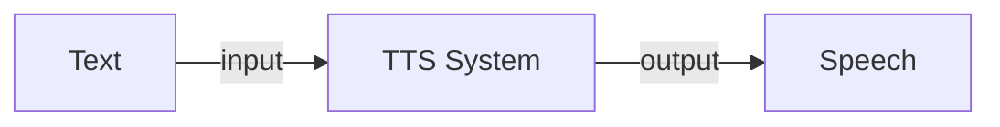

## Introduction

- Text to Speech (TTS) is the process of generating synthesized speech for a given text input. The output is a computer generated audio that sounds and feels like spoken by a human. 
- While the field of speech synthesis is quite old, the accuracy has always been limited. Recently with introduction of neural network based approaches, there has been improvements on multiple fronts like adding languages, ascent and even making the audio seems more like human with necessary pauses and fillers!

<figure markdown> 
    { width="500" }
    <figcaption>*man typing on a typewriter that is connected to a loudspeaker; a steampunk painting (Created by DallE)*</figcaption>
</figure>

## Code

- There are lot of open source python package for TTS like [Coqui TTS](https://github.com/coqui-ai/TTS), [Mozilla TTS](https://github.com/mozilla/TTS), [ESPNet](https://github.com/espnet/espnet), [PaddleSpeech](https://github.com/PaddlePaddle/PaddleSpeech), etc.
- For this tutorial, let's use Coqui TTS as it is one of the simplest package in terms of usability. In fact you just need to install the package with `pip install TTS` and then run the server with `tts-server`, and thats it! It will run a http dashboard on the localhost woth default model and vocoder like shown below, 

<figure markdown> 
    { width="500" }
    <figcaption>Coqui TTS server dashboard</figcaption>
</figure>

- You can check out other models and vocoder available in the package with `tts-server --list_models`. Note, not all models and vocoder pairs are comparable. On top of this, Coqui TTS also provides the option to train and finetune the models further!
## Additional Materials

- [Speech synthesis: A review of the best text to speech architectures with Deep Learning](https://theaisummer.com/text-to-speech/)