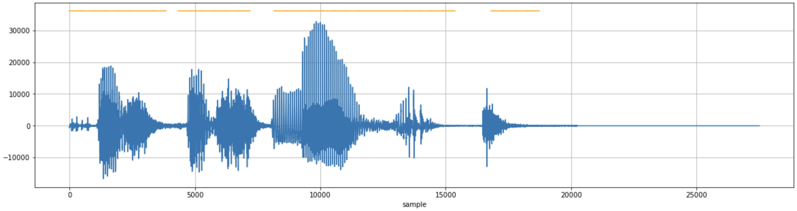

## Introduction

- 🗣 Voice activity detection (VAD) is the process of identifying the chunks or parts of an audio stream that contains certain "voiced activities".
- There could be different types of activity detection modules depending on the type of voice we want to identify. It could be human voice (in a conversation) or animal voice (in forest) or something else entirely!  

<figure markdown> 
    { width="500" }
    <figcaption>a drawing of head of human, dog and cat speaking something *Created using DallE*</figcaption>
</figure>

## Steps in VAD

- The complete VAD process can be broken down to two simple steps, 
  - `Step 1:` we start with dividing the audio into multiple chunks of small sizes. Usually these chunks are quite small like `10ms`, `20ms` or `30ms`. 
  - `Step 2:` we have a classifier or detector, that takes the chunk as input and predicts if the chunk has voice or not. The classifier could be a simple logic based algorithm or even neural network models. It depends on the acceptable tradeoff between accuracy and speed. 

## Code

### Py-WebRTC VAD

- For practice, we will use [Py-WebRTC VAD](https://github.com/wiseman/py-webrtcvad) package that is a port to the WebRTC project by Google. It provides sufficiently good accuracy with lightening speed! ⚡️ The complete code is shown below, 

``` python linenums="1"
# Python 3.8 on Macbook Pro M1 2020
# import
import struct 
import librosa # librosa==0.9.1
import webrtcvad # webrtcvad==2.0.10

# load data
file_path = 'hello_my_name_is_mohit.wav'

# load wav file (librosa)
y, sr = librosa.load(file_path, sr=16000)
# convert the file to int if it is in float (Py-WebRTC requirement)
if y.dtype.kind == 'f':
    # convert to int16
    y = np.array([ int(s*32768) for s in y])
    # bound
    y[y > 32767] = 32767
    y[y < -32768] = -32768

# create raw sample in bit
raw_samples = struct.pack("%dh" % len(y), *y)

# define webrtcvad VAD
vad = webrtcvad.Vad(3) # set aggressiveness from 0 to 3
window_duration = 0.03 # duration in seconds
samples_per_window = int(window_duration * sr + 0.5)
bytes_per_sample = 2 # for int16

# Start classifying chunks of samples
# var to hold segment wise report
segments = []
# iterate over the audio samples
for i, start in enumerate(np.arange(0, len(y), samples_per_window)):
    stop = min(start + samples_per_window, len(y))
    loc_raw_sample = raw_samples[start * bytes_per_sample: stop * bytes_per_sample]
    try:
        is_speech = vad.is_speech(loc_raw_sample, 
                              sample_rate = sr)
        segments.append(dict(
                start = start,
                stop = stop,
                is_speech = is_speech))
    except Exception as e:
        print(f"Failed for step {i}, reason: {e}")

# import pandas as pd
# pd.DataFrame(segments) # result of classification
```

- Let's go through the code,
  - `Line 3-5`: we import the required packages. Make sure to install them using `pip` before starting. In case you are facing some issue, please install the specificed python and package versions *(mentioned in the code)*.
  - `Line 7- 18`: we read a sample wav file *(use your own :smile:)* and then transform the bit depth of the audio into `int16`. One point to note here is that `webrtcvad` only works for `sample rate = 16000` and `bit depth = int16`. And `librosa` loads an audio file in float. Because of all this requirement we need to perform the transformations.
  - `Line 21`: we transform the numpy array *(format in which an audio file is loaded in `librosa`)* to byte string. This will be required for chunking and VAD analysis.
  - `Line 24-27`: we initialize an instance of `webrtcvad` with aggressiveness parameter. Note, the range is form 0 to 3, and higher the value, the more strict VAD is in classification chunks as voice. This means, you can miss some relevant voice chunks for higher aggressiveness and on the other hand get some false positives with lower aggressiveness.
  - `Line 31-45`: the code to first create chunks of the audio and then perform VAD classification at `line 37-38`. The final results is stored in `segments` variable and a sample output is shown below, 

    | start | stop | is_speech |
    |-----:|----------:|------|
    |    0 |       480 | True |
    |  480 |       960 | True |
    |  960 |      1440 | False |
    | 1440 |      1920 | False |
    | 1920 |      2400 | False |

    Here, each row denotes one chunk. The `start` and `stop` columns contain the begin and end details of each chunk. Finally the `is_speech` column contains `True` or `False` value depedening on if the chunk was detected as voice chunk or not.

- Here is the code's output visualized in form of waveform with vice chunks highlighted.

<figure markdown> 
    
    <figcaption>Waveform of audio with `webrtcvad` detected voice chunks highlighted with yellow line on top. The aggressiveness parameter value was 0, hence lot's of false positive *(chunks with no voice)* are detected as well.</figcaption>
</figure>

<figure markdown> 
    
    <figcaption>Same as above, but with aggressiveness parameter value set to 3. Hence the detection is quite strict *(some voice parts are missed)*.</figcaption>
</figure>

### Silero-VAD

!!! Hint
    Personal experience - Silerio-VAD is much more efficient and accurate than Py-WebRTC VAD. It is highly recommended even for production systems.

- [Silero-VAD](https://github.com/snakers4/silero-vad) is another voice activity detection model that stands out for its stellar accuracy and speed. The model can process an audio chunk of over 30 milliseconds in less than 1 millisecond on a single CPU thread. This performance can be further enhanced through batching or GPU usage, with ONNX potentially offering a 4-5 times speed increase under certain conditions. Additionally, Silero VAD's lightweight nature is evident in its JIT model, which is approximately one megabyte in size, making it highly efficient and easy to integrate into various applications.

- Beyond its technical prowess, Silero VAD is notable for its general applicability and flexibility. It was trained on a vast corpus covering over 100 languages, enabling it to perform effectively across a range of audio types, from different domains to various background noise and quality levels. The model supports 8000 Hz and 16000 Hz sampling rates, accommodating different audio quality requirements. Furthermore, while it was trained on 30 ms chunks, it can handle longer chunks directly, and possibly even shorter ones. Its high portability is another advantage, benefiting from the robust ecosystems of PyTorch and ONNX, and it can run wherever these frameworks are available. Finally, Silero VAD is published under the permissive MIT license. Now, let's try it out ([Refer](https://colab.research.google.com/github/snakers4/silero-vad/blob/master/silero-vad.ipynb#scrollTo=pSifus5IilRp))

``` python linenums="1"
# import 
import torch

# load the silerio vad model
model, utils = torch.hub.load(repo_or_dir='snakers4/silero-vad',
                              model='silero_vad',
                              force_reload=True,
                              onnx=False) # perform `pip install -q onnxruntime` and set this to True, if you want to use ONNX
# get the helper functions out of util
(get_speech_timestamps,
 save_audio,
 read_audio,
 VADIterator,
 collect_chunks) = utils

# Option 1: Process complete audio
wav = read_audio('example.wav', sampling_rate=SAMPLING_RATE)
speech_timestamps = get_speech_timestamps(wav, model, sampling_rate=SAMPLING_RATE)
# Output: [{'end': 31200, 'start': 1568},
#  {'end': 73696, 'start': 42528}, ..]

# Option 2: Run on small chunks
for chunk in chunk_list:
    speech_prob = model(chunk, SAMPLING_RATE).item()
    print(speech_prob)
    ## Output: 0.06508486717939377 
    ## If the probability is more than a threshold, then it is speech.
    ## The threshold is an hyperparameter and can be experimented for each use case. Default value of 0.5 can be used here.
model.reset_states() # reset state after every audio
```

!!! Warning
    For consistent results, use `model.reset_states()` after every audio chunk. [Refer here](https://github.com/snakers4/silero-vad/discussions/358) for more details.