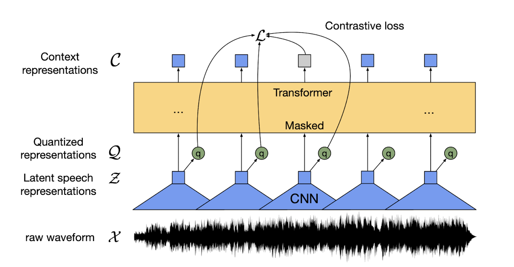

## Introduction

- [Wav2Vec](https://arxiv.org/abs/2006.11477) is a framework for [self-supervised](../machine_learning/introduction.md#self-supervised-learning) learning of representations from raw audio data. Basically it learns to efficiently represent the raw audio data as a vector space encoding.

<figure markdown> 
    { width="500" }
    <figcaption>Illustration of the Wav2vec2 framework ([Wav2vec2 paper](https://arxiv.org/abs/2006.11477))</figcaption>
</figure>

- A major advantage of this approach is that we end up training a generic audio model that could be used for multiple downtream tasks! And because of the self-supervised learning, we don't need access to huge amount of labeled data. In the paper, after pre-training on unlabeled speech, the model is fine-tuned on small labeled data with a [Connectionist Temporal Classification (CTC)](../audio_intelligence/connectionist_temporal_classification.md) loss for [speech recognition task](../audio_intelligence/stt.md).

## Architecture

- The complete architecture of the framework can be divided into 3 components, they are
  - **Feature encoder**: This is the encoder part of the model. It takes the raw audio data as input and outputs feature vectors. Input size is limited to 400 samples which is 20ms for 16kHz sample rate. The raw audio is first standardized to have zero mean and unit variance. Then it is passed to 1D [convolutional neural network](https://stanford.edu/~shervine/teaching/cs-230/cheatsheet-convolutional-neural-networks) (temporal convolution) followed by layer normalization and GELU activation function. There could be 7 such convolution blocks with constant channel size (512), decreasing kernel width (10, 3x4, 2x2) and stride (5, 2x6). The output is list of feature vectors each with 512 dimensions.
  - **Transformers**: The output of the feature encoder is passed on to a transformer layer. One differentiator is use of relative positional embedding by using convolution layers, rather than using fixed positional encoding as done in original Transformers paper. The block size differs, as 12 transformers block with model dimension of 768 is used in BASE model but 24 blocks with 1024 dimension in LARGE version. 
  - **Quantization module**: For self-supervised learning, we need to work with discrete outputs. For this, there is a quantization module that converts the continous vector output to discrete representations, and on top of it, it automatically learns the discrete speech units. This is done by maintaining multiple codebooks/groups (320 in size) and the units are sampled from each codebook are later concatenated *(320x320=102400 possiblt speech units)*. The sampling is done using Gumbel-Softmax which is like argmax but differentiable. 

## Training

- To pre-train the model, Wav2Vec2 masks certain portions of time steps in the feature encoder which is similar to masked language model. The aim is to teach the model to predict the correct quantized latent audio representation in a set of distractors for each time step.
- The overall training objective is to minimize contrastive loss ($L_m$) and diversity loss ($L_d$) in $L = L_m + \alpha L_d$. Contrastive loss is the performance on the self-supervised task. Diversity loss is designed to increase the use of the complete quantized codebook representations, and not only a select subset.
- For pretraining, the datasets used were (1) Librispeech corpus with 960 hours of audio data, (2) LibriVox 60k hours of audio data that was later subset to 53.2k hours. Only unlabeled data was used for pretraining.
- To make the model more robust to different tasks, we can finetune the model on a different task specific modifications and dataset. Here, the paper finetuned for ASR by adding a randomly initialized classification layer on top on Transformer layer with class size equal to the size of vocab. The model is optimized by minimizing the CTC loss. 
- Adam was used as optimization algorithm and the learning rate is warmed up till 10% of the training duration, then kept constant for next 40% and finally linearly decayed for the remaining duration. Also, for the first 60k updates only output classifier was trained after which Transformer is also updated. The feature encoder is kept frozen (not trained at all).


## Results

- There are two interesting points to note from the results of the Wav2Vec2 model,
  - The model is able to learn ASR with as minimum as 10 mins of labeled data! As shown below, $LARGE$ model pre-trained on LV-60k and finetuned on Librispeech with CTC loss is giving 4.6/7.9 WER! This is a very good news incase you want to finetune the model for your domain or accent!
  - The choice of decoder can lead to improvement in performance. As obvious from the results, Transformer decoder is giving best performance, followed by n-gram and then CTC decoding. But also note that the CTC decoding will gives the best inference speed. The suggested decoder could be 4-gram, as it provides huge improvement in performance by fixing the spellling mistakes and grammer issues of CTC and is still faster than Transformer decoders.


<figure markdown> 
    { width="500" }
    <figcaption>WER on Librispeech dev/test data ([Wav2vec2 paper](https://arxiv.org/abs/2006.11477))</figcaption>
</figure>

## Code

### Offline transcription using Wav2Vec2 (CTC)

- Here is the code to perform offline transcription using Wav2Vec2 model with `transformer` package. Note the default decoder is CTC.

``` python linenums="1"
# import 
import torch
import librosa
from transformers import Wav2Vec2ForCTC, Wav2Vec2Tokenizer

# load the tokenizer and model
tokenizer = Wav2Vec2Tokenizer.from_pretrained("facebook/wav2vec2-large-960h")
model = Wav2Vec2ForCTC.from_pretrained("facebook/wav2vec2-large-960h")

# load the audio data (use your own wav file here!)
input_audio, sr = librosa.load('my_wav_file.wav', sr=16000)

# tokenize
input_values = tokenizer(input_audio, return_tensors="pt", padding="longest").input_values

# retrieve logits
logits = model(input_values).logits

# take argmax and decode
predicted_ids = torch.argmax(logits, dim=-1)
transcription = tokenizer.batch_decode(predicted_ids)

# print the output
print(transcription)
```

### Offline transcription using Wav2Vec2 (N-gram)

- We can also use n-gram language model as decoder using a pre-trained model available in Huggingface. The usage is very similar to the CTC model, we just have to change the model name. Note, this downloads the Wav2Vec2 model plus the N-gram language model which will be around 3.2 GBs!

``` python linenums="1"
# install dependencies
!pip install pyctcdecode pypi-kenlm
# import
import librosa
from transformers import Wav2Vec2ProcessorWithLM, Wav2Vec2ForCTC

# load the processor
processor = Wav2Vec2ProcessorWithLM.from_pretrained("patrickvonplaten/wav2vec2-base-100h-with-lm")
model = Wav2Vec2ForCTC.from_pretrained("facebook/wav2vec2-large-960h")

# load the audio data (use your own wav file here!)
input_audio, sr = librosa.load('my_wav_file.wav', sr=16000)

# tokenize
input_values = processor(input_audio, return_tensors="pt", padding="longest").input_values

# retrieve logits
logits = model(input_values).logits

# decode using n-gram
transcription = processor.batch_decode(logits.detach().numpy()).text

# print the output
print(transcription)
```

### Creating your own N-gram language model for Word2Vec2 

- To use n-gram model we can [KenLM](https://github.com/kpu/kenlm) to create language model and then use [pyctcdecode](https://github.com/kensho-technologies/pyctcdecode) for decoding. This part is referenced from [Huggingface blog on Wav2vec2 with n-gram](https://huggingface.co/blog/wav2vec2-with-ngram). The steps are as follows, 
  - First, we will select one text dataset. This dataset can be the transcript of train data *(part of labeled data we used to finetune Wav2Vec2 model)* or a related *(same domain like medical, telecom, etc)* collection of documents. 
  - Next we can perform data cleaning like removing special characters and then combine the individual sentences to a free flow text and save that into text file. After this we can run KenLM to create a language model. 

    ``` shell
    kenlm/build/bin/lmplz -o 3 <"text.txt" > "3-gram.arpa"
    ```

  - The `.arpa` file contains the n-gram language model that is ready to go with just two minor modifications. As per the [Huggingface blog](https://huggingface.co/blog/wav2vec2-with-ngram), we need to add `</s>` end of sentence token as 1 gram as well, so we open the arpa file, duplicate the existing `<s>` start of sentence token, and just replace the `<s>` with `</s>`. Next we also increment the count of 1-gram *(present at the top of the `.arpa` file)* by 1, because of what we just did. Then we save the file. 

  - Next, we load the a LM-less model and then we can use the `pyctcdecode`.

``` python linenums="1"
# Taken from Blog @ https://huggingface.co/blog/wav2vec2-with-ngram
# import packages
from transformers import AutoProcessor
from pyctcdecode import build_ctcdecoder
from transformers import Wav2Vec2ProcessorWithLM

# load a LM-less model
processor = AutoProcessor.from_pretrained("hf-test/xls-r-300m-sv")

# get the vocabulary of the tokenizer
vocab_dict = processor.tokenizer.get_vocab()
sorted_vocab_dict = {k.lower(): v for k, v in sorted(vocab_dict.items(), key=lambda item: item[1])}

# build the decoder
decoder = build_ctcdecoder(
    labels=list(sorted_vocab_dict.keys()),
    kenlm_model_path="3-gram.arpa",
)

# create a processor with the decoder
processor_with_lm = Wav2Vec2ProcessorWithLM(
    feature_extractor=processor.feature_extractor,
    tokenizer=processor.tokenizer,
    decoder=decoder
)

# now the processor can be used for inference as shown in other above code sections.
```

- We can even reduce the size of the LM-model by converting it to a binary file.

``` shell
kenlm/build/bin/build_binary 3-gram.arpa 3-gram.bin
```

### Online transcription using Wav2Vec2

- For live transcription using Wav2Vec2, we can utilize [wav2vec2-live](https://github.com/oliverguhr/wav2vec2-live) package. 
- Once you have cloned the repo and installed the packages from `requirements.txt`, the live transcription can be started with *(taken from the package readme and modified)*, 

``` python linenums="1"
# import
from live_asr import LiveWav2Vec2

# load model
english_model = "facebook/wav2vec2-large-960h-lv60-self"
asr = LiveWav2Vec2(english_model,device_name="default")

# start the live ASR
asr.start()

try:        
    while True:
        text,sample_length,inference_time = asr.get_last_text()                        
        print(f"Duration: {sample_length:.3f}s\tSpeed: {inference_time:.3f}s\t{text}")
        
except KeyboardInterrupt:   
    asr.stop()  
```

- This starts the Live ASR on your terminal. The code listen to the audio in your microphone, identifies the chunks with voice using VAD and then pass the voiced chunks to Wave2Vec2 for transcription. One sample output is shown below, 

``` shell 
listening to your voice

Duration: 0.780s	Speed: 0.205s	hello
Duration: 0.780s	Speed: 0.190s	hello
Duration: 0.960s	Speed: 0.223s	my name
....
```


## Additional Materials

- [An Illustrated Tour of Wav2vec 2.0 by Jonathan Bgn](https://jonathanbgn.com/2021/09/30/illustrated-wav2vec-2.html)
- [Boosting Wav2Vec2 with n-grams in 🤗 Transformers](https://huggingface.co/blog/wav2vec2-with-ngram)