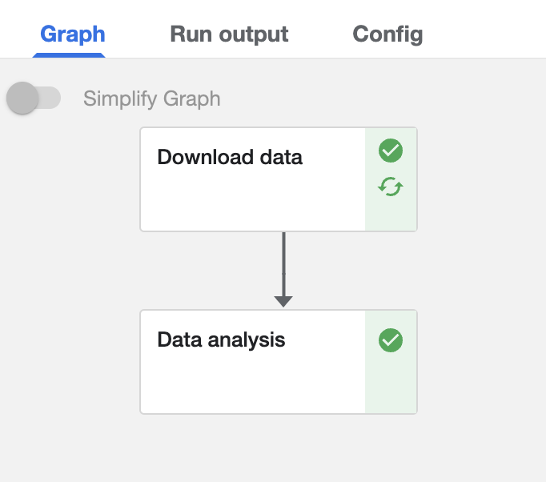

# Compute and AI Services

- Gone are the days when we needed to buy high end devices to do literally anything. Currently there are plethora of services available online *(and many of them are free!)* that provide not only compute to use as you feel, but also generic AI services. 

- Let's look into some of the famous and widely used compute and AI services.

## CaaS: Compute as a Service

In this section we will cover some of the famous *(and with some hint of free)* platforms that provide compute-as-a-service (CaaS). These CaaS sometimes could be plain simple virtual machines, sometime they can be a cluster of nodes, while in other cases they can also be jupyter like coding environment. Let's go through some of the examples.

### Google Colab

#### Introduction

- Colaboratory or ["Colab"](https://colab.research.google.com/signup) in short, is a browser based jupyter notebook environment that is available for free. It requires no installation and even provides access to free GPU and TPU. 
- The main disadvantages of Colab is that you cannot run long-running jobs (limit to max 12 hrs), GPU is subject to availability and in case of consistent usage of Colab, it might take longer to get GPU access.
- Google provides Pro and Pro+ options which are paid subscriptions to Colab (10$ and 50$ per month, respectively). While it provides longer background execution time and better compute (among others), they do not guarantee GPU and TPU access all the time. Remember, Colab is not an alternative to a full-blown cloud computing environment. It's just a place to test out some ideas quickly.

#### Google Colab Snippets

##### Run tensorboard to visualize embeddings

- Taken from: [how-to-use-tensorboard-embedding-projector](https://stackoverflow.com/questions/40849116/how-to-use-tensorboard-embedding-projector)

``` python linenums="1"
import numpy as np
import tensorflow as tf
import tensorboard as tb
tf.io.gfile = tb.compat.tensorflow_stub.io.gfile
from torch.utils.tensorboard import SummaryWriter

vectors = np.array([[0,0,1], [0,1,0], [1,0,0], [1,1,1]])
metadata = ['001', '010', '100', '111']  # labels
writer = SummaryWriter()
writer.add_embedding(vectors, metadata)
writer.close()

%load_ext tensorboard
%tensorboard --logdir=runs
```

##### Connect with Google Drive and access files

- This code will prompt you to provide authorization to access your Google Drive.

``` python linenums="1"
from google.colab import drive
drive.mount('/content/drive')
```

### Kaggle

- Apart from being famous for hosting big AI/ML competitions, the next cool thing about the site is that it also provides free GPU/TPU computes! All you have to do is to sign up, create a new notebook and then you can start using it - import their datasets or your own, and start training you AI models!
- All of this ofcourse has a limit, you get minimum 30 hours of GPU usage per week, and at max 20 hours of TPU per week. Another catch is that you can only use GPU/TPU for 9 hours continuously.
- That said, Kaggle notebooks are a great place to perform your personal experiments or participate in new competitons to enhance your expertise. For more official work (industry or academics), do remember that you are putting your dataset in 3rd party's hands.

<figure markdown> 
        
        <figcaption>Code/Notebook page of [Kaggle](https://www.kaggle.com/code).</figcaption>
        </figure>


### DeepNote

- DeepNote provides a highly customised jupyter like notebook. It's one of the richest service in terms of features. Here goes some examples - you can create projects with multiple notebooks, you can create teams and collaborate with your colleagues live, you can quickly visualize datasets from notebooks, you can schedule notebooks, you can host reports, and best of all - they have free tier :smile:  

- There are multiple pricing based tiers. To begin with you can try out the free tier and get upto 750 hours of Standard compute hours per month, that's like keeping one project (that could consist of multiple notebooks) open for the complete month! (*offer subject to change; was valid at the time of writing*)

<figure markdown> 
        
        <figcaption>Pricing tiers of [Deepnote](https://deepnote.com).</figcaption>
        </figure>


!!! hint
    Planning to try DeepNote out? Use the [refer link](https://deepnote.com/referral?token=5a501a4e) to get free 20 Pro compute hours (thats upto 16GB RAM and v4vCPU)

## MLaaS: Machine Learning as a Service

In this section we will cover some of the famous platforms that provide Machine learning-as-a-Service (MLaaS). These MLaaS take care of infrastructure related aspect of data holding, data preparing, model training and model deployment. On top of this, they provide a repository of classical ML algorithms that can be leveraged to create data science solutions. The idea is to make data science as a plug and play solution creation activity, as they take care of most of the engineering aspect. Let's go through some of the examples.

### AWS Sagemaker (Amazon)

- [AWS Sagemaker](https://aws.amazon.com/sagemaker/) is a cloud-based servies that helps data scientists with the complete lifecycle of data science project.
- They have specialised tools that cover following stages of data science projects, 
  - **Prepare**: It's the pre-processing step of the project. Some of the important services are "*Gound Truth*" that is used for data labeling/annotation and "*Feature Store*" that is used to provide consistence data transformation across teams and services like training and deployment.
  - **Build**: It's where an Data Scientists spends most of his time coding. "*Studio Notebooks*" provides jupyter notebooks that can be used to perform quick ideation check and build the model.
  - **Train & Tune**: It's where you can efficiently train and debug your models. "*Automatic Model Training*" can be used for hyper-parameter tuning of the model i.e. finding the best parameters that provides highest accuracy. "*Experiments*" can be used to run and track multiple experiments, its an absolute must if your projects requires multiple runs to find the best architecture or parameters. 
  - **Deploy & Manage**: The final stage, where you deploy your model for the rest of the world to use. "*One-Click Deployment*" can be used to efficiently deploy your model to the cloud. "*Model Monitor*" can be used to manage your model, like deleting, updating, and so on.
 
<figure markdown> 
        
        <figcaption>Services provided by [AWS Sagemaker](https://aws.amazon.com/sagemaker/).</figcaption>
        </figure>

- AWS charges a premium for providing all of these features under a single umbrella. For a more detailed pricing information, you can estimate the cost using [this](https://aws.amazon.com/sagemaker/pricing/).

!!! hint
    As AWS Sagemaker is a costly affair, several DS teams try to find workarounds. Some of them are like using spot instances for training as they are cheaper & using AWS Lambda for deploying small models. 

<!-- ### Azure ML Services (Microsoft)

Coming soon!

### Google AI Platform

Coming soon! -->

### Kubeflow

#### Introduction

- [Kubeflow](https://www.kubeflow.org/) is an open-source project that is dedicated to making development, tracking and deployments of machine learning (ML) workflows on Kubernetes simple, portable and scalable. As per their website, *"Anywhere you are running Kubernetes, you should be able to run Kubeflow."*
- While there are many **paid** MLaaS like [Sagemaker](https://aws.amazon.com/sagemaker/), [Azure ML Services](https://azure.microsoft.com/en-in/services/machine-learning/) and [Google AI Platform](https://cloud.google.com/vertex-ai), Kubeflow is an outlier that provides most of the features present in the paid platforms, but for free!
- We can deploy Kubeflow on Kubernetes by following the [guide on their website](https://www.kubeflow.org/docs/started/installing-kubeflow/). Once done, you can boot it up and it should look as shown below, 

<figure markdown> 
        
        <figcaption>Main page of [Kubeflow](https://www.kubeflow.org/).</figcaption>
        </figure>

!!! Hint
    Go with Kubeflow if you are setting up a new AI team for your organziation or school, and don't want to commit to costly services like Sagemaker. But beware, it does require DevOps knowledge, as you will need to setup Kubernetes and manage it. While it is completly free, you will be charged for the compute you utilize. To cut down the cost, in case you are connecting Kubeflow with AWS, you can use Spot instances. 

#### Components

- Kubeflow provides several individual components that will help with the ML lifecycle. Note, we can even pick and choose the components you want while installation. Some of them are, 
  - **Notebook:** here we can create jupyter notebook servers and perform quick experimentations. Each server is assigned its own volume (hard memory). On booting up a server, a new compute is procured and you will see [Jupyter Lab](https://jupyter.org/) page where you can create mulitple notebooks, scripts or terminals. The compute could be EC2 instance or Spot instance, incase of AWS connection and based on your configuration.
  - **Pipeline:** here we define one ML project. Kubeflow supports defining a pipeline in terms of a DAG (Directed Acyclic Graph), where each individual function or module is one node. Pipeline represents a graph of modules, where execution happens in a sequential or parallel manner while considering the inter-module dependencies , ex: `module_2` requires output of `module_1`. While this leads to modularization of the code, the real intention is to make the pipeline execution traceable and independent from each other. This is achieved by containerizing each module and running them on different instances, making the process truly independent.  
  - **Experiments:** On a single ML project, we may want to run multiple experiments, ex: (1) `test_accuracy` to try out a couple of parameters and compare accuracy, (2) `test_performance` to compare latency on different shape and size of data. This is where you define individual experiments.
  - **Runs:** One execution of an experiment for a pipeline is captured here, ex: for `test_accuracy` experiment of MNIST pipeline, perform one run with `learning_rate = 0.001`.
  - **Experiments (AutoML):** we cannot try all the parameters for the `test_accuracy` one by one. The obvious question, why not automate it by doing hyperparameter tuning? AutoML is what you are looking for!
  - **Models:** after all experimentations and model training, we would like to host/deploy the model. It can done using this component.

#### Creating and running Pipeline

- Let's start the coding :smile:. So for this tutorial, we will create a simple Kubeflow pipeline with two steps, 
  - **Step 1 - Download data:** where we will download data from S3 bucket, pass the downloaded data to the next step for further analysis. 
  - **Step 2 - Perform analysis:** we will perform some rudimentary analysis on the data and log the metrics. 
- We will try to go through some basic and advanced scenarios, so that you can refer the code to create your own pipeline, even if it is completely different. After creating the pipeline, we will register it, create an experiment and then execute a run.

- Lets start with importing the relevant packages. Make sure to install `kfp` with the latest version by using `pip install kfp --upgrade`

``` python linenums="1"
# imports
import kfp
import kfp.dsl as dsl
from typing import NamedTuple
import kfp.components as comp
from kfp.components import InputPath, OutputPath
```

- Now we will create the first module that downloads data from S3 bucket. Note, Kubeflow takes care of the logistics of data availability between modules, but we need to share the path where data is downloaded. This is done by typecasing parameter with `OutputPath(str)` as done on `line 2`. The process will be similar for ML models as well. We can download a model in the first module and perform training in another, and perform performance check in the third module. 

``` python linenums="1"
## Step 1
def download_data(data_path: OutputPath(str)):
    # import the functions
    import os
    import boto3
    
    # create the path if not exist
    if not os.path.exists(data_path):
        os.makedirs(data_path)
        
    # setup boto3
    s3 = boto3.resource('s3')
    s3_client = boto3.client('s3')
    bucket_name = 'my-bucket'
    bucket = s3.Bucket(bucket_name)
    
    # get list of all files at the s3 bucket prefix
    prefix = "dataset/"
    query = s3_client.list_objects(Bucket=bucket_name, Prefix=prefix, Delimiter='/')
    files = []
    if 'Contents' in query:
        for obj in query['Contents']: 
            files.append(obj['Key'])
            
    # download each file into the folder
    for file_path in files:
        # get file name
        file_name = file_path.split('/')[-1]
        # download and save the file
        s3_client.download_file(bucket_name, 
                        file_path, 
                        f'{data_path}/{file_name}')
        print(f"Downloaded: '{file_path}' into '{data_path}/{file_name}'")
        
    # done!
    return print("Done")

# download_data()
# create kubeflow component
download_data_comp = kfp.components.create_component_from_func(
    func=download_data,
    base_image='python:3.7',
    packages_to_install=['boto3'])
```

- From `line 40` to `line 43`, we are converting the function to Kubeflow pipeline component. As the component will run on an independent instance, we need to provide the `base_image` and `packages_to_install` information as well. 

- Next, we will create the second module that loads the data from first module and just returns some dummy metrics. In reality, you can do a lot of things like data preprocessing or data transformation or EDA. For now, we will just stick with a dummy example.

``` python linenums="1"
## Step 2
from typing import NamedTuple
def data_analysis(data_path: InputPath(str)) -> NamedTuple('Outputs', [
  ('mlpipeline_metrics', 'Metrics'),
]):
    # import
    import json
    from glob import glob
    from collections import namedtuple
    
    # load each json file
    for file_path in glob(f"{data_path}/*.json"):
        # load the call data file and perform some analysis
        data = json.load(open(file_path))
        # print
        print(f"Loaded {file_path}")
        # --- do something fancy here ---
        
    # create metrics that should be logged
    metrics = {'metrics': [
        {
        'name': 'accuracy',
        'numberValue': 89
        },
        {
        'name': 'f1',
        'numberValue': 89
        }]}

    return [json.dumps(metrics)]
    
# create kubeflow component
data_analysis_comp = kfp.components.create_component_from_func(
    func=data_analysis,
    base_image='python:3.7',
    packages_to_install=[])
```

- In the function we are defining the `data_path` as `InputPath(str)` and is later used directly on `line 14`, without the need of manually sharing the data across instances. 

- We define `mlpipeline_metrics` as output *(by type casing)* as this is mandatory if you want to log metrics. This is done on `line 21` to `line 29`, where we log dummy `accuracy` and `f1` metrics. Next we return the metrics. Finally, we also create Kubeflow component.

- Next, we will combine all of the components together to create the pipeline.

``` python linenums="1"
## Create pipeline
from kubernetes.client.models import (V1Affinity, 
                                      V1NodeAffinity, 
                                      V1NodeSelector, 
                                      V1NodeSelectorTerm, 
                                      V1NodeSelectorRequirement)

# define pipeline
@dsl.pipeline(name="my_pipeline", 
              description="A simple demo of kubeflow pipeline")

# Define parameters to be fed into pipeline
def my_pipeline(data_path='data/'):
    # Step 1
    download_data_container = download_data_comp()
    # Step 2
    data_analysis_container = data_analysis_comp(download_data_container.output)
    
    # add affinity
    aff = V1Affinity(node_affinity=V1NodeAffinity(
        required_during_scheduling_ignored_during_execution=V1NodeSelector( 
            node_selector_terms=[V1NodeSelectorTerm( 
                match_expressions=[V1NodeSelectorRequirement(
                    key="xxxx", 
                    operator="In",
                    values=['yyy'])])]))
    )
    
    download_data_container.add_affinity(aff)
    data_analysis_container.add_affinity(aff)

# create client that would enable communication with the Pipelines API server 
client = kfp.Client()
experiment_name = 'my_pipeline'
# Compile pipeline to generate compressed YAML definition of the pipeline.
kfp.compiler.Compiler().compile(my_pipeline,  
  '{}.zip'.format(experiment_name))
```

- We start with importing relevant modules and creating the pipeline function where we define the name and description of the pipeline. Next we connect the components together. 
- From `line 20` to `line 30`, we are defining and setting the node wide affinity so that we only use spot instances for the computation. This will keep our cost to the minimum. 
- Finally we create a Kubeflow client and compile the complete pipeline. This will create a zip file of the compiled pipeline that we can upload from the pipeline tab in Kubeflow. 
- Next, we can create an experiment and the perform a run from the respective Kubeflow tabs. The process is quite simple and can be easily done from the UI. Once we have executed a run and the process is completed, we can see the individual modules and the status in the run page as shown below. 

<figure markdown> 
        { width="500" }
        <figcaption>Run page after successful execution of a run of `my_pipeline` pipeline</figcaption>
        </figure>

- And we have done it :sunglasses: