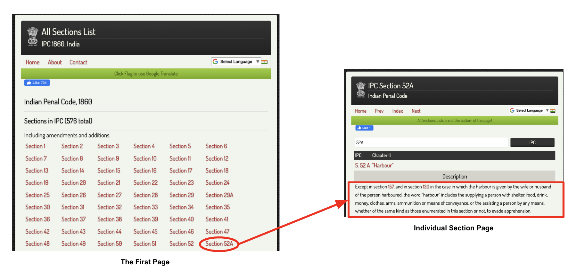
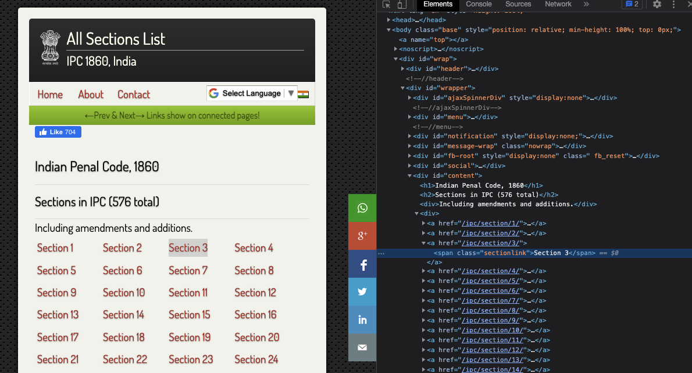
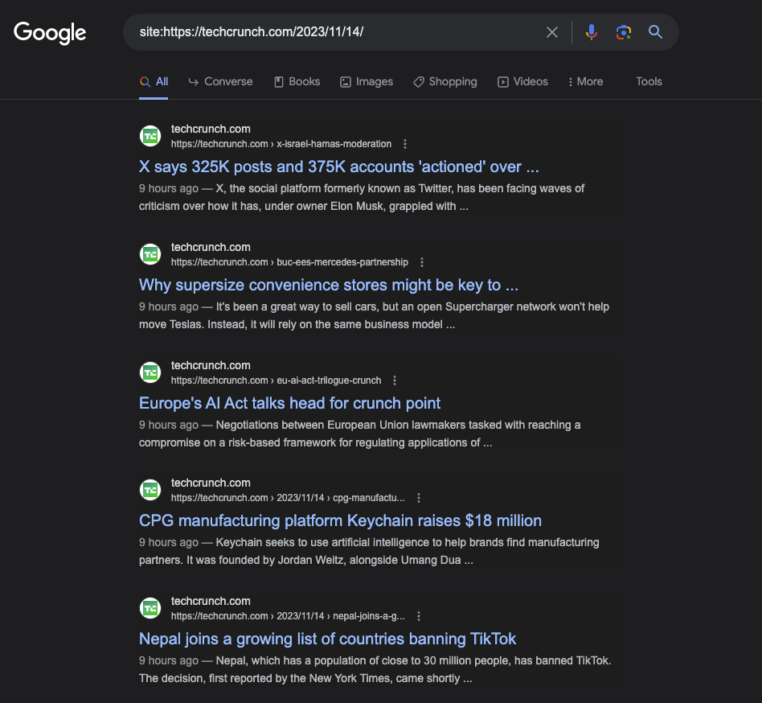

# Scraping Websites

## Introduction 

- Scraping is the process of traversing and collecting data from the web pages. People scrape websites for many reasons -- to get information about companies or fetch latest news or get stock prices informations or just create a dataset for the next big AI model :sunglasses: 
- In this article, we will be focusing on two different techniques to scrape website. 
  - For static website, we can use [Scrapy](https://docs.scrapy.org). As an example, we will scrape data from the [Devgan](http://devgan.in/all_sections_ipc.php) website that hosts details of difference sections in [Indian Penal Code](https://en.wikipedia.org/wiki/Indian_Penal_Code) (IPC). [[Github Code]](https://github.com/imohitmayank/ipc_semantic_search/tree/main/devganscrap)
  - For dynamic website, we can use [Selenium](https://selenium-python.readthedocs.io/getting-started.html) in combination with [BeautifulSoup4](https://pypi.org/project/beautifulsoup4/) (BS4). As an example, we will scrape data from Google search results. In short, Selenium is an open-source tool for browser automation and it will be used to automate the process of opening the browser and loading the website *(as dynamic websites populates the data once the website is completely loaded)*. For extracting the data from the website, we will use BS4.

!!! Warning
    This article is purely for educational purpose. I would highly recommend considering website's Terms of Service (ToS) or getting website owner's permission before scraping. 

## Static Website scrape using Scrapy

### Understanding the website

- Before we even start scraping, we need to understand the structure of the website. This is very important, as we want to (1) get an idea of what we want to scrapeand (2) where those data are located.

<figure markdown> 
    
    <figcaption>The flow of scraping section descriptions from Devgan website</figcaption>
</figure>

- Our goal is to scrapethe description for each section in IPC. As per the website flow above, the complete process can be divided into two parts, 
  - First, we need to traverse to the main page and extract the link of each sections.
  - Next, we need to traverse to each individual section page and extract the description details present there.


### Data extraction methods

- Now, let's also look into different methods exposed by Scrapy to extract data from the web pages. The basic idea is that scrapy downloads the web page source code in HTML and parse it using different parsers. For this, we can either use `XPaths` or `CSS` selectors. The choice is purely up to us.
- We can begin with the main page and try to find the link of each section. For this, you can open inspect option from your browser by right clicking on any of the sections and select `inspect`. This should show you the source code. Next, try to find the position of the tag where each section is defined. Refer the image below, and you can see that each section is within `<a>` tag inside the `<div id="content">` tag. The `href` component will give you the link of the section and the `<span>` tag inside gives the section name. 
  
<figure markdown> 
    
    <figcaption>Inspecting the source code of the first relevant page in Devgan website</figcaption>
</figure>

- To try out the extraction, we can utilize the interpreter functionality of Scapy. For that just activate your Scrapy VM and type `scrapy shell '{website-link}'`, here it will be `scrapy shell http://devgan.in/all_sections_ipc.php`. This opens a playground where we can play around with `response` variable to experiment with different extraction queries.
- To extract the individual sections we can use `CSS` query - `response.css('div#content').css('a')`. Note, here we define the `{tag_type}#{id}` as the first CSS query and then use another `CSS` query - `a`. This will give us a list of all the `<a>` tags inside the `<div id="content">` tag.
- Now from within section, to extract the title, we can use `CSS` query - `section.css('span.sectionlink::text').extract()`. For this to work, you should save the last query as `section` variable.
- Similar approach can be applied to extract the description from the next page. Just re-run the shell with one of the section's link and try out building `CSS` query. Once you have all the queries ready, we can move on to the main coding part :peace:

!!! Note
    You can refer the [Scrapy official doc](https://docs.scrapy.org/en/latest/intro/tutorial.html#extracting-data) for more details on creating `CSS` or `XPath` queries. 


### Setup Scrapy project

- First, let us install the Scapy package using pip. It can be easily done by running the following command in the terminal: `pip install scrapy`. Do make sure to create your own virtual environment (VE), activate it and then install the package in that environment. For confusion regarding VE, refer my [snippets](http://mohitmayank.com/a_lazy_data_science_guide/python/python_snippets/#conda-cheat-sheet) on the same topic. 
- Next, let us setup the Scrapy project. Go to your directory of choice and run the command `scrapy startproject tutorial`. This will create a project with folder structure as shown below. We can ignore most of the files created here, our main focus will be on the `spiders/` directory.

``` shell
tutorial/
    scrapy.cfg            # deploy configuration file
    tutorial/             # project's Python module, you'll import your code from here
        __init__.py
        items.py          # project items definition file
        middlewares.py    # project middlewares file
        pipelines.py      # project pipelines file
        settings.py       # project settings file
        spiders/          # a directory where you'll later put your spiders
            __init__.py
``` 

!!! Note
    The above folder structure is taken from the [Scrapy Official Tutorial](https://docs.scrapy.org/en/latest/intro/tutorial.html#)


### Create your Spider

- Usually we create one spider to scrapeone website. For this example we will do exactly the same for Devgan website. So let's create a spider `spiders/devgan.py`. The code is shown below, 

``` python linenums="1"
# import
import scrapy

# function
class DevganSpider(scrapy.Spider):
    name = "devgan"
    allowed_domains = ["devgan.in"]

    def start_requests(self):
        urls = [
            'http://devgan.in/all_sections_ipc.php',
        ]
        for url in urls:
            yield scrapy.Request(url=url, callback=self.parse_mainpage)

    def parse_mainpage(self, response):
        # identify the links to the individual section pages
        sections = response.css('div#content').css('a')#.getall()
        # for each section
        for section in sections:
            # loc var
            loc = {
                'title' : section.xpath('@title').extract(),
                'link' : 'http://devgan.in' + section.xpath('@href').extract()[0],
                'section': section.css('span.sectionlink::text').extract(),
            }
            # traverse again and extract the description
            yield scrapy.Request(loc['link'], callback=self.parse_section, 
                    cb_kwargs=dict(meta=loc))

    def parse_section(self, response, meta):
        # extract the description
        meta['description'] = " ".join(response.css('tr.mys-desc').css('::text').extract())
        # return
        return meta
```

- Now lets us try to understand the code line by line, 
  - `Line 2:` Importing the `scrapy` package.
  - `Line 5:` Defining the spider class that inherits the `scrapy.Spider` class.
  - `Line 6-7:` We define the name of the spider and allow the spider to crawl the domain `devgan.in`.
  - `Line 9-14:` We define the `start_requests` method. This method is called when the spider is executed. It calls the scraping function for each url to scrap, it is done using `scrapy.Request` function call. For each url, the scraping function set within `callback` parameter is called. 
  - `Line 16:` We define the scraping function `parse_mainpage` for the main page. Note, this function receives `response` as an argument, that contains the source code from the server for the main page url. 
  - `Line 18-29:` We start with identifying the links to the individual section pages, store them in `sections`, and call the scraping function `parse_section` for each section. Before that, we also extract the title, link and section name from the main page using the queries we created before. One point to remember, this particular example is little complex as we want to traverse further inside into the section pages. For this, we again call the `scrapy.Request` for the individual section links. Finally, we want to pass the data collected form this page to the section page, as we will consolidate all data for individual section there and return it. For this, we use `cb_kwargs` parameter to pass the meta data to the next function. 
  - `Line 31-35:` We extract the description from the section page using the `CSS` query. We add description detail to the metadata and return the complete data that is to be persisted.


### Executing the spider

- To run the spider, traverse to the root directory and execure the following command, `scrapy crawl devgan -O sections_details.csv -t csv`. Here, `devgan` is the name of the spider we created earlier, `-O` is used to set the output file name as `sections_details.csv`. `-t` is used to define the output format as `csv`. This will create the csv file with all details of the sections as separate columns as shown below *(only 2 rows)*

| title            | link       | section   | description                                       |
|------------------|------------|-----------|---------------------------------------------------|
| IPC Section 1... | http://... | Section 1 | This Act shall be called the Indian Penal Code... |
| IPC Section 2... | http://... | Section 2 | Every person shall be liable to punishment un.... |

And that's it! Cheers! :smile:

## Dynamic Website scrape using Selenium and BS4

### Understanding the website

- Well, everyone knows and has used Google atleast once in their life. Nevertheless, for an example, if we want to find all of the latest news from TechCrunch, this is how the google search will look like.

<figure markdown> 
    
    <figcaption>Google search result shows the news for the 14th of Nov, 2023</figcaption>
</figure>

- On looking at the page source of the above screen, you will only see javascript code that does not contain any data as shown above. This is because Google is a dynamic website which is event-driven and created with server-side languages. Because of this, we cannot use Scrapy alone as it cannot run Javascript, what we we need is a browser to run the code. That's where Selenium and BS4 comes in.

### Selenium and BS4 Automation

- We will code a generic function to automate the process of opening Chrome browser, loading the website and extracting the data from the website. To run it for our example of TechCrunch, we just need to change the input param. 

!!! Note
    Before starting make sure to install the Selenium package and drivers as [explained here](https://selenium-python.readthedocs.io/getting-started.html).

``` python linenums="1"
from selenium import webdriver
from selenium.webdriver.chrome.service import Service
from selenium.webdriver.chrome.options import Options
from bs4 import BeautifulSoup
import csv
import time

# Set up the Selenium driver (make sure you have the Chrome WebDriver installed)
options = Options()
options.add_argument("--window-size=1920,1200")
driver = webdriver.Chrome(options=options)

# Function to scrape Google using Selenium and BeautifulSoup
def scrape_google(search_query, num_pages, start_page=0):
    results = []
    for page in range(0, num_pages):
        start = (page * 10) + start_page * 10
        url = f"https://www.google.com/search?q={search_query}&start={start}"
        driver.get(url)
        time.sleep(2)  # Sleep to ensure all scripts are loaded properly

        # loading and processing the page source in BS4
        soup = BeautifulSoup(driver.page_source, 'html.parser')
        search_items = soup.find_all('div', class_='g')

        # iterate over all items (search results)
        for item in search_items:
            title = item.find('h3')
            link = item.find('a', href=True)
            description = item.get_text().split(' › ')[2]
            if title and link:
                results.append({
                    'title': title.get_text(),
                    'link': link['href'],
                    'description': description if description else ""
                })
            save_results_to_csv(results, f'google_search_results_{page}.csv')

    driver.quit()
    return results

# Save results to CSV
def save_results_to_csv(results, filename):
    with open(filename, 'w', newline='', encoding='utf-8') as csvfile:
        fieldnames = ['title', 'link', 'description']
        writer = csv.DictWriter(csvfile, fieldnames=fieldnames)
        writer.writeheader()
        for result in results:
            writer.writerow(result)

# Use the function to scrape and save results
search_results = scrape_google("site:https://techcrunch.com/2023/11/14/", 10)
```

Let's understand the code in detail, 

- `Line 1-6`: Importing the required packages.
- `Line 8-11`: Initializes the Chrome WebDriver with the specified options.
- `Line 14-40`: Defines a function to scrape Google. It takes a search query, the number of pages to scrape, and an optional starting page. Inside the function, we iterate over the number of pages specified, constructing a URL for each page of Google search results based on the query and the current page. The WebDriver is used to navigate to the URL. Then, we use BS4 to parse the page source and extracts the title, link, and description of each search result and appends it to the `results` list. At each iteration, we save the result to a CSV. Finally, we close the driver and return the `results`.
- `Line 42-49`: Defines `save_results_to_csv` function to save the scraped results to a CSV file. It uses Python's `csv` module to write the title, link, and description of each search result to a CSV file.
- `Line 52`: We call the `scrape_google` function to scrape first 10 pages of Google search results for the specified query.

And we are done! :wave: