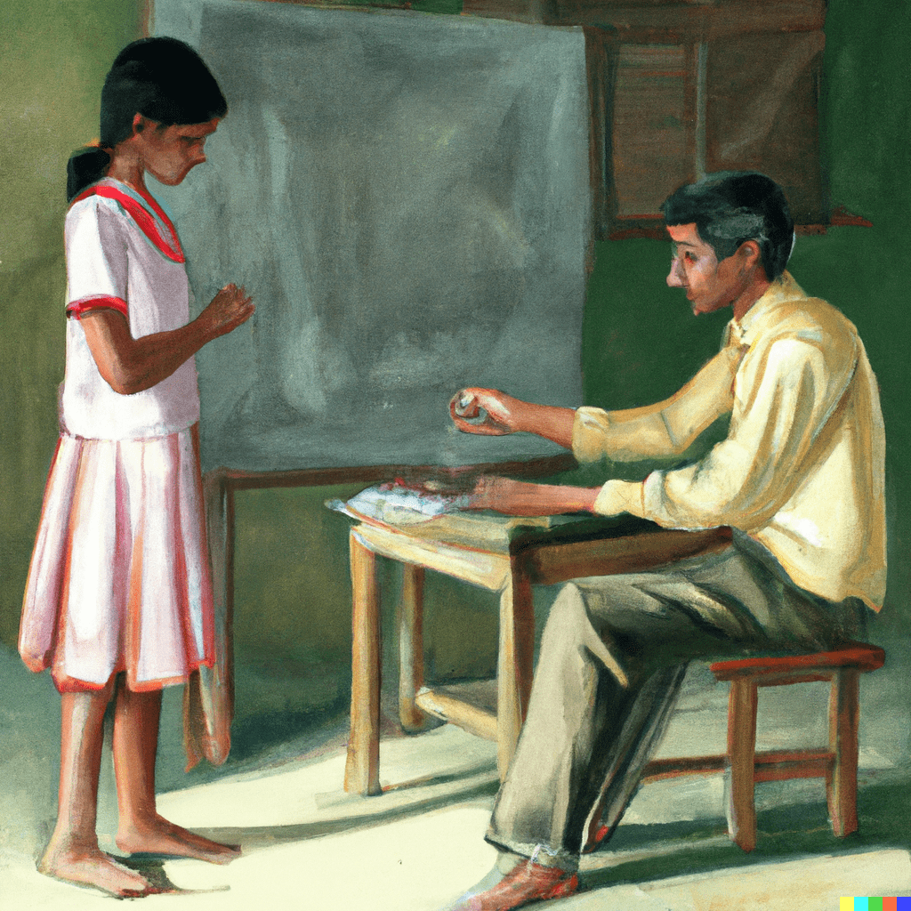
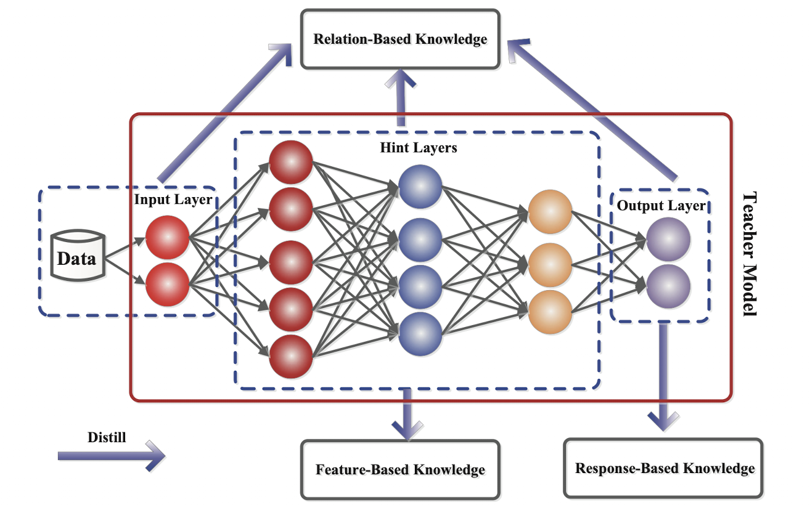

## Introduction

- Deep Learning models provide enhanced accuracy for majority of tasks, but they compromise with speed. This is highly relevant for industrial use case, where somtimes hundreds and thousands of inferences needs to be made in short amount of time. In face we have two problems, (1) high inference time, (2) lots of inference request in short amount of time. 
- From engineering perspective, to solve the first issue we can,
  - **Use more powerful compute:** just use newer and faster machine! 😎 
  - **Use GPU or TPU compute:** use GPU computes to enhance Deep learning models performance due to faster matrix juggling by GPUs.
- For the second issue, we could explore a couple of solutions such as,
  - **Multi Threading**: if your system performs some I/O calls or DB calls or 3rd party API polling, multi threading could be the way to improve inference speed. Basically, while one thread is busy perfoming asyncronous task, another task can take over and start running. 
  - **Multi Processing**: we can utilize multiple cores of a compute to create multiple processes, each working independently of each other. Note, it is memory (or GPU) consuming task, as if you create 4 workers (4 processes), OS will create 4 copies of your model! For a 1GB model, 4GB will be consumed just to keep the system up and running.
  - **Multi Instances**: if you are using K8, just create multiple nodes of the code. It's like creating multiple copies of the code and running them independently on different computes. Note, this is cost consuming task, as each new replication needs a new compute which will increase the cost.
- All of the above proposed solutions have one major flaw -- it will cost you money 💰 and that too on a recurrent basis if you plan to keep the model running for months. On top of it, all of these are not "Data Scientist" way of solving tacking the problem 😊 Can we do something more scientific? 🤔 
- Enter model compression techniques, where the intuition is to enhance the speed of the inference (or training) once and forever, with minimal compromise on the accuracy!

## Types of Model compression

- At a high level, there are following types of model compression. We will go through them one by one.
  - **Knowledge Distillation**: in these methods, we distil the learned information (or knowledge) from one neural network model (mainly larger) to another (smaller)
  - **Parameter Pruning and Sharing**: in these methods, we remove the non-essential parameters from a neural network with minimal to no effect on the overall performance. 

## Knowledge Distillation

<figure markdown> 
    { width="500" }
    <figcaption>Teacher teaching a student. *Source: DallE*</figcaption>
</figure>

- The main idea in knowledge distillation (KD) is to make a smaller model (student model) mimic the larger model (teacher model). This could lead to student model having competitive or sometimes even superior performance than teacher model.
- For example consider this use case -- suppose you have a medium sized (>300MBs) model that is quite accurate (>80%) but slow (700-800ms per inference on CPU). While we can apply any of the above solution, it will not be cost effective. With KD if we can distil the model's knowledge to a much smaller one (say, 40-50MBs) with minimum compromise on accuracy (>78%) we can greatly reduce the inference time (2x to 3x) and make the complete solution scalable. 

| Metric | Teacher Model | Student Model |
| ------ | ------ | ----- |
| Size class | Medium | Small |
| Size | >300MBs | 40-50MBs |
| Accuracy | >80% | >78% |
| Inference time | 800ms | ~300ms |

!!! Note
    Remember there will most probably be a compromise between speed and accuracy. As you decrease the size of model (by model compression techniques) the accuracy will also drop. The science here is to make sure that decrease is not too drastic. And this relationship must be kept in mind before making the choice to do KD. For example, in certain use case related to medical domain accuracy is of upmost importance and developers should be aware of the risks.

- To better understand the different ways of performing KD, we should understand two things - (1) knowledge (2) distillation schemes. Let's understand them one by one.

### Types of Knowledge

- To distil knowledge, we should first define knowledge or different sources of knowledge. In a neural network, what is really a knowledge source (specifically for KD) -- is it the prediction or the parameters learned or activations for one input or maybe multiple inputes?
- Once we know this, we can try to teach student model to mimic that behavior of the teacher model. Based on this intuition we can further categorize knowledge.

<figure markdown> 
    
    <figcaption>Different types of knowledge in Deep eteacher network. *[1]*</figcaption>
</figure>

#### Response Based Knowledge

- Here, we directly mimic the final prediction of the teacher model. For example, for a cat vs dog model, we can teach the student model the final prediction made by the teacher for each input image.
- To be more exact, the final predictions could be of multiple types - logits, soft targets or hard targets ([refer terms](deep_learning_terms.md#logits-soft-and-hard-targets) for details). In short, logits are the model output, soft targets are the probabilities, and hard targets are the classes. It is user's choice to pick type of response to use for training, but usually soft targets are preferred, as they contain more information than hard target and not not too specific or architecture dependent as logits. 
- So we first predict the responses of student and teacher model on a sample, then compute the distillation loss on the difference between the soft targets values generated by both.

$$LR(p(zt,T),p(zs,T))$$

#### Feature Based Knowledge

- Here, instead of the repsonse, we directly match the feature activations of the teacher and student model.

$$LF=Φt(ft(x)),Φs(fs(x))$$

#### Relation Based Knowledge

### Distillation schemas

#### Online Distillation
#### Offline Distillation

## Parameter Pruning [TODO]

## References

[1] [J Gou et al. - Knowledge Distillation: A Survey](https://arxiv.org/abs/2006.05525)