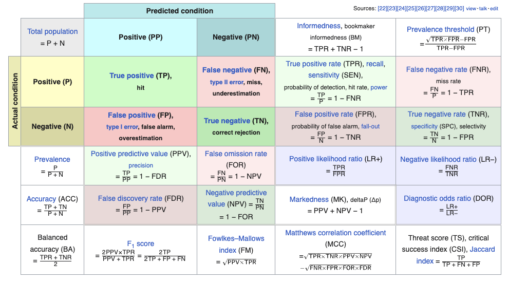

!!! note
    This page is still not complete and new sections might get added later. That said, the existing content is ready to be consumed. 🍔

## Introduction

Classification is a fundamental task in [supervised machine learning](introduction.md#supervised-learning), where the goal is to assign predefined labels or categories to input data points based on their features. Unlike [clustering](clustering.md), which deals with [unsupervised learning](introduction.md#unsupervised-learning) and aims to discover inherent patterns or groupings in data, classification relies on a labeled dataset to learn a model that can make predictions on new, unseen data. The primary objective of classification is to create a decision boundary or model that can accurately differentiate between different classes or categories within the data. Some use cases of classification could be bank loan defaulter prediction, spam email detection, image recognition, medical diagnosis, sentiment analysis, etc.

## Metrics

Classification metrics are used to evaluate the performance of a classification model by comparing its predictions to the actual ground truth labels.  Here are some common classification metrics, 

<figure markdown> 
    
    <figcaption>An extensive view of Confusion Matrix and different metrics. Source: [Wikipedia](https://en.wikipedia.org/wiki/Confusion_matrix)</figcaption>
</figure>

1. **Accuracy**: Accuracy is the most basic classification metric, measuring the ratio of correctly predicted instances to the total number of instances. It provides an overall measure of the model's correctness. However, it may not be suitable for imbalanced datasets, where one class significantly outnumbers the others.

  $${\displaystyle \mathrm {Accuracy} ={\frac {TP+TN}{TP+TN+FP+FN}}}$$

2. **Precision**: Precision is the ratio of true positive predictions to the total number of positive predictions made by the model. High precision indicates that when the model predicts a positive class, it is likely to be correct.

  $${\displaystyle \mathrm {Precision} ={\frac {TP}{TP+FP}}}$$

3. **Recall (Sensitivity or True Positive Rate)**: Recall is the ratio of true positive predictions to the total number of actual positive instances in the dataset. It measures the model's ability to capture all positive instances. High recall means that the model can find most of the positive cases.

  $${\displaystyle \mathrm {Recall} ={\frac {TP}{TP+FN}}}$$

4. **F1-Score**: The F1-Score is the harmonic mean of precision and recall. It balances both metrics and is particularly useful when you need to consider the trade-off between precision and recall. It's a good overall measure of a model's performance. 

  !!! Note
      Please be aware of `average` params in the [Sklearn implementation](https://scikit-learn.org/stable/modules/generated/sklearn.metrics.f1_score.html). Set the param to `macro` in case of imbalanced dataset, as it will compute the score for each class and then perform unweighted average i.e. giving each class equal importance, no matter their frequency. Setting it to `weighted` is similar to `macro`, but now the average will be weighted. Setting to `micro` will lead to computing the numbers for complete data without considering any class.

  $${\displaystyle \mathrm {F1}_{score} ={\frac {2}{\frac {1}{\mathrm {Precision}}+\frac {1}{\mathrm {Recall}}}}}$$

5. **Specificity (True Negative Rate)**: Specificity measures the model's ability to correctly identify negative instances. It is the ratio of true negative predictions to the total number of actual negative instances. It is particularly relevant when false negatives are costly.

  $${\displaystyle \mathrm {Specificity} ={\frac {TN}{TN+FP}}}$$

6. **ROC Curve and AUC**: The Receiver Operating Characteristic (ROC) curve is a graphical representation of the model's performance across different thresholds. The Area Under the ROC Curve (AUC) quantifies the overall performance of the model, with a higher AUC indicating better discrimination between classes.

7. **Confusion Matrix**: A confusion matrix is a table that summarizes the model's predictions compared to the actual labels, breaking down true positives, true negatives, false positives, and false negatives. It provides detailed insights into the model's performance.

<!-- 8. **Matthews Correlation Coefficient (MCC)**: MCC takes into account all four elements of the confusion matrix and produces a balanced measure of classification performance. It is particularly useful when dealing with imbalanced datasets.

9.  **Cohen's Kappa**: Cohen's Kappa measures the agreement between the model's predictions and the actual labels, accounting for the possibility of random chance. It is useful for evaluating inter-rater agreement in cases where the class distribution is imbalanced.

10. **Log Loss (Logarithmic Loss)**: Log Loss measures the accuracy of the predicted probabilities compared to the true probabilities. It is commonly used in probabilistic classification problems, such as binary and multi-class classification.

11. **Precision-Recall Curve**: The Precision-Recall curve visualizes the trade-off between precision and recall at different classification thresholds. It is especially useful when dealing with imbalanced datasets where one class is rare.

12. **F-beta Score**: The F-beta score is a generalized metric that allows you to adjust the balance between precision and recall by varying the parameter beta. When beta is 1, it is equivalent to the F1-Score.

13. **G-measure**: The G-measure is the geometric mean of precision and recall. It provides a balanced metric similar to the F1-Score but is less influenced by class imbalances. -->

The choice of which metric to use depends on the specific problem, the nature of the dataset, and the business or application requirements. It's essential to consider the context and goals when selecting the appropriate classification metrics for evaluating a machine learning model.

## Classification Algorithms

While there are many classification algorithms, here are some of the most common and widely used ones, 

### Logistic Regression

- Logistic Regression is a widely used classification model that is particularly effective for binary classification problems. It works by modeling the relationship between the input features and the probability of belonging to a particular class. It does this by fitting a logistic curve to the data, which allows it to output probabilities that an instance belongs to a specific class. [Logistic Regression is a linear model](interview_questions.md#even-though-sigmoid-function-is-non-linear-why-is-logistic-regression-considered-a-linear-classifier), which means it assumes a linear relationship between the input features and the log-odds of the class probabilities. It's simple, interpretable, and computationally efficient, making it a good choice for problems with a large number of features.

- The formula for Logistic Regression is shown below,

  $${\displaystyle \mathrm {LogisticRegression_loss}(i) = -(y_i \log(\hat{y_i})+(1-y_i) \log(1-\hat{y_i}))}$$

  where, $y_i$ is the actual class and $\hat{y_i}$ is the predicted class

### Decision Tree

- A Decision Tree is a versatile and interpretable machine learning model used for both classification and regression tasks. It is a tree-like structure where each internal node represents a feature, each branch represents a decision rule based on that feature, and each leaf node represents the predicted outcome or value. Decision Trees are particularly well-suited for tasks where the decision-making process can be represented as a series of logical if-then-else conditions.

- One of the significant advantages of Decision Trees is their transparency and interpretability. The model's decision rules can be easily visualized, understood, and explained to non-technical stakeholders, making it a valuable tool in domains where interpretability is crucial, such as healthcare and finance. However, Decision Trees can be prone to overfitting, especially when they are deep and the dataset is small. To mitigate this issue, techniques like pruning, limiting tree depth, and using ensemble methods like Random Forests or Gradient Boosting Trees are often employed. Decision Trees also provide feature importance scores, helping analysts identify the most critical factors driving the model's predictions, which can inform feature selection and data exploration efforts in a broader context.

<!-- ## K Neighbors Classifier (knn):
The K Neighbors Classifier is a non-parametric and instance-based classification algorithm. It classifies data points based on the majority class among their k-nearest neighbors in the feature space. This method is intuitive and easy to understand, making it a popular choice for both beginners and experts in machine learning. However, the choice of the value of k can significantly impact the model's performance. Smaller values of k result in more flexible models that can capture fine-grained patterns but may be sensitive to noise, while larger values of k yield smoother decision boundaries but may miss local patterns. KNN can work well for both binary and multi-class classification tasks, and its performance depends on the quality of the distance metric used to measure similarity between data points.

## Logistic Regression (lr): 
Logistic Regression is a widely used classification model that models the probability of a binary or multi-class outcome. It is a linear model that uses a logistic function to transform the linear combination of input features into a probability score. Logistic Regression is particularly useful when the relationship between the features and the target variable is roughly linear. It is interpretable, easy to implement, and can serve as a good baseline model for classification tasks.

## K Neighbors Classifier (knn): 
The K Nearest Neighbors classifier is a non-parametric algorithm that classifies data points based on the majority class of their k-nearest neighbors in the feature space. It's a simple and intuitive method, often used for both binary and multi-class classification tasks. The choice of the 'k' value is crucial, as it impacts the model's sensitivity to noise. A smaller 'k' makes the model more susceptible to noise, while a larger 'k' may lead to oversmoothing. KNN is computationally expensive for large datasets since it requires calculating distances between data points for predictions.

## Naive Bayes (nb): 
Naive Bayes is a probabilistic classification model based on Bayes' theorem with a strong independence assumption between features. It is particularly useful for text classification and spam detection but can be applied to a wide range of problems. Despite its simplicity, Naive Bayes often performs surprisingly well and is computationally efficient. However, the independence assumption may not hold in some real-world scenarios, which can lead to suboptimal results.

## Decision Tree Classifier (dt): 
Decision Tree Classifier is a versatile classification algorithm that recursively splits the dataset into subsets based on the most discriminative feature at each node. It's easy to understand and interpret, making it a valuable tool for explaining model decisions. However, Decision Trees can suffer from overfitting if they are allowed to grow too deep, which can be mitigated using techniques like pruning. Ensemble methods like Random Forest and Gradient Boosting are often used with Decision Trees to improve their performance and reduce overfitting.

## SVM - Linear Kernel (svm): 
Support Vector Machine (SVM) with a linear kernel is a powerful binary classification model that finds the optimal hyperplane that maximizes the margin between classes. SVM is effective in high-dimensional spaces and is especially useful when there is a clear linear separation between classes. It can handle both linear and non-linear classification problems by using different kernel functions. The linear kernel is computationally efficient and a good choice when the data is linearly separable.

## SVM - Radial Kernel (rbfsvm): 
SVM with a radial kernel, also known as the Gaussian kernel, is an extension of the linear SVM that can handle non-linear classification problems by mapping data into a higher-dimensional space. The radial kernel is particularly useful when the decision boundary is complex and not linearly separable in the original feature space. However, it can be computationally expensive and prone to overfitting when not properly regularized.

## Gaussian Process Classifier (gpc): 
Gaussian Process Classifier is a probabilistic model that can be used for binary and multi-class classification tasks. It models the distribution over functions and provides uncertainty estimates for predictions. GPC is particularly useful when dealing with small datasets or when quantifying uncertainty is crucial. However, it can be computationally expensive and may not scale well to large datasets.

## MLP Classifier (mlp): 
The Multi-Layer Perceptron (MLP) Classifier is a type of artificial neural network with multiple layers of interconnected neurons. It can be used for both binary and multi-class classification tasks. MLPs are known for their ability to capture complex relationships in the data, but they also require careful tuning of hyperparameters to prevent overfitting. They are computationally intensive and may require substantial amounts of data for training.

## Ridge Classifier (ridge): 
The Ridge Classifier is a linear classification model that applies L2 regularization to the linear coefficients. It helps prevent overfitting and can handle multicollinearity in the feature space. Ridge classifiers are useful when dealing with high-dimensional data or when there is a need to regularize the model to avoid extreme parameter values.

## Random Forest Classifier (rf): 
The Random Forest Classifier is an ensemble method that combines multiple decision trees to improve classification performance. It reduces overfitting by aggregating the predictions of individual trees and can handle both binary and multi-class classification tasks. Random Forests are robust, easy to use, and provide feature importance scores, making them valuable for understanding the importance of different features in a dataset.

## Quadratic Discriminant Analysis (qda): 
Quadratic Discriminant Analysis is a classification model that generalizes Naive Bayes by relaxing the assumption of equal variance-covariance matrices for each class. QDA models the class-conditional densities as quadratic functions, making it more flexible than Naive Bayes. However, it requires more data to estimate the additional parameters accurately.

## Ada Boost Classifier (ada): 
AdaBoost is an ensemble method that combines multiple weak classifiers to create a strong classifier. It assigns more weight to misclassified samples in each iteration, making it focus on the most challenging examples. AdaBoost can adapt to complex decision boundaries and is less prone to overfitting.

## Gradient Boosting Classifier (gbc): 
Gradient Boosting Classifier is another ensemble method that builds an additive model by sequentially adding weak learners to correct the errors of the previous ones. It is known for its high predictive accuracy and is widely used in machine learning competitions. However, it can be computationally expensive and requires careful hyperparameter tuning.

## Linear Discriminant Analysis (lda): 
Linear Discriminant Analysis is a dimensionality reduction technique often used for classification. It finds linear combinations of features that maximize the separation between classes while minimizing within-class variance. LDA is particularly useful when there are multiple classes, and it can be a powerful tool for dimensionality reduction and feature extraction.

## Extra Trees Classifier (et): 
Extra Trees Classifier is an ensemble method similar to Random Forest but with a few differences in how it constructs individual decision trees. It introduces randomness in the selection of features and split thresholds, which can reduce overfitting and computational cost. Extra Trees are known for their robustness and can perform well on a variety of classification tasks.

## Extreme Gradient Boosting (xgboost): 
XGBoost is a highly efficient and scalable implementation of gradient boosting, which can be used for classification tasks. It has become a popular choice in machine learning competitions and real-world applications due to its speed and performance. XGBoost incorporates various regularization techniques and supports custom objective functions, making it versatile and effective.

## Light Gradient Boosting Machine (lightgbm): 
LightGBM is another gradient boosting framework known for its speed and efficiency. It uses a histogram-based approach for building decision trees, which can reduce memory usage and training time. LightGBM is well-suited for large datasets and is widely used in industry for classification tasks.

## CatBoost Classifier (catboost): 
CatBoost is a gradient boosting library specifically designed for categorical feature support. It can automatically handle categorical variables without requiring extensive preprocessing. CatBoost is known for its robustness and is suitable for a wide range of classification tasks, particularly when dealing with categorical data. -->