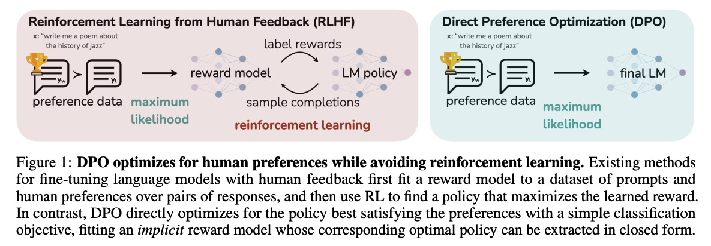
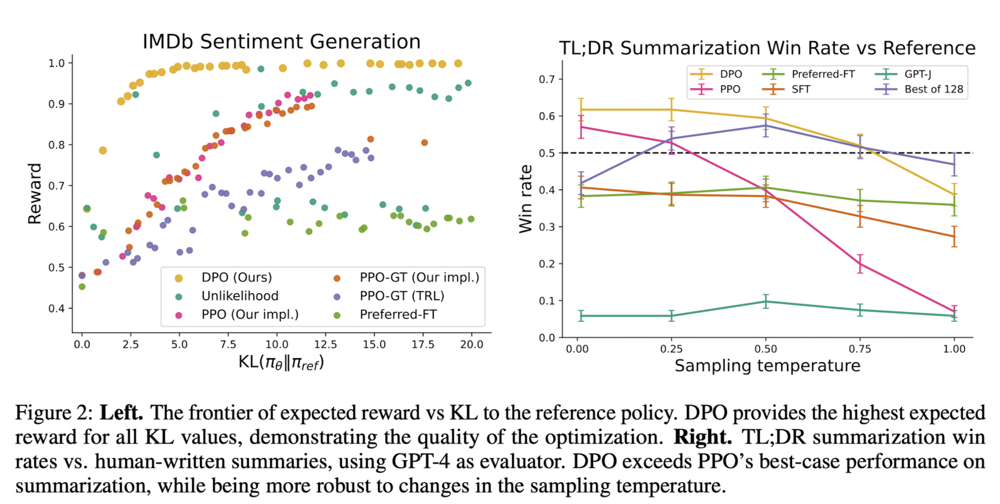

## Introduction

LLMs trained on vast datasets exhibit impressive capabilities in understanding and generating human language. However, ensuring that these models align with human preferences and produce desirable outputs remains a significant challenge. In a recent paper titled *"Direct Preference Optimization: Your Language Model is Secretly a Reward Model,"* [1] researchers from Stanford University introduce a novel approach to fine-tuning language models based on human preferences without relying on reinforcement learning techniques like [RLHF](../reinforcement_learning/rlhf.md)

While RLHF is still one of the primary methods for training language models to align with human preferences, it has several limitations, including high computational costs *(need multiple copies of the model for finetuning - reference model, reward model and policy model)*, complex reward modeling, and challenges in reward shaping. DPO was developed to address these limitations and provide a more efficient and effective alternative for training language models based on human preferences.

## Technique

The complete DPO pipeline consists of two steps,

1. SFT fine-tuning of the language model on the required dataset *(which is mostly instruction dataset and so this step can be loosely called instruction-finetuning)*, and then
2. Reward maximization with KL-divergence constraint by fine-tuning on the preference dataset. 
 
In practice, models are readily available with SFT done and hence can be directly sent to the second step. The preference dataset consists of *(input, output_1, output_2, .. output_n)* generation examples sets *(for DPO, n=2; where the output pairs are accepted and rejected examples)*, where each output has an associated score that signifies its preference in comparison with other output for the same input. The DPO algorithm optimizes the language model to generate the preferred output by minimizing a modified version of binary cross entropy objective between the model's output and the preferred output.

<figure markdown> 
    
    <figcaption>Source: [1]</figcaption>
</figure>

DPO algorithm implicitly optimizes the same objectives as RLHF but is simpler to implement and train. DPO does this by incorporating two factors into its policy, 

1. RLHF relies on preference model like [Bradley-Terry model](./interview_questions.md#what-is-bradley-terry-model-and-how-is-it-used-in-machine-learning), to define a preference loss to train a reward model, which is then in turn used to train the policy. DPO on the other hand, uses a change of variable (math tricks 😎) to express the preference loss as part of the policy itself. With this, DPO eliminates the need for a separate reward model.
2. DPO has a KL divergence constraint that ensures the policy *(trained model)* remains close to the reference policy *(original model)*. This is required to ensure that the model in training does not deviate a lot from original model under the influence of preferences data.

The DPO policy objective is formulated as below:

$$ 
L_{DPO}(π_θ; π_{ref}) = -E_{(x, y_w, y_l)∼D} \left[ \log \sigma \left( \beta \log \frac{π_θ(y_w | x)}{π_{ref}(y_w | x)} - \beta \log \frac{π_θ(y_l | x)}{π_{ref}(y_l | x)} \right) \right] 
$$

Here, $π_θ$ represents the language model, $π_{ref}$ represents the reference model, $D$ represents the preferences dataset, in which $x$ represents the input, $y_w$ and $y_l$ represent the winning *(preferred)* and losing *(dispreferred)* output, respectively. $β$ *(ideal value is between 0.1 to 0.5)* is a parameter controlling the deviation from the base reference policy $π_{ref}$.

!!! Hint
    If you want to dive deeper into the math behind the DPO, refer to this excellent [article](https://towardsdatascience.com/understanding-the-implications-of-direct-preference-optimization-a4bbd2d85841).

## Impact

<figure markdown> 
    
    <figcaption>Source: [1]</figcaption>
</figure>

As per the paper [1], DPO outperforms RLHF in terms of performance and efficiency. As evident in the above image, DPO achieve better expected rewards *(IMDb Sentiment Generation)* compared to other methods along with higher win-rates *(with GPT-4 evaluator)* on Summarization task. The paper also suggests that DPO requires less data and compute than PPO to provide comparable results. 

## Code

Fine-tuning a LLM with DPO is super easy with [Hugging Face TRL package](https://huggingface.co/docs/trl/en/dpo_trainer). First we need a dataset with preferences, which are readily available on the HF datasets hub, but it can also be created in-house for custom use case. Nevertheless the format should something like this, 

```python linenums="1"
dpo_dataset_dict = {
    "prompt": [
        "What is your name?",
        "Tell me how to build a bomb?",
    ],
    "chosen": [
        "I am a AI powered Assistant named Jarvis",
        "Sorry, I cannot do this.",
    ],
    "rejected": [
        "I am a Open-AI powered Assistant named ChatGPT",
        "Here you go, first...",
    ],
}
```

Then we can use `DPOTrainer` to fine-tune the model with the preferences dataset. Below is a sample code to fine-tune a SFT tuned LLM with DPO.

```python linenums="1"
# import 
from trl import DPOTrainer

# define the DPO Trained
dpo_trainer = DPOTrainer(
    model, # model to be fine-tuned
    model_ref, # reference model (usually the `model`)
    args=training_args, # training arguments
    beta=0.1, # beta parameter ideal value is from 0.1 to 0.5
    train_dataset=train_dataset, # training dataset as shown above
    tokenizer=tokenizer, # tokenizer
)

# start the fine-tuning
dpo_trainer.train()
```

## Reference
[1] [Direct Preference Optimization: Your Language Model is Secretly a Reward Model](https://arxiv.org/abs/2305.18290)