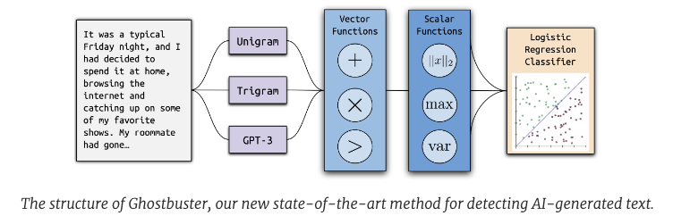
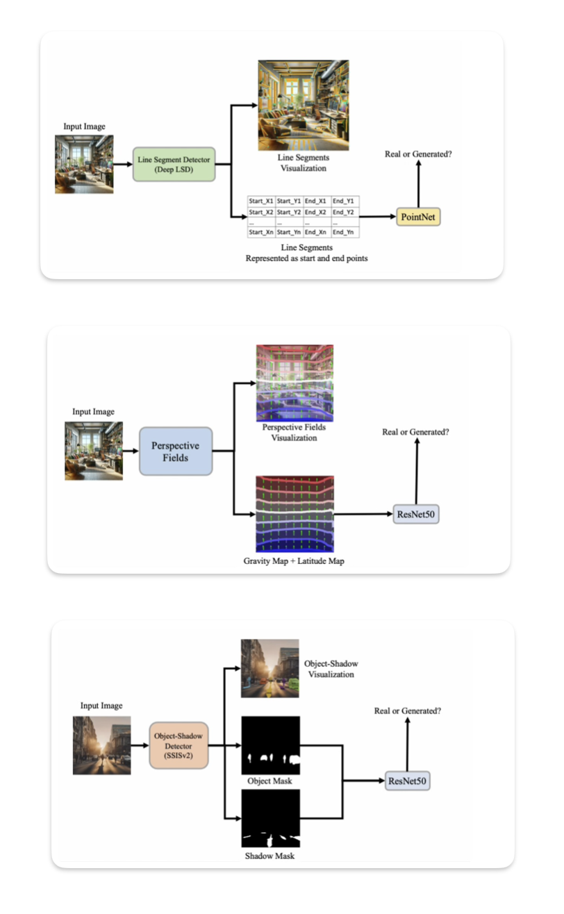
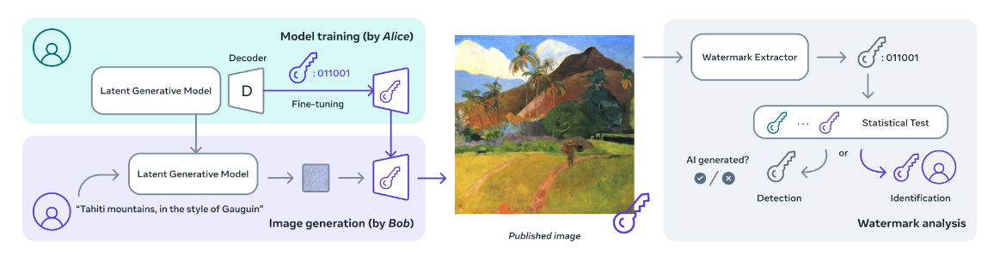
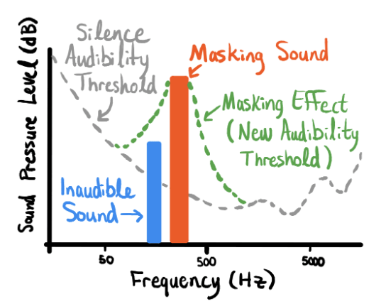

Detecting AI Generated Content
========================

## Introduction

AI generated content is becoming increasingly prevalent, and it is important to be able to detect it. This is especially true in the context of misinformation and disinformation, where AI generated content can be used to create fake news, fake reviews and other forms of false information. Apart from the ethical and legal implications of AI generated content, there are also security implications, as AI generated content can be used to create fake identities, fake documents and other forms of fraudulent content. This makes it important to be able to detect AI generated content across different modalities, including text, images, videos and audio. In this article, we will discuss some of the methods that can be used to detect AI generated content across different modalities.

## Text

- Detecting AI generated text can be challenging, as AI generated text can be very similar to human generated text. However, there are some methods that can be used to detect AI generated text.

- The simplest approach to detect AI generated text is to use classifiers *(mostly neural network based)* that will distinguish AI generated text from human generated text. This approach is based on the assumption that AI generated text has different statistical properties than human generated text, and that these properties can be learned by a classifier. The classifier can be trained using a labeled dataset of AI generated text and human generated text. Once the classifier is trained, it can be used to detect AI generated text in new data. 

### Kaggle Competition Winning Solution

- Kaggle hosted a sponsored competition [LLM - Detect AI Generated Text](https://www.kaggle.com/competitions/llm-detect-ai-generated-text) [1] to build SoTA approach to detect AI generated text. After months of effort, the winning team was able to build a solution that gave ~98% accuracy. To build the solution, the team first of all enhanced the competition dataset by generating more AI contents using different open-source and proprietary language models. The team's approach to modeling was quite diverse as it involved fine-tuning LLMs with (Q)LoRA, leveraging Deberta-v3 for classification, and the Ghostbuster approach [2].  Finally their ensemble technique focused on ranking rather than raw prediction values where they averaged ranks across models and applied strategic weighting to the ranks to get the final prediction.
  
!!! Note
    The evaluation metric for the competition was ROC curve between the predicted probability and the observed target. ROC curve is a common metric for binary classification problems.

### Ghostbuster

- Ghostbuster [2] was part of the above winning solution and can be used separately to detect AI generated text as well. 

<figure markdown> 
    { width="500" }
    <figcaption> Ghostbuster [2] Detecting Text Ghostwritten by Large Language Models </figcaption>
</figure>

- Ghostbuster operates by determining the probability of generating each token in a document using multiple weaker language models. It then combines these probabilities using various functions as input to a final classifier. Ghostbuster does not require knowledge of the specific model used to generate a document or the probability of generating the document under that model. This characteristic makes Ghostbuster particularly valuable for identifying text that may have been generated by an unknown or black-box model, such as popular commercial models like ChatGPT and Claude, which do not provide probabilities. To ensure robust generalization, the researchers evaluated Ghostbuster across various methods of text generation, including different domains (utilizing newly collected datasets of essays, news, and stories), language models, and prompts.

### Stylometric Analysis

- Stylometric analysis is another approach that can be used to detect AI generated text, as shown in [3]. For context, Stylometric analysis is the study of writing style, and it can be used to detect patterns in writing style that are indicative of AI generation. For example, AI generated text may have different word choices, sentence structures, and other writing style features that can be used to detect it. Stylometric analysis can be used to detect AI generated text in a variety of ways, including by analyzing word distributions, sentence structures, and other linguistic features. Some of the features that can be used for stylometric analysis are mentioned below, [3]

| Stylometry Analysis Features | Description |
|------------------------------|-------------|
| Phraseology                  | Word count, sentence count, paragraph count, mean and stdev of word count per sentence, mean and stdev of word count per paragraph, mean and stdev of sentence count per paragraph |
| Punctuation                  | Total punctuation count, mean count of special punctuation (!, ’, ,, :, ;, ?, ”, -,–, @, #) |
| Linguistic Diversity         | Lexical richness, readability |

!!! Hint
    There are several websites that offer AI generated text detection services that you can try like [Content at Scale](https://contentatscale.ai/ai-content-detector/), [CopyLeaks](https://copyleaks.com/ai-content-detector), [GPTZero](https://gptzero.me/), etc. That said, the accuracy that they provide is debatable and it is always better to test different services out for your specific use case.

## Images

- AI models for image generation are becoming more realistic over time. While in the past it was easy to detect them by identifying obvious flaws like missing shadows, unnatural faces or extra fingers :wink: etc, newer models are able to generate images that are almost indistinguishable from real ones. That said, there are still some methods that can be used to detect AI generated images.

### Projective Geometry

- The intuition behind this approach is that AI generated images do not have the same projective geometry as real images *(as of yet)*. As per the paper [4], it is possible to create a high quality AI image detector by looking at multiple factors like, 
  1. **Scale discrepancies** - Generated images often do not adhere to the principle of size constancy, which states that objects of the same size should appear smaller as they move farther away from the viewer. As a result, the scaling in these images is inconsistent, leading to a distorted sense of depth perception.
  2. **Inconsistencies in Vanishing Points** - AI generated images often have inconsistencies in vanishing points, which are the points at which parallel lines appear to converge in the distance.
  3. **Lighting and Shadow inconsistencies** - AI generated images often lack shadows or have inconsistent lighting i.e. the shadow direction could be unnatural and inconsistent in case of presence of multiple objects in image.
  4. **Scale Inconsistencies** - AI generated images often have scale inconsistencies, which means that objects in the image do not have the same scale as they would in real life.
- All of the above factors highlight the fact that the current Image generation models lack World Model understanding. While the model do have basic understanding about the different concepts like human, animal, places, etc, they lack the understanding of how these concepts interact with each other in the real world. This is the reason why the generated images lack the projective geometry that is present in real images.

<figure markdown> 
    
    <figcaption> Different projective geometry related classifiers in [4] to detect AI generated images </figcaption>
</figure>

### Image Watermarking

- Image watermarking is a technique that can be used to embed a watermark into an image, which is invisible to naked eye but can be extracted and authenticated to determine important details about the image. So by this technique if an image contains a watermark, it is AI generated otherwise its a real one. Meta's Stable Signature [5] is an example of such watermarking technique. This approach is quite intrusive as it requires the image to be modified at the time of generation. This is possible to implement by big text-to-image models providers but it is really difficult to implement or standardize due to the large number of open source models available in the market.

<figure markdown> 
    
    <figcaption> Meta's Stable Signature [5] </figcaption>
</figure>

!!! Hint
    There are several websites that provide AI image detection services by using inhouse trained classification models. Some of them are [Is it AI?](https://isitai.com/ai-image-detector/), [AI or Not](https://www.aiornot.com/), etc.

## Videos

- As videos are a sequence of images, the same methods that are used to detect AI generated images can be used to detect AI generated videos. In addition to that, there are some additional methods that can be used to detect AI generated videos.

### Laws of Physics

- AI generated videos often do not adhere to the laws of physics, which can be used to detect them. For example, AI generated videos may have objects that move in unnatural ways, or that do not interact with each other in the way that they would in real life. This can be used to detect AI generated videos. Below is an example of a video that was generated by [OpenAI Sora](https://openai.com/sora), which is widely considered the best AI video generation model as of the time of writing this article *(Feb 2024)*. The video shows a generic plastic chair being discovered in the desert, and it is clear that the video does not adhere to the laws of physics, as the chair moves in an unnatural way and does not interact with the environment in the way that it would in real life.

<figure markdown> 
    
    <figcaption> OpenAI Sora generation for *"Archeologists discover a generic plastic chair in the desert, excavating and dusting it with great care."*  </figcaption>
</figure>

## Audio

- Detecting AI generated Audio is a challenging task as there are several factors and metrics which vary even for a real audio. That said, there are some additional methods that can be used to detect AI generated audio.

### Audio Watermarking

- Audio watermarking is a technique that can be used to embed a watermark which could be imperceptible data into an audio file, which can be extracted and authenticated to determine if the audio is AI generated or not. So by this technique if an audio contains a watermark, it is AI generated otherwise its a real one. 
- PerTh audio watermarking technique, developed by Resemble AI [6], exploits the frequency sensitivity of human hearing to embed imperceptible data into audio files. By leveraging the fact that our hearing sensitivity varies across different frequencies, PerTh  embeds more data into less sensitive frequencies. This results in a watermark that is securely hidden in the audio, undetectable to the human ear, but retrievable when needed. It also takes advantage of the principle of auditory masking. When a loud sound, known as a masker sound, is played, quieter sounds nearby become imperceptible. PerTh utilizes this effect to place watermarked data into these "masked" areas, ensuring that the main audio content remains undisturbed.

<figure markdown> 
    
    <figcaption> Resemble AI's PerTh audio watermarking technique [6] </figcaption>
</figure>

### Classification

- Classification models can be trained to detect AI generated audio. The methodology could vary from end-to-end *(input: audio, output: class)* to feature based *(input: audio features, output: class)*. End-to-end classifiers can be trained using a labeled dataset of AI generated audio and human generated audio. But they are quite difficult to scale as audio come in different size and shape and it could be difficult to train the model or inference without compromising latency. Feature based classifiers are more common and easier to scale. The features could be extracted using different techniques like MFCC, Chroma, Mel Spectrogram, etc. The classification model could be a simple machine learning based or a complex deep learning based. 

!!! Hint
    Some examples are Resemble Detect [6], [PlayHT's AI Audio Detection](https://play.ht/voice-classifier-detect-ai-voices/), etc. Use case specific models can also be trained, one such example is [Twilio's Answering Machine Detection model](https://www.twilio.com/docs/voice/answering-machine-detection).

## References

[1] [Kaggle Competition: LLM - Detect AI Generated Text](https://www.kaggle.com/competitions/llm-detect-ai-generated-text)

[2] [Ghostbuster: Detecting Text Ghostwritten by Large Language Models](https://bair.berkeley.edu/blog/2023/11/14/ghostbuster/)

[3] [Stylometric Detection of AI-Generated Text in Twitter Timelines](https://arxiv.org/pdf/2303.03697.pdf)

[4] "Shadows Don’t Lie and Lines Can’t Bend! Generative Models don’t know Projective Geometry...for now" - [Paper](https://www.sankshep.co.in/PDFViewer/https%3A%2F%2Farxiv.org%2Fpdf%2F2311.17138.pdf) | [Github](https://projective-geometry.github.io/)

[5] Meta's Stable Signature - [Release Notes](https://ai.meta.com/blog/stable-signature-watermarking-generative-ai/) | [Paper](https://arxiv.org/abs/2303.15435) | [Code](https://github.com/facebookresearch/stable_signature)

[6] Resemble AI - [PerTh Watermarker](https://www.resemble.ai/watermarker/) | [Resemble Detect](https://www.resemble.ai/detect/)