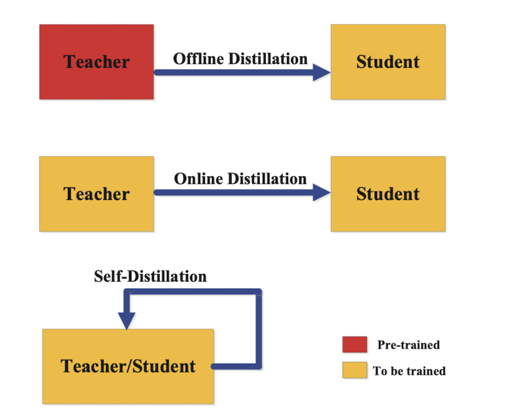
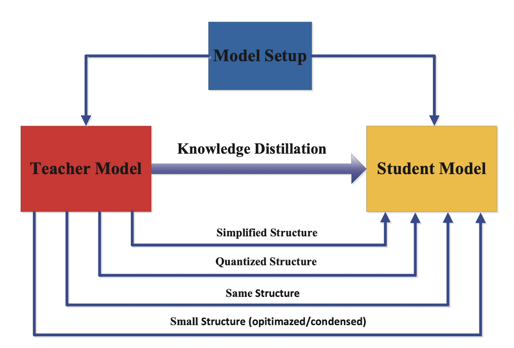
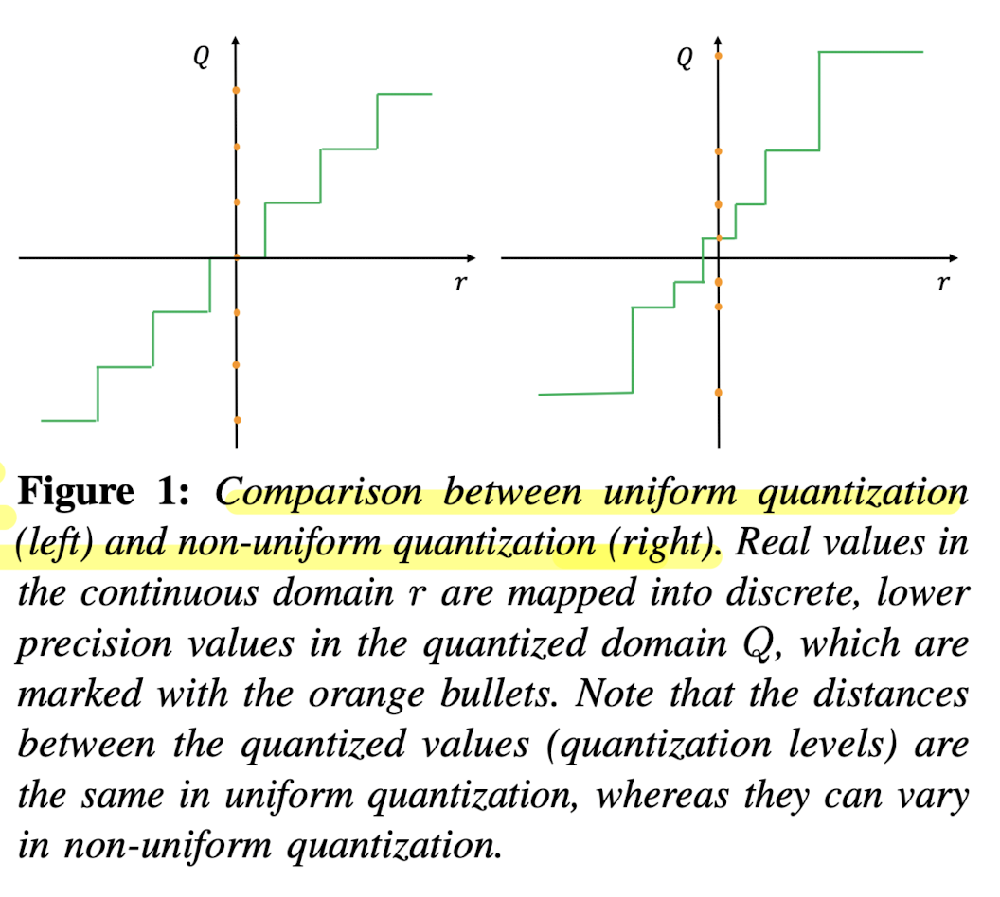
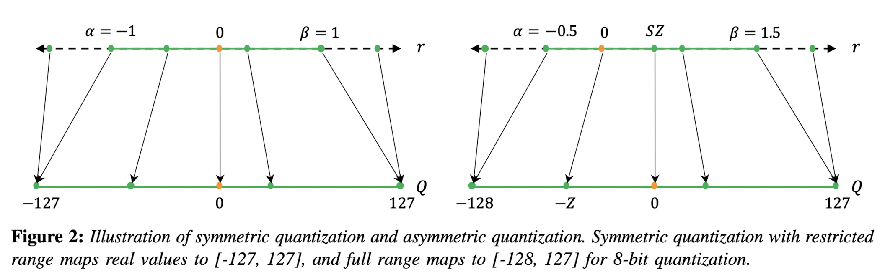
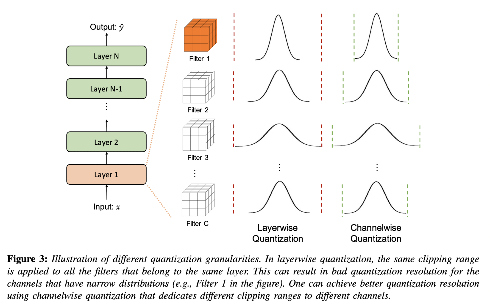

!!! note
    This page is still not complete and new sections might get added later. That said, the existing content is ready to be consumed. 🍔 :wink:
    
## Introduction

- Large Deep Learning models provide high accuracy for majority of tasks, but they compromise with speed. This could be a deal breaker for industrial use case, where sometimes hundreds or thousands of inferences needs to be made in short amount of time. In fact we have two major problems to solve here, and let's take a detour to explore what can be done about them from the AIOps perspective *(i.e. not involving Data Scientists at all)*,

  1. **Slower model** *leading to high inference time*. To solve this issue we can,
    - **Use more powerful compute:** just use newer and faster machine! 😎 
    - **Use GPU or TPU compute:** use GPU computes *(if only using CPU till now)* to enhance Deep learning models performance due to faster matrix juggling by GPUs.
  2. **High demand** *leading to a lots of inference request in short amount of time.* To solve this issue we can,
    - **Multi Threading**: if your system performs some I/O calls or DB calls or 3rd party API polling, multi threading could be the way to improve inference speed. Basically, while one thread is busy perfoming asyncronous task, another task can take over and start running. 
    - **Multi Processing**: we can utilize multiple cores of a compute to create multiple processes, each working independently of each other. 
    !!! Note
        Multi-processing is a memory (or GPU) consuming task. This is because if you create 4 workers (4 processes), OS will create 4 copies of your model! For a 1GB model, 4GB will be consumed just to keep the system up and running.
    - **Multi Instances**: if you are using K8, just create multiple nodes of the code. It's like creating multiple copies of the code and running them independently on different computes. 
    !!! Note
        Multi Instances is a costly task, as each new replication needs a new compute which will increase the overall cost.

- All of the above proposed solutions have one major flaw -- it will cost you money 💰 and that too on a recurrent basis if you plan to keep the model running for months. On top of it, all of these are not the "Data Scientist" way of tacking the problem 😊 Can we do something more scientific? 🤔 
- Enter **model compression** techniques, where the intuition is to reduce the size of the model which will inherently increase the speed of the inference *(or training)*. And do this with minimal compromise on the accuracy!

!!! Note
    Please understand that the main assumption before applying model compression techniques is that to create a good smaller model, it is more optimal *(in terms of either cost, time, data or accuracy)* to utilize an existing good bigger model, rather than training the smaller model from scratch on the same data. 

    From another perspective, people might argue that if they have sufficient compute and data, why not just train a smaller model from scratch? A counter argument could be that for the same data, a bigger model will most likely always provide better accuracy, so using a bigger model to distil a smaller model might induce some additional knowledge from the teacher model or at the least drastically reduce the learning time.

## Types of Model compression

- At a high level, there are following types of model compression. We will go through them one by one.
  - **Knowledge Distillation**: in these methods, we distil the learned information *(or [knowledge](#types-of-knowledge))* from one neural network model *(generally larger)* to another model *(generally smaller)*.
  - **Quantization**: in these methods, we transform the data type used to represent the weights and activations of Neural networks which leads to reduction in memory consumption. 
  - **Parameter Pruning and Sharing**: in these methods, we remove the non-essential parameters from a neural network with minimal to no effect on the overall performance. 

## Knowledge Distillation

<figure markdown> 
    { width="500" }
    <figcaption>Teacher with a student. *Source: DallE*</figcaption>
</figure>

- The main idea in Knowledge Distillation (KD) is to make a smaller model *(student model)* mimic the larger model *(teacher model)*. This could lead to student model having competitive or sometimes even superior performance than teacher model. In generic sense, the distillation process is like this -- first, the teacher model is trained on the training data to learn the task-specific features, and then the student model is trained to mimic the teacher model by paying attention to certain characteristics *(or [knowledge](#types-of-knowledge))* of the teacher model.
<!-- - For example consider this scenario -- suppose you have a medium sized (>300MBs) model that is quite accurate (>80%) but slow (700-800ms per inference on CPU). While we can apply any of the above non-scientific solutions, it will not be cost effective. With KD if we can distil the model's knowledge to a much smaller one (say, ~100MBs) with minimum compromise on accuracy (>78%) we can greatly reduce the inference time (2x to 3x) and make the complete solution scalable. 

    | Metric | Teacher Model | Student Model |
    | ------ | ------ | ----- |
    | Size class | Medium | Small |
    | Size | >300MBs | ~100MBs |
    | Accuracy | >80% | >78% |
    | Inference time | 800ms | ~300ms | -->

!!! Note
    Remember there will always be a compromise between speed and accuracy. As you decrease the size of model *(by model compression techniques)* the accuracy will also drop. The science here is to make sure that decrease in size is drastic whereas that in accuracy is not too drastic. And this relationship must be kept in mind before making the choice to do KD. For example, in certain use case related to medical domain, accuracy is of upmost importance and developers should be aware of the associated risks.

- To better understand the different ways of performing KD, we should first understand two things - (1) knowledge, and (2) distillation schemes. Let's go through them one by one.

### Types of Knowledge

- Before we start to distil knowledge, we should first define and understand what is meant by "knowledge" in context of neural network -- is it the prediction OR the activation parameters OR activations for one input OR maybe multiple inputs? Once we know this, we can try to teach student model to mimic that particular characterisitics of the teacher model. Based on this intuition, let's categorize knowledge and respective distillation techniques.

<figure markdown> 
    
    <figcaption>Different types of knowledge in Deep teacher network. *[1]*</figcaption>
</figure>

#### Response Based Knowledge

- Here, we define the final layer output of the teacher model as the knowledge, so the idea is to train a student model that will mimic the final prediction of the teacher model. For example, for a cat vs dog image classification model, if the teacher model classifies an image as 'Cat', a good student model should also learn from the same classification and vice-versa.
- Now the final predictions could also be of multiple types - logits *(the model output)*, soft targets *(the class probabilities)* or hard targets *(the class enums)* ([refer](interview_questions.md#what-is-the-difference-between-logits-soft-and-hard-targets)). Developers can select any of the prediction types, but **usually soft targets are preferred**, as they contain more information than hard target and are not as specific or architecture dependent as logits.
- Technically, we first predict the responses of student and teacher model on a sample, then compute the distillation loss on the difference between the logits *(or other prediction)* values generated by both. The distillation loss is denoted by $L_R(z_t, z_s)$ where $L_R()$ denotes the divergence loss and $z_t$ and $z_s$ denotes logits of teacher and student models respectively. In case of soft targets, we compute the probability of logits of one class wrt to other classes using softmax function, 

  $$p(z_i,T) = \frac{exp(z_i/T)}{\sum{}_j exp(z_j/T)}$$

  and the distillation loss becomes $L_R(p(z_t,T),p(z_s,T))$ which often employs Kullback-Leibler divergence loss. Note, here $T$ is the [temperature](interview_questions.md#explain-the-concept-of-temperature-in-deep-learning).

- In terms of final loss, researchers also recommend complimenting distillation loss with student loss which could be cross-entropy loss ($L_{CE}(y, p(z_s, T=1))$) between the ground truth label and soft logits of the student model.

#### Feature Based Knowledge

- Here, we define the feature activations *(present in the intermediate layers)* of the teacher model as the knowledge. This is in line with the intuition of [representation learning](interview_questions.md#what-is-representation-learning) or feature learning. Hence, the main idea is to match the feature activations of one or more intermediate layers of the teacher and student model. 
- The distillation loss for feature-based knowledge transfer is given below, where, $f_t(x)$ and $f_s(x)$ are feature map of intermediate layers of teacher and student model respectively. $Φ_t(.)$ and $Φ_s(.)$ are the transformation functions used when the teacher and student model are not of the same shape. Finally, $L_F()$ is the similarity function used to match the feature map of the teacher and student model.

$$L_{F_{ea}D}(f_t(x), f_s(x)) = L_F(Φ_t(f_t(x)),Φ_s(f_s(x)))$$ 

!!! Note
    Easier said than done, there are some open research questions when using feature based knowledge,

    - Which intermediate layers to choose? (i.e. $f_t(x)$ and $f_s(x)$)
    - How to match the feature representation of teacher and student models? (i.e. $L_F()$)

#### Relation Based Knowledge

- Here, we define knowledge as the relationship among different representations for the same data sample or even across different data samples. This representation can again be either from intermediate layer *(feature-based)* or output layer *(response-based)*. The intuition here is that looking across multiple layers or data samples at the same time could highlight some hidden pattern or structure which will be useful for student model to learn. Consider the classical `King - Man + Women = Queen` notation, which when represented as word embedding and visualized in the embedding space showcase directional pattern. The idea here is to learn this pattern rather than individual details of the representation.
- The distillation loss can be expressed as shown below, where $x_i$ is one input sampled from $X^N$, $f_T(.)$ and $s_T(.)$ can be defined as the intermediate or output layer values of the teacher and student model respectively *(wrt to an input)*, $t_i=f_T(x_i)$ and $s_i=f_s(x_i)$, $\psi$ is a relationship potential function *(like a similarity function)* and $l$ is the loss that penalize difference between the teacher and the student.

$$L_{RKD} = \sum_{(x_1, ... , x_n) \epsilon X^N} l(\psi(t_1, ..., t_n), \psi(s_1, ..., s_n))$$

!!! Note
    Response-based and Feature-based approaches are collectively called **Individual Knowledge Distillation** as they transfer knowledge from individual outputs of the teacher to student. This is in contrast with **Relational Knowledge Distillation** which extracts knowledge using relationships between different outputs of the teacher and student models.

### Distillation Schemes

<figure markdown> 
    { width="500" }
    <figcaption>Different distillation schemes. [1]</figcaption>
</figure>

#### Offline Distillation

- This is the classical KD scheme, and as the name suggests, the transfer of knowledge happens in an offline fashion wherein the knowledge is transferred from a pre-trained teacher model to the student model *(one-way only)*. The complete training process has two stages,
  - First, a large teacher model is trained on a big set of training samples before distillation. This process is time and money intensive; and 
  - Second, the teacher model is used to extract the knowledge in the form of logits or the intermediate features, which are then used to guide the training of the student model during distillation.

#### Online Distillation

- Online knowledge distillation, is used to transfer knowledge from a larger model to a smaller one in a continuous and sequential manner. This method involves live training of both the teacher and student models, and the whole knowledge distillation framework is end-to-end trainable. As new data becomes available, the teacher model is updated in real-time, and the student model learns from the teacher's updated output. 
- This dynamic learning process enables the student model to continually improve its performance, ensuring it remains aligned with the latest insights from the teacher model. This makes the approach suitable for cases when large-capacity high performance teacher model is not available , or when the data is continuously changing.

#### Self-Distillation

- There are several challenges in online or offline distillation process, like (1) which teacher model to choose *(the most accurate one is not always the better one)*, (2) the student model always has a degraded performance wrt the teacher model.
- Self Distillation is a special case of online distillation wherein the same network is utilised for both teacher and student roles. To be more exact, the knowledge from the deeper sections of the network is distilled into its shallow sections. For this the network utilizes the attention maps of its own layers as distillation targets for its lower layers. There are even some special cases where knowledge in the earlier epochs of the network *(teacher)* is transfered into its later epochs *(student)*.

!!! Hint
    A very good analogy of comparing KD schemes wrt human teacher-student is provided in [1] as follows, *"Offline distillation means the knowledgeable teacher teaches a student knowledge; online distillation means both teacher and student study together with each other; self-distillation means student learn knowledge by oneself."*

### Teacher-Student Architecture

<figure markdown> 
    { width="500" }
    <figcaption>Relationship of the teacher and student models [1]</figcaption>
</figure>

- The teacher-student architecture plays a crucial role in knowledge distillation. The design of both the teacher and student networks is vital for effective knowledge transfer. In traditional approaches, student networks are simplified versions of teachers, quantized structures, or small networks optimized for basic operations. However, the model capacity gap between large teachers and small students can hinder knowledge transfer.

- Various methods have been developed to address this issue, including teacher assistants, residual learning, and structural compression. Some methods aim to minimize the structural differences between teachers and students. Additionally, depth-wise separable convolution and neural architecture search have been employed to design efficient networks for mobile and embedded devices.

- The future of knowledge distillation might involve an adaptive teacher-student learning architecture, where neural architecture search is used to optimize both student structure and knowledge transfer. This joint search guided by the teacher model is an interesting avenue for further research in the field.
    
## Quantization

- Quantization is a technique that has been used in digital computing for a long time. It involves compressing data by converting a continuous signal or data set into a discrete set of values or levels. 
- Neural Networks (NNs) present unique challenges and opportunities in the context of quantization. Firstly, both inference and training of NNs require significant computational resources, making the efficient representation of numerical values crucial. Secondly, many current NN models are highly over-parameterized, allowing scope for techniques that could reduce bit precision without sacrificing accuracy. 
- However, an important distinction is that NNs exhibit remarkable resilience to aggressive quantization and extreme discretization. That said, by moving from floating-point representations to low-precision fixed integer values represented in four bits or less, it is possible to significantly reduce memory footprint and latency. In fact, reductions of 4x to 8x are often observed in practice in these applications. This article serves as a beginner-friendly introduction to quantization in deep learning.

### Data Types and Representations

Before diving into the topic, let’s understand the importance and advantages of using smaller data-type representations. 

- Neural Nets consists of weights which are matrices of numbers, where each number is mostly represented in `float32` data type. This means each number’s size is 32 bits (4 bytes) and an average-sized LLM of 7B parameters (like LLaMA) will have a size around 7 * 10^9 * 4  = 28GB! This is vRAM required just for inference, and for training, you might need 2x more memory as the system needs to store gradients as well. *(For finetuning, the memory requirements depend on which optimizer we are using. AdamW needs 8 bytes per parameter)*. Now if we can use half-precision (`float16`) our memory requirements are reduced by half and for much advanced 8-bit representation it becomes just 1/4th of the original requirement! 
- Below is a table with different data types, their ranges, size and more details. 

| Data Type | Min | Max | Range | Bits | Accumulation Data Type |
| --- | --- | --- | --- | --- | --- |
| uint8 | 0 | 255 | 0-255 | 8 | uint16 |
| int8 | -128 | 127 | -128 to 127 | 8 | int16 |
| uint16 | 0 | 65535 | 0-65535 | 16 | uint32 |
| int16 | -32768 | 32767 | -32768 to 32767 | 16 | int32 |
| uint32 | 0 | 4294967295 | 0-4294967295 | 32 | uint64 |
| int32 | -2147483648 | 2147483647 | -2147483648 to 2147483647 | 32 | int64 |
| uint64 | 0 | 18446744073709551615 | 0-18446744073709551615 | 64 | uint64 |
| int64 | -9223372036854775808 | 9223372036854775807 | -9223372036854775808 to 9223372036854775807 | 64 | int64 |
| float16 | -65504 | 65504 | -65504 to 65504 | 16 | float32 |
| float32 | -3.4028235E+38 | 3.4028235E+38 | -3.4028235E+38 to 3.4028235E+38 | 32 | float64 |
| float64 | -1.7976931348623157E+308 | 1.7976931348623157E+308 | -1.7976931348623157E+308 to 1.7976931348623157E+308 | 64 | float128 |

!!! Note
    `float128` isn't a standard data type in many environments, and the accumulation type for some might vary based on the context or platform. For float types, the range values typically represent the maximum magnitude, not the precise range of normal numbers. Please verify against your specific environment or programming language for the most accurate information.

### Basics of Quantizations

Now we are ready to tackle the basic concepts of Quantization in Deep Learning.

#### Uniform vs Non-Uniform Quantization

- A normal quantization function is shown below where \( S \) is a scaling factor, \( Z \) is an integer zero point, and \( \text{Int} \) represents an integer mapping through rounding. In the scaling factor \( S \), $[\alpha, \beta]$ denotes the clipping range i.e. a bounded range that we are clipping the real values with, and $b$ is the quantization bit width. The key characteristic of uniform quantization is that the quantized values are evenly spaced. This spacing can be visualized in a graph where the distance between each quantized level is constant.

$$
Q(r) = \text{Int}\left(\frac{r}{S}\right) - Z;
$$

$$
S = \frac{\beta - \alpha}{2^b - 1},
$$

- In contrast to uniform quantization, non-uniform quantization methods produce quantized values that are not evenly spaced. Non-uniform quantization can be more efficient in representing values with a non-linear distribution. However, implementing non-uniform quantization schemes efficiently on general computation hardware (e.g., GPU and CPU) is typically challenging. Therefore, uniform quantization is currently the most commonly used method due to its simplicity and efficient mapping to hardware.

<figure markdown> 
    { width="500" }
    <figcaption>Source: [3]</figcaption>
</figure>

- Also note that for both uniform and non-uniform quantization, the original real values can be approximated through dequantization, using the inverse operation \( \tilde{r} = S(Q(r) + Z) \). However, due to the rounding inherent in the quantization process, the recovered values \( \tilde{r} \) will not be exactly the same as the original \( r \). This approximation error is a trade-off for the benefit of reduced precision and computational complexity.

#### Symmetric vs. Asymmetric Quantization

<figure markdown> 
    
    <figcaption>Source: [3]</figcaption>
</figure>

- In symmetric quantization, the scaling factor \( S \) is determined using a symmetric clipping range, typically defined as \( \alpha = -\beta \). The value for \( \alpha \) and \( \beta \) is often selected based on the maximum absolute value in the data, resulting in \( -\alpha = \beta = \max(|r_{\max}|, |r_{\min}|) \). Symmetric quantization simplifies the quantization process by setting the zero point \( Z \) to zero, thus the quantization equation becomes \( Q(r) = \text{Int}\left(\frac{r}{S}\right) \). There are two versions of symmetric quantization: full range, which utilizes the entire representable range of the data type (e.g., INT8), and restricted range, which excludes the extremes for better accuracy. Symmetric quantization is preferred for weight quantization in practice due to computational efficiency and straightforward implementation.

- Asymmetric quantization uses the actual minimum and maximum values of the data as the clipping range, i.e., \( \alpha = r_{\min} \) and \( \beta = r_{\max} \), resulting in a non-symmetric range where \( -\alpha \neq \beta \). This method may provide a tighter clipping range which is advantageous when the data distribution is imbalanced, such as activations following a ReLU function. Asymmetric quantization allows for a more precise representation of the data's distribution, but at the cost of a more complex quantization process due to the non-zero zero point.

!!! Hint

    Both symmetric and asymmetric quantization require calibration, which involves selecting the appropriate clipping range. A common method is to use the min/max values of the signal; however, this can be susceptible to outliers which may expand the range unnecessarily and reduce quantization resolution. Alternative methods include using percentiles or optimizing for the minimum Kullback-Leibler divergence to minimize information loss.

#### Dynamic vs Static Quantization

So far we have discussed about calibrating the clipping range for weights which is relatively simple as it does not change during inference. Calibrating the activations is different as its range could be different for different input. Let's look into different ways to handle it, 

- Dynamic quantization involves calculating the clipping range (\([α, β]\)) in real-time for each activation map based on the current input. Since activation maps change with each new input sample, dynamic range calibration allows the quantization process to adapt to these changes, potentially leading to higher accuracy. The trade-off, however, is the computational overhead required to compute signal statistics on the fly for every input during runtime.

- Static quantization, in contrast, involves determining a fixed clipping range prior to inference. This range is computed using a series of calibration inputs to estimate the typical range of activations. The advantage of this approach is the elimination of computational overhead during inference, as the range is not recalculated for each input. While typically less accurate than dynamic quantization due to its non-adaptive nature, static quantization benefits from methods that optimize the range, such as minimizing the Mean Squared Error between the original and quantized distributions. Other metrics like entropy can also be used, but MSE remains the most popular.

#### Quantization Granularity

Quantization granularity refers to the level of detail at which the clipping range \([α, β]\) is determined for quantization. There are various levels at which this can be implemented:

- **Layerwise quantization** sets a single clipping range based on the collective statistics of all the weights in a layer's convolutional filters. This method is straightforward to implement but may lead to suboptimal accuracy. The reason is that different filters within the layer can have widely varying ranges, and using a single range for all may compromise the resolution of filters with narrower weight ranges.

- **Groupwise quantization** segments multiple channels within a layer and calculates a clipping range for each group. This method can be beneficial when parameter distributions vary significantly within the layer, allowing for more tailored quantization. However, managing multiple scaling factors adds complexity.

- **Channelwise quantization** assigns a unique clipping range and scaling factor to each channel or convolutional filter. This granularity level is widely adopted because it provides a high quantization resolution and often yields higher accuracy without significant overhead.

- **Sub-channelwise quantization** further divides the granularity to smaller groups within a convolution or fully-connected layer. Although it could potentially lead to even higher accuracy due to finer resolution, the computational overhead of managing numerous scaling factors is considerable. Therefore, while channelwise quantization is a standard practice, sub-channelwise is not, due to its complexity and overhead.

<figure markdown> 
    
    <figcaption>Source: [3]</figcaption>
</figure>

### Different Types of Quantization

Below are three primary types of quantization methods used in neural networks:

1. **Quantization-Aware Training (QAT):**

   - Quantization may skew the weights by moving them away from their converged points. To mitigate this, in QAT the model is retrained with quantized parameters to converge to a new optimal point. This involves using a forward and backward pass on a quantized model but updating the model parameters in floating-point precision. After each gradient update, the model parameters are quantized again. QAT utilizes techniques such as the Straight Through Estimator (STE) to approximate the gradient of the non-differentiable quantization operator. Other approaches like regularization operators or different gradient approximations are also explored.

     - **Advantages:** QAT typically results in models with better performance and minimal accuracy loss due to the careful retraining with quantized parameters.

     - **Disadvantages:** It is computationally expensive as it involves retraining the model, often for several hundred epochs.

2. **Post-Training Quantization (PTQ):**
   - PTQ is applied after a model has been trained with full precision. It adjusts the weights and activations of a model without any retraining or fine-tuning. Various methods exist to mitigate accuracy loss in PTQ, including bias correction methods, optimal clipping range calculations, outlier channel splitting, and adaptive rounding methods.
     - **Advantages:** PTQ is a quick and often negligible overhead method for reducing the size of neural network models. It is particularly useful when training data is limited or unavailable.
     - **Disadvantages:** Generally, PTQ leads to lower accuracy compared to QAT, particularly for low-precision quantization.

    !!! Note
        While no model finetuning happens in PTQ, we may use training dataset for activation calibration.

1. **Zero-shot Quantization (ZSQ):**
   - ZSQ refers to performing quantization without any access to the training or validation data. This is particularly vital for scenarios where the dataset is too large, proprietary, or sensitive. Approaches to ZSQ include generating synthetic data that closely mimics the real data distribution using techniques like Generative Adversarial Networks (GANs) or utilizing the statistics stored in batch normalization layers.
     - **Advantages:** ZSQ is crucial for scenarios where data privacy or availability is a concern. It allows the quantization of models without needing access to the original dataset.
     - **Disadvantages:** While innovative, ZSQ methods may not capture the nuances of the actual data distribution as effectively as methods with access to real data, potentially leading to less accurate models.

In summary, each quantization method has its own set of trade-offs between accuracy, efficiency, and applicability. The choice among QAT, PTQ, and ZSQ depends largely on the specific constraints of the deployment environment, the availability of computational resources, and the necessity for data privacy.

## Parameter Pruning 

(*Lazy Data Scientist at work* - 😴)

## References

[1] [J Gou et al. - Knowledge Distillation: A Survey](https://arxiv.org/abs/2006.05525)

[2] [Relational Knowledge Distillation](https://arxiv.org/pdf/1904.05068.pdf)

[3] [A Survey of Quantization Methods for Efficient Neural Network Inference](https://arxiv.org/abs/2103.13630)