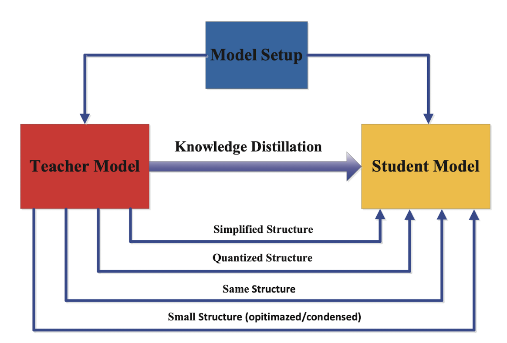

## Introduction

<figure markdown> 
    { width="500" }
    <figcaption>Teacher with a student. *Source: DallE*</figcaption>
</figure>

- The main idea in Knowledge Distillation (KD) is to make a smaller model *(student model)* mimic the larger model *(teacher model)*. This could lead to student model having competitive or sometimes even superior performance than teacher model. In generic sense, the distillation process is like this -- first, the teacher model is trained on the training data to learn the task-specific features, and then the student model is trained to mimic the teacher model by paying attention to certain characteristics *(or [knowledge](#types-of-knowledge))* of the teacher model.
<!-- - For example consider this scenario -- suppose you have a medium sized (>300MBs) model that is quite accurate (>80%) but slow (700-800ms per inference on CPU). While we can apply any of the above non-scientific solutions, it will not be cost effective. With KD if we can distil the model's knowledge to a much smaller one (say, ~100MBs) with minimum compromise on accuracy (>78%) we can greatly reduce the inference time (2x to 3x) and make the complete solution scalable. 

    | Metric | Teacher Model | Student Model |
    | ------ | ------ | ----- |
    | Size class | Medium | Small |
    | Size | >300MBs | ~100MBs |
    | Accuracy | >80% | >78% |
    | Inference time | 800ms | ~300ms | -->

!!! Note
    Remember there will always be a compromise between speed and accuracy. As you decrease the size of model *(by model compression techniques)* the accuracy will also drop. The science here is to make sure that decrease in size is drastic whereas that in accuracy is not too drastic. And this relationship must be kept in mind before making the choice to do KD. For example, in certain use case related to medical domain, accuracy is of upmost importance and developers should be aware of the associated risks.

- To better understand the different ways of performing KD, we should first understand two things - (1) knowledge, and (2) distillation schemes. Let's go through them one by one.

## Types of Knowledge

- Before we start to distil knowledge, we should first define and understand what is meant by "knowledge" in context of neural network -- is it the prediction OR the activation parameters OR activations for one input OR maybe multiple inputs? Once we know this, we can try to teach student model to mimic that particular characterisitics of the teacher model. Based on this intuition, let's categorize knowledge and respective distillation techniques.

<figure markdown> 
    
    <figcaption>Different types of knowledge in Deep teacher network. *[1]*</figcaption>
</figure>

### Response Based Knowledge

- Here, we define the final layer output of the teacher model as the knowledge, so the idea is to train a student model that will mimic the final prediction of the teacher model. For example, for a cat vs dog image classification model, if the teacher model classifies an image as 'Cat', a good student model should also learn from the same classification and vice-versa.
- Now the final predictions could also be of multiple types - logits *(the model output)*, soft targets *(the class probabilities)* or hard targets *(the class enums)* ([refer](interview_questions.md#what-is-the-difference-between-logits-soft-and-hard-targets)). Developers can select any of the prediction types, but **usually soft targets are preferred**, as they contain more information than hard target and are not as specific or architecture dependent as logits.
- Technically, we first predict the responses of student and teacher model on a sample, then compute the distillation loss on the difference between the logits *(or other prediction)* values generated by both. The distillation loss is denoted by $L_R(z_t, z_s)$ where $L_R()$ denotes the divergence loss and $z_t$ and $z_s$ denotes logits of teacher and student models respectively. In case of soft targets, we compute the probability of logits of one class wrt to other classes using softmax function, 

  $$p(z_i,T) = \frac{exp(z_i/T)}{\sum{}_j exp(z_j/T)}$$

  and the distillation loss becomes $L_R(p(z_t,T),p(z_s,T))$ which often employs Kullback-Leibler divergence loss. Note, here $T$ is the [temperature](interview_questions.md#explain-the-concept-of-temperature-in-deep-learning).

- In terms of final loss, researchers also recommend complimenting distillation loss with student loss which could be cross-entropy loss ($L_{CE}(y, p(z_s, T=1))$) between the ground truth label and soft logits of the student model.

### Feature Based Knowledge

- Here, we define the feature activations *(present in the intermediate layers)* of the teacher model as the knowledge. This is in line with the intuition of [representation learning](interview_questions.md#what-is-representation-learning) or feature learning. Hence, the main idea is to match the feature activations of one or more intermediate layers of the teacher and student model. 
- The distillation loss for feature-based knowledge transfer is given below, where, $f_t(x)$ and $f_s(x)$ are feature map of intermediate layers of teacher and student model respectively. $Φ_t(.)$ and $Φ_s(.)$ are the transformation functions used when the teacher and student model are not of the same shape. Finally, $L_F()$ is the similarity function used to match the feature map of the teacher and student model.

$$L_{F_{ea}D}(f_t(x), f_s(x)) = L_F(Φ_t(f_t(x)),Φ_s(f_s(x)))$$ 

!!! Note
    Easier said than done, there are some open research questions when using feature based knowledge,

    - Which intermediate layers to choose? (i.e. $f_t(x)$ and $f_s(x)$)
    - How to match the feature representation of teacher and student models? (i.e. $L_F()$)

### Relation Based Knowledge

- Here, we define knowledge as the relationship among different representations for the same data sample or even across different data samples. This representation can again be either from intermediate layer *(feature-based)* or output layer *(response-based)*. The intuition here is that looking across multiple layers or data samples at the same time could highlight some hidden pattern or structure which will be useful for student model to learn. Consider the classical `King - Man + Women = Queen` notation, which when represented as word embedding and visualized in the embedding space showcase directional pattern. The idea here is to learn this pattern rather than individual details of the representation.
- The distillation loss can be expressed as shown below, where $x_i$ is one input sampled from $X^N$, $f_T(.)$ and $s_T(.)$ can be defined as the intermediate or output layer values of the teacher and student model respectively *(wrt to an input)*, $t_i=f_T(x_i)$ and $s_i=f_s(x_i)$, $\psi$ is a relationship potential function *(like a similarity function)* and $l$ is the loss that penalize difference between the teacher and the student.

$$L_{RKD} = \sum_{(x_1, ... , x_n) \epsilon X^N} l(\psi(t_1, ..., t_n), \psi(s_1, ..., s_n))$$

!!! Note
    Response-based and Feature-based approaches are collectively called **Individual Knowledge Distillation** as they transfer knowledge from individual outputs of the teacher to student. This is in contrast with **Relational Knowledge Distillation** which extracts knowledge using relationships between different outputs of the teacher and student models.

## Distillation Schemes

<figure markdown> 
    { width="500" }
    <figcaption>Different distillation schemes. [1]</figcaption>
</figure>

### Offline Distillation

- This is the classical KD scheme, and as the name suggests, the transfer of knowledge happens in an offline fashion wherein the knowledge is transferred from a pre-trained teacher model to the student model *(one-way only)*. The complete training process has two stages,
  - First, a large teacher model is trained on a big set of training samples before distillation. This process is time and money intensive; and 
  - Second, the teacher model is used to extract the knowledge in the form of logits or the intermediate features, which are then used to guide the training of the student model during distillation.

### Online Distillation

- Online knowledge distillation, is used to transfer knowledge from a larger model to a smaller one in a continuous and sequential manner. This method involves live training of both the teacher and student models, and the whole knowledge distillation framework is end-to-end trainable. As new data becomes available, the teacher model is updated in real-time, and the student model learns from the teacher's updated output. 
- This dynamic learning process enables the student model to continually improve its performance, ensuring it remains aligned with the latest insights from the teacher model. This makes the approach suitable for cases when large-capacity high performance teacher model is not available , or when the data is continuously changing.

### Self-Distillation

- There are several challenges in online or offline distillation process, like (1) which teacher model to choose *(the most accurate one is not always the better one)*, (2) the student model always has a degraded performance wrt the teacher model.
- Self Distillation is a special case of online distillation wherein the same network is utilised for both teacher and student roles. To be more exact, the knowledge from the deeper sections of the network is distilled into its shallow sections. For this the network utilizes the attention maps of its own layers as distillation targets for its lower layers. There are even some special cases where knowledge in the earlier epochs of the network *(teacher)* is transfered into its later epochs *(student)*.

!!! Hint
    A very good analogy of comparing KD schemes wrt human teacher-student is provided in [1] as follows, *"Offline distillation means the knowledgeable teacher teaches a student knowledge; online distillation means both teacher and student study together with each other; self-distillation means student learn knowledge by oneself."*

## Teacher-Student Architecture

<figure markdown> 
    { width="500" }
    <figcaption>Relationship of the teacher and student models [1]</figcaption>
</figure>

- The teacher-student architecture plays a crucial role in knowledge distillation. The design of both the teacher and student networks is vital for effective knowledge transfer. In traditional approaches, student networks are simplified versions of teachers, quantized structures, or small networks optimized for basic operations. However, the model capacity gap between large teachers and small students can hinder knowledge transfer.

- Various methods have been developed to address this issue, including teacher assistants, residual learning, and structural compression. Some methods aim to minimize the structural differences between teachers and students. Additionally, depth-wise separable convolution and neural architecture search have been employed to design efficient networks for mobile and embedded devices.

- The future of knowledge distillation might involve an adaptive teacher-student learning architecture, where neural architecture search is used to optimize both student structure and knowledge transfer. This joint search guided by the teacher model is an interesting avenue for further research in the field.

## References

[1] [J Gou et al. - Knowledge Distillation: A Survey](https://arxiv.org/abs/2006.05525)

[2] [Relational Knowledge Distillation](https://arxiv.org/pdf/1904.05068.pdf)