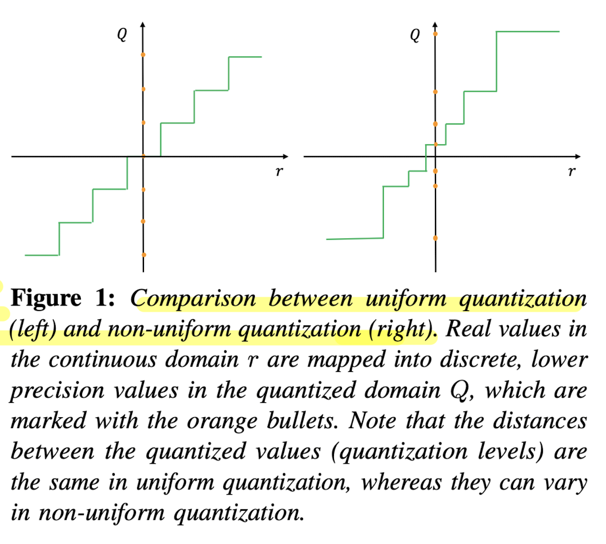
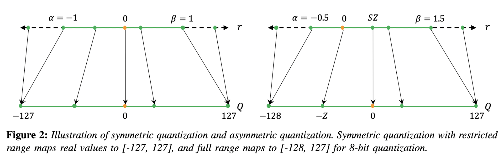

## Introduction

Quantization is a technique that has been used in digital computing for a long time. It involves compressing data by converting a continuous signal or data set into a discrete set of values or levels. 

Neural Networks (NNs) present unique challenges and opportunities in the context of quantization. Firstly, both inference and training of NNs require significant computational resources, making the efficient representation of numerical values crucial. Secondly, many current NN models are highly over-parameterized, allowing scope for techniques that could reduce bit precision without sacrificing accuracy. 

However, an important distinction is that NNs exhibit remarkable resilience to aggressive quantization and extreme discretization. That said, by moving from floating-point representations to low-precision fixed integer values represented in four bits or less, it is possible to significantly reduce memory footprint and latency. In fact, reductions of 4x to 8x are often observed in practice in these applications. This article serves as a beginner-friendly introduction to quantization in deep learning.

## Data Types and Representations

Before diving into the topic, let’s understand the importance and advantages of using smaller data-type representations. 

- Neural Nets consists of weights which are matrices of numbers, where each number is mostly represented in `float32` data type. This means each number’s size is 32 bits (4 bytes) and an average-sized LLM of 7B parameters (like LLaMA) will have a size around 7 * 10^9 * 4  = 28GB! This is vRAM required just for inference, and for training, you might need 2x more memory as the system needs to store gradients as well. *(For finetuning, the memory requirements depend on which optimizer we are using. AdamW needs 8 bytes per parameter)*. Now if we can use half-precision (`float16`) our memory requirements are reduced by half and for much advanced 8-bit representation it becomes just 1/4th of the original requirement! 
- Below is a table with different data types, their ranges, size and more details. 

| Data Type | Min | Max | Range | Bits | Accumulation Data Type |
| --- | --- | --- | --- | --- | --- |
| uint8 | 0 | 255 | 0-255 | 8 | uint16 |
| int8 | -128 | 127 | -128 to 127 | 8 | int16 |
| uint16 | 0 | 65535 | 0-65535 | 16 | uint32 |
| int16 | -32768 | 32767 | -32768 to 32767 | 16 | int32 |
| uint32 | 0 | 4294967295 | 0-4294967295 | 32 | uint64 |
| int32 | -2147483648 | 2147483647 | -2147483648 to 2147483647 | 32 | int64 |
| uint64 | 0 | 18446744073709551615 | 0-18446744073709551615 | 64 | uint64 |
| int64 | -9223372036854775808 | 9223372036854775807 | -9223372036854775808 to 9223372036854775807 | 64 | int64 |
| float16 | -65504 | 65504 | -65504 to 65504 | 16 | float32 |
| float32 | -3.4028235E+38 | 3.4028235E+38 | -3.4028235E+38 to 3.4028235E+38 | 32 | float64 |
| float64 | -1.7976931348623157E+308 | 1.7976931348623157E+308 | -1.7976931348623157E+308 to 1.7976931348623157E+308 | 64 | float128 |

!!! Note
    `float128` isn't a standard data type in many environments, and the accumulation type for some might vary based on the context or platform. For float types, the range values typically represent the maximum magnitude, not the precise range of normal numbers. Please verify against your specific environment or programming language for the most accurate information.

## Basics of Quantizations

Now we are ready to tackle the basic concepts of Quantization in Deep Learning.

### Uniform vs Non-Uniform Quantization

- A normal quantization function is shown below where \( S \) is a scaling factor, \( Z \) is an integer zero point, and \( \text{Int} \) represents an integer mapping through rounding. In the scaling factor \( S \), $[\alpha, \beta]$ denotes the clipping range i.e. a bounded range that we are clipping the real values with, and $b$ is the quantization bit width. The key characteristic of uniform quantization is that the quantized values are evenly spaced. This spacing can be visualized in a graph where the distance between each quantized level is constant.

$$
Q(r) = \text{Int}\left(\frac{r}{S}\right) - Z;
$$

$$
S = \frac{\beta - \alpha}{2^b - 1},
$$

- In contrast to uniform quantization, non-uniform quantization methods produce quantized values that are not evenly spaced. Non-uniform quantization can be more efficient in representing values with a non-linear distribution. However, implementing non-uniform quantization schemes efficiently on general computation hardware (e.g., GPU and CPU) is typically challenging. Therefore, uniform quantization is currently the most commonly used method due to its simplicity and efficient mapping to hardware.

<figure markdown> 
    { width="500" }
    <figcaption>Source: [1]</figcaption>
</figure>

- Also note that for both uniform and non-uniform quantization, the original real values can be approximated through dequantization, using the inverse operation \( \tilde{r} = S(Q(r) + Z) \). However, due to the rounding inherent in the quantization process, the recovered values \( \tilde{r} \) will not be exactly the same as the original \( r \). This approximation error is a trade-off for the benefit of reduced precision and computational complexity.

### Symmetric vs. Asymmetric Quantization

<figure markdown> 
    
    <figcaption>Source: [1]</figcaption>
</figure>

- In symmetric quantization, the scaling factor \( S \) is determined using a symmetric clipping range, typically defined as \( \alpha = -\beta \). The value for \( \alpha \) and \( \beta \) is often selected based on the maximum absolute value in the data, resulting in \( -\alpha = \beta = \max(|r_{\max}|, |r_{\min}|) \). Symmetric quantization simplifies the quantization process by setting the zero point \( Z \) to zero, thus the quantization equation becomes \( Q(r) = \text{Int}\left(\frac{r}{S}\right) \). There are two versions of symmetric quantization: full range, which utilizes the entire representable range of the data type (e.g., INT8), and restricted range, which excludes the extremes for better accuracy. Symmetric quantization is preferred for weight quantization in practice due to computational efficiency and straightforward implementation.

- Asymmetric quantization uses the actual minimum and maximum values of the data as the clipping range, i.e., \( \alpha = r_{\min} \) and \( \beta = r_{\max} \), resulting in a non-symmetric range where \( -\alpha \neq \beta \). This method may provide a tighter clipping range which is advantageous when the data distribution is imbalanced, such as activations following a ReLU function. Asymmetric quantization allows for a more precise representation of the data's distribution, but at the cost of a more complex quantization process due to the non-zero zero point.

!!! Hint

    Both symmetric and asymmetric quantization require calibration, which involves selecting the appropriate clipping range. A common method is to use the min/max values of the signal; however, this can be susceptible to outliers which may expand the range unnecessarily and reduce quantization resolution. Alternative methods include using percentiles or optimizing for the minimum Kullback-Leibler divergence to minimize information loss.

### Dynamic vs Static Quantization

So far we have discussed about calibrating the clipping range for weights which is relatively simple as it does not change during inference. Calibrating the activations is different as its range could be different for different input. Let's look into different ways to handle it, 

- Dynamic quantization involves calculating the clipping range (\([α, β]\)) in real-time for each activation map based on the current input. Since activation maps change with each new input sample, dynamic range calibration allows the quantization process to adapt to these changes, potentially leading to higher accuracy. The trade-off, however, is the computational overhead required to compute signal statistics on the fly for every input during runtime.

- Static quantization, in contrast, involves determining a fixed clipping range prior to inference. This range is computed using a series of calibration inputs to estimate the typical range of activations. The advantage of this approach is the elimination of computational overhead during inference, as the range is not recalculated for each input. While typically less accurate than dynamic quantization due to its non-adaptive nature, static quantization benefits from methods that optimize the range, such as minimizing the Mean Squared Error between the original and quantized distributions. Other metrics like entropy can also be used, but MSE remains the most popular.

### Quantization Granularity

Quantization granularity refers to the level of detail at which the clipping range \([α, β]\) is determined for quantization. There are various levels at which this can be implemented:

- **Layerwise quantization** sets a single clipping range based on the collective statistics of all the weights in a layer's convolutional filters. This method is straightforward to implement but may lead to suboptimal accuracy. The reason is that different filters within the layer can have widely varying ranges, and using a single range for all may compromise the resolution of filters with narrower weight ranges.

- **Groupwise quantization** segments multiple channels within a layer and calculates a clipping range for each group. This method can be beneficial when parameter distributions vary significantly within the layer, allowing for more tailored quantization. However, managing multiple scaling factors adds complexity.

- **Channelwise quantization** assigns a unique clipping range and scaling factor to each channel or convolutional filter. This granularity level is widely adopted because it provides a high quantization resolution and often yields higher accuracy without significant overhead.

- **Sub-channelwise quantization** further divides the granularity to smaller groups within a convolution or fully-connected layer. Although it could potentially lead to even higher accuracy due to finer resolution, the computational overhead of managing numerous scaling factors is considerable. Therefore, while channelwise quantization is a standard practice, sub-channelwise is not, due to its complexity and overhead.

<figure markdown> 
    
    <figcaption>Source: [1]</figcaption>
</figure>

## Quantization Strategies

Below are three primary ways quantization can be performed wrt neural networks:

1. **Quantization-Aware Training (QAT):**

   - Quantization may skew the weights by moving them away from their converged points. To mitigate this, in QAT the model is retrained with quantized parameters to converge to a new optimal point. This involves using a forward and backward pass on a quantized model but updating the model parameters in floating-point precision. After each gradient update, the model parameters are quantized again. QAT utilizes techniques such as the Straight Through Estimator (STE) to approximate the gradient of the non-differentiable quantization operator. Other approaches like regularization operators or different gradient approximations are also explored.

     - **Advantages:** QAT typically results in models with better performance and minimal accuracy loss due to the careful retraining with quantized parameters.

     - **Disadvantages:** It is computationally expensive as it involves retraining the model, often for several hundred epochs.

2. **Post-Training Quantization (PTQ):**
   - PTQ is applied after a model has been trained with full precision. It adjusts the weights and activations of a model without any retraining or fine-tuning. Various methods exist to mitigate accuracy loss in PTQ, including bias correction methods, optimal clipping range calculations, outlier channel splitting, and adaptive rounding methods. That said, it might require some example data to calibrate the quantization parameters.
     - **Advantages:** PTQ is a quick and often negligible overhead method for reducing the size of neural network models. It is particularly useful when training data is limited or unavailable.
     - **Disadvantages:** Generally, PTQ leads to lower accuracy compared to QAT, particularly for low-precision quantization.

    !!! Note
        While no model finetuning happens in PTQ, we may use training dataset for activation calibration.

3. **Zero-shot Quantization (ZSQ):**
   - ZSQ refers to performing quantization without any access to the training or validation data, not even example sample for calibration. This is particularly vital for scenarios where we want quick turnaround time on quantization.
     - **Advantages:** ZSQ is simplest form of quantization and it is crucial for scenarios where data privacy or availability is a concern. It allows the quantization of models without needing access to any dataset.
     - **Disadvantages:** While innovative, ZSQ methods may not capture the nuances of the actual data distribution as effectively as methods with access to real data, potentially leading to less accurate models. It also has quite a bit of overhead in terms of loading model as quantization usually happens during loading.

In summary, each quantization method has its own set of trade-offs between accuracy, efficiency, and applicability. The choice among QAT, PTQ, and ZSQ depends largely on the specific constraints of the deployment environment, the availability of computational resources, and the necessity for data privacy.

## Quantization in Practice

In practice, PTQ *(Post-Training Quantization)* and ZSQ *(Zero-shot Quantization)* are most widely used quantization methods due to their simplicity and minimal overhead. It is particularly effective for reducing the size of neural network models without requiring access to the original training data. Here is a 30k feet look of how playing with quantization looks like in practice:

1. First we get the model which is trained in full precision *(float32)*.
2. Next, we can either quantize the model and save it *(ex: loading an quantized model `TheBloke/Llama-2-7B-Chat-AWQ`)* or we can quantize the model during loading *(ex: HuggingFace supports like `load_in_4_bit` option as `bitsandbytes` config)*
3. Based on the quantization method, models can be dynamically dequantized *(converted back to higher precision)* during inference. This is because inference requires a forward pass which consists of complex computations like matrix multiplication and currently float-float matmul is much faster than int-int matmul. *([Refer](https://stackoverflow.com/questions/45373679/why-is-it-faster-to-perform-float-by-float-matrix-multiplication-compared-to-int))*


!!! Hint
    You can find thousands of quantized models *(with different algorithms)* on the [TheBloke's collection](https://huggingface.co/TheBloke) in HuggingFace.

<!-- TODO: !!! Hint
    **???** There is an interesting debate on memory-bound vs compute-bound quantization methods -->
<!-- TODO: ### AQLM - Feb 2024, latest -->
<!-- TODO: EXL2 quantization: https://github.com/turboderp/exllamav2 -->

Now, let's look into some of the popular quantization methods and their practical details.

### AWQ

Activation-aware Weight Quantization (AWQ) [3], introduced in Oct 2023, is a PTQ type and Weight only quantization method based on the fact that not all weights are equally important for the model's performance. With this in mind, AWQ tries to identify those salient weights using the activation distribution where weights with larger activation magnitudes are deemed crucial for model performance. On further analysis, it was found that just a minor fraction (~1%) of weights, if left unquantized (FP16) could lead to non-significant change in model performance. While this is a crucial observation, it is also important to note that partial quantization of weights leads to mixed-precision data types, which are not efficiently handled in many hardware architectures. To circumvent these complexities, AWQ introduces a novel per-channel scaling technique that scales the weights *(multiple weight by scale $s$ and inverse scale the activation i.e multiply activation by $1/s$)* before quantization, where $s$ is usually greater than 1, and it is determined by a grid search. This minor trick optimizes the quantization process, removes the need for mixed-precision data types, and keep the performance consistent with 1% FP16 weights.
  
<figure markdown> 
    
    <figcaption>Source: [3]</figcaption>
</figure>

Empirical evidence demonstrates AWQ's superiority over existing quantization techniques, achieving remarkable speedups and facilitating the deployment of large models on constrained hardware environments. Notably, AWQ has enabled the efficient deployment of massive LLMs, such as the Llama-2-13B model, on single GPU platforms with limited memory (~8GB), and has achieved significant performance gains across diverse LLMs with varying parameter sizes. 

<figure markdown> 
    
    <figcaption>Better Perplexity score of AWQ on LLaMA-1 and 2 models in comparison with other quantization techniques. Source: [3]</figcaption>
</figure>

Running inference on AWQ model can be done using the `transformers` library. Below is an example of how to use AWQ model for inference.

```python linenums="1"
# install
# !pip install autoawq

# import
import time
from transformers import AutoModelForCausalLM, AutoTokenizer

# AWQ quantized model
model_id = "TheBloke/Llama-2-7B-Chat-AWQ"

# load model
model = AutoModelForCausalLM.from_pretrained(model_id, device_map="cuda:0")
# load tokenizer
tokenizer = AutoTokenizer.from_pretrained(model_id, trust_remote_code=False)
# tokenize the prompt
tokens = tokenizer(
    "Tell me a joke",
    return_tensors='pt'
).input_ids.cuda()

# generating output
start_time = time.time()
generation_output = model.generate(
    tokens,
    temperature=0.7,
    max_new_tokens=50
)
end_time = time.time()
# the output
print("Output: ", tokenizer.decode(generation_output[0]))
# calc and print the speed 
# Calculate the number of tokens generated
num_tokens = len(generation_output[0]) - tokens.shape[1]
# Calculate the tokens per second
tokens_per_second = num_tokens / (end_time - start_time)
print("Tokens per second:", tokens_per_second)
```

Further, if you want to quantize a model and save it, you can use the below code ([*Code Source*](https://github.com/casper-hansen/AutoAWQ/blob/main/examples/quantize.py)). 

```python linenums="1"
# imports
from awq import AutoAWQForCausalLM
from transformers import AutoTokenizer

# model and quantization path
model_path = 'mistralai/Mistral-7B-Instruct-v0.2'
quant_path = 'mistral-instruct-v0.2-awq'
# set quantization config
quant_config = { "zero_point": True, "q_group_size": 128, "w_bit": 4, "version": "GEMM" }

# Load model
model = AutoAWQForCausalLM.from_pretrained(
    model_path, **{"low_cpu_mem_usage": True, "use_cache": False}
)
# Load tokenizer
tokenizer = AutoTokenizer.from_pretrained(model_path, trust_remote_code=True)

# Quantize
model.quantize(tokenizer, quant_config=quant_config)

# Save quantized model
model.save_quantized(quant_path)
tokenizer.save_pretrained(quant_path)
```

We can modify the config based on our requirement, but the important settings are  `zero_point` *(for zero point quantization)*, `q_group_size` *(for group size)*, `w_bit` *(for weight bit)* and `version` *(for the version of AWQ)*. The quantized model will be saved at `quant_path`. As part of AWQ quantization, calibration is needed to identify the salient weights and this is done on a small set of training data so that the model does not loose its generalization ability. The above code does it with the default dataset *(512 samples of [mit-han-lab/pile-val-backup](https://huggingface.co/datasets/mit-han-lab/pile-val-backup))*, but if you want to use your own dataset, you can refer [this code](https://github.com/casper-hansen/AutoAWQ/pull/27/commits/69d31edcd87318bb4dc1bcfff0c832df135e3208).

!!! Note
    AWQ models come in multiple flavors and you can choose the version best suited for your need.  As per [AutoAWQ Github Repo](https://github.com/casper-hansen/AutoAWQ) these are,

    - **GEMM**: Much faster than FP16 at batch sizes below 8 *(good with large contexts)*.
    - **GEMV**: 20% faster than GEMM, only batch size 1 *(not good for large context)*.
    
!!! Note
    You need GPU with [compute capacity](https://docs.nvidia.com/cuda/cuda-c-programming-guide/index.html#compute-capabilities) >=7 to run AWQ models as they are optimized for GPU inference. You can check your GPU's compute capacity [here](https://developer.nvidia.com/cuda-gpus#compute).

### GPTQ

GPTQ [5], introduced in March 2023, is a PTQ type and one-shot weight quantization method designed to efficiently and accurately compress GPT models even of bigger size such as GPT-3 with 175 billion parameters. GPTQ achieves this by utilizing approximate second-order information to reduce the models' weight bitwidth to 3 or 4 bits, with minimal loss in accuracy compared to the uncompressed model. This method significantly improves upon previous one-shot quantization approaches, doubling the compression gains while maintaining accuracy. As a result, it enables the execution of a 175 billion-parameter model on a single GPU for the first time, facilitating generative inference tasks. Additionally, GPTQ demonstrates reasonable accuracy even when weights are quantized to 2 bits or to a ternary level. Experimental results reveal that GPTQ can accelerate end-to-end inference by approximately 3.25 times on high-end GPUs (like NVIDIA A100) and by 4.5 times on more cost-effective GPUs (like NVIDIA A6000).

Here is how you can run inference on GPTQ model.

```python linenums="1"
# Install
!pip install auto-gptq optimum

# Imports
import time
from transformers import AutoTokenizer
from auto_gptq import AutoGPTQForCausalLM, BaseQuantizeConfig

# Model and tokenizer
model_id = "TheBloke/Llama-2-7b-Chat-GPTQ"
# load quantized model
model = AutoGPTQForCausalLM.from_quantized(model_id, device="cuda:0")
# load tokenizer
tokenizer = AutoTokenizer.from_pretrained(model_id, use_fast=True)

# Inference
tokens = tokenizer("Tell me a joke.\nJoke:", return_tensors="pt").to(model.device)

# Calculate the time taken to generate the output
start_time = time.time()
generation_output = model.generate(
    **tokens,
    temperature=0.001,
    max_new_tokens=50
)
end_time = time.time()

print("Output: ", tokenizer.decode(generation_output[0]))
# Calculate the number of tokens generated
num_tokens = len(generation_output[0]) - tokens['input_ids'].shape[1]
# Calculate the tokens per second
tokens_per_second = num_tokens / (end_time - start_time)
print("Tokens per second:", tokens_per_second)

# or you can also use pipeline
# pipeline = TextGenerationPipeline(model=model, tokenizer=tokenizer)
# print(pipeline("auto-gptq is")[0]["generated_text"])

```

Quantizing a model using GPTQ can be done using the below code. 

```python linenums="1"
# install
!pip install auto-gptq optimum

# imports
from auto_gptq import AutoGPTQForCausalLM, BaseQuantizeConfig
from transformers import AutoTokenizer

# model and quantization path
pretrained_model_name = "facebook/opt-125m"
quantize_config = BaseQuantizeConfig(bits=4, group_size=128)
model = AutoGPTQForCausalLM.from_pretrained(pretrained_model_name, quantize_config)
tokenizer = AutoTokenizer.from_pretrained(pretrained_model_name)

# example for quantization calibration (here we have only provided one, in reality provide multiple)
examples = [
    tokenizer(
        "auto-gptq is an easy-to-use model quantization library with user-friendly apis, based on GPTQ algorithm."
    )
]

# quantize
model.quantize(examples)

# save quantized model
quantized_model_dir = "opt-125m-4bit-128g"
model.save_quantized(quantized_model_dir)
```

By default, the saved file type is `.bin`, you can also set `use_safetensors=True` to save a `.safetensors` model file. The format of model file base name saved using this method is: `gptq_model-{bits}bit-{group_size}g`. Pretrained model's config and the quantize config will also be saved with file names `config.json` and `quantize_config.json`, respectively. [(Refer)](https://github.com/AutoGPTQ/AutoGPTQ/blob/main/docs/tutorial/01-Quick-Start.md)

### BitsAndBytes

BitsAndBytes [7] is a Python package to perform ZSQ on models to convert them to 8bit or 4bit representations. To load a model in 4bit quantization with the `transformers` library, you simply set the `load_in_4bit=True` flag and specify a `device_map="auto"` when using the `from_pretrained` method. This process automatically infers an optimal device map, facilitating efficient model loading. For example, loading a model can be done as follows: 

``` python linenums="1"
# import 
from transformers import BitsAndBytesConfig, AutoModelForCausalLM
# load model
model = AutoModelForCausalLM.from_pretrained("facebook/opt-350m", \
                        load_in_4bit=True, device_map="auto")
```

!!! Note
    It's important not to manually assign the device after loading the model with a device map to avoid potential issues.

Quantized models automatically cast submodules to `float16`, but this can be modified *(e.g., keeping layer norms in float32)* by specifying `torch_dtype` in the `from_pretrained` method. For those interested in exploring beyond the basics, various 4bit quantization types are available, such as NF4 *(normalized float 4)* or pure FP4, with NF4 generally recommended for its performance benefits. Additional features like double quantization via `bnb_4bit_use_double_quant` can save extra bits per parameter *(by enabling a second round of quantization to further compress the model)*, and the computation precision (`bnb_4bit_compute_dtype`) can be adjusted to balance between speed and resource usage.

Advanced configurations, such as NF4 quantization with double quantization and altered compute dtype for faster training, are facilitated through the `BitsAndBytesConfig` class. For instance, configuring a model with NF4 quantization and bfloat16 compute dtype can be achieved as follows:

```python linenums="1"
# import 
import torch
from transformers import BitsAndBytesConfig, AutoModelForCausalLM
# define config
nf4_config = BitsAndBytesConfig(load_in_4bit=True, 
                                bnb_4bit_quant_type="nf4", 
                                bnb_4bit_use_double_quant=True, 
                                bnb_4bit_compute_dtype=torch.bfloat16)
# load model
model_nf4 = AutoModelForCausalLM.from_pretrained(model_id, 
                    quantization_config=nf4_config)
```

!!! Hint
    Use double quant only if you have problems with memory, use NF4 for higher precision, and use a 16-bit dtype for faster finetuning. 
    [Refer](https://huggingface.co/blog/4bit-transformers-bitsandbytes)

!!! Hint
    If your hardware supports it, `bf16` is the optimal compute dtype. The default is `float32` for backward compatibility and numerical stability. `float16` often leads to numerical instabilities, but `bfloat16` provides the benefits of both worlds: numerical stability equivalent to `float32`, but combined with the memory footprint and significant computation speedup of a 16-bit data type. Therefore, be sure to check if your hardware supports `bf16` and configure it using the `bnb_4bit_compute_dtype` parameter in `BitsAndBytesConfig`. 
    [Refer](https://huggingface.co/docs/bitsandbytes/main/en/integrations)

### GGML/GGUF

GGUF [9] *(older version was called GGML)* is a file format developed by [Georgi Gerganov](https://github.com/ggerganov) specifically for the rapid loading and saving of models, along with its user-friendly approach to model reading. The format is designed to be a single-file deployment format *(as it contains all the necessary information for model loading)*, is compatible with memory-mapped files (mmap) and is extensible *(support legacy models)*. It was initially developed for [whisper.cpp](https://github.com/ggerganov/whisper.cpp) and later extended into [llama.cpp](https://github.com/ggerganov/llama.cpp). This made it the go to format for transformer models *(which is the back bone of all LLMs today)* and it is especially suited for anyone who wants to run model locally or on edge devices or use it for devices with limited GPU memory.

That said, with advent of quantization for model compression especially for running LLMs on low memory devices, several quantization techniques were added into the `llama.cpp` package. Below is a table that summarizes the quantization techniques with more helpful practical details.

| ID | Quantization Type | Size  | Perplexity Increase @ 7B | Quality Loss Level         | Recommendation         |
|----|-------------------|-------|-------------------------|----------------------------|------------------------|
| 2  | Q4_0              | 3.50G | +0.2499                 | Very high           | Legacy, use Q3_K_M     |
| 3  | Q4_1              | 3.90G | +0.1846                 | Substantial         | Legacy, use Q3_K_L     |
| 8  | Q5_0              | 4.30G | +0.0796                 | Balanced           | Legacy, use Q4_K_M     |
| 9  | Q5_1              | 4.70G | +0.0415                 | Low                | Legacy, use Q5_K_M     |
| 10 | Q2_K              | 2.67G | +0.8698                 | Extreme          | Not recommended        |
| 11 | Q3_K_S            | 2.75G | +0.5505                 | Very high      |                        |
| 12 | Q3_K_M or Q3_K           | 3.06G | +0.2437                 | Very high      |                        |
| 13 | Q3_K_L            | 3.35G | +0.1803                 | Substantial         |                        |
| 14 | Q4_K_S            | 3.56G | +0.1149                 | Significant         |                        |
| 15 | Q4_K_M or Q4_K           | 3.80G | +0.0535                 | Balanced           | *Recommended*          |
| 16 | Q5_K_S            | 4.33G | +0.0353                 | Low                 | *Recommended*          |
| 17 | Q5_K_M or Q5_K           | 4.45G | +0.0142                 | Very low            | *Recommended*          |
| 18 | Q6_K              | 5.15G | +0.0044                 | Extremely low  |                        |
| 7  | Q8_0              | 6.70G | +0.0004                 | Extremely low  | Not recommended        |
| 1  | F16               | 13.00G|                         | Virtually no | Not recommended     |
| 0  | F32               | 26.00G|                         | Lossless | Not recommended        |

!!! Hint
    While selecting which quantization version to use, it is important to consider the trade-off between model size and quality. It also depends on the specific use case and the available resources. That said, if you are looking for something small and fast that does not compromise a lot on quality, `Q5_K_M` is a good choice.

Furthermore, it's good to know the two types of quantization supported in `llama.cpp` - "type-0" where weights `w` are obtained from quants `q` using $w = d * q$, where `d` is the block scale and "type-1" where weights are given by $w = d * q + m$, where `m` is the block minimum. The naming convention of quantized model is `Q{bits}_K_{type}` or `Q{bits}_{type}` where `bits` is the number of bits, `type` is the type of quantization, and presence of `K` denotes that the new k-quant technique is used. The `S`, `M`, and `L` in the `type` are the size of the model where the `S` is the smallest, `M` is the medium, and `L` is the largest. This [PR comment](https://github.com/ggerganov/llama.cpp/pull/1684) provides further details on underlying techniques as follows,

``` markdown
The following new quantization types are added to ggml:

GGML_TYPE_Q2_K - "type-1" 2-bit quantization in super-blocks containing 16 blocks, each block having 16 weight. Block scales and mins are quantized with 4 bits. This ends up effectively using 2.5625 bits per weight (bpw)
GGML_TYPE_Q3_K - "type-0" 3-bit quantization in super-blocks containing 16 blocks, each block having 16 weights. Scales are quantized with 6 bits. This end up using 3.4375 bpw.
GGML_TYPE_Q4_K - "type-1" 4-bit quantization in super-blocks containing 8 blocks, each block having 32 weights. Scales and mins are quantized with 6 bits. This ends up using 4.5 bpw.
GGML_TYPE_Q5_K - "type-1" 5-bit quantization. Same super-block structure as GGML_TYPE_Q4_K resulting in 5.5 bpw
GGML_TYPE_Q6_K - "type-0" 6-bit quantization. Super-blocks with 16 blocks, each block having 16 weights. Scales are quantized with 8 bits. This ends up using 6.5625 bpw
GGML_TYPE_Q8_K - "type-0" 8-bit quantization. Only used for quantizing intermediate results. The difference to the existing Q8_0 is that the block size is 256. All 2-6 bit dot products are implemented for this quantization type.


This is exposed via llama.cpp quantization types that define various "quantization mixes" as follows:

LLAMA_FTYPE_MOSTLY_Q2_K - uses GGML_TYPE_Q4_K for the attention.vw and feed_forward.w2 tensors, GGML_TYPE_Q2_K for the other tensors.
LLAMA_FTYPE_MOSTLY_Q3_K_S - uses GGML_TYPE_Q3_K for all tensors
LLAMA_FTYPE_MOSTLY_Q3_K_M - uses GGML_TYPE_Q4_K for the attention.wv, attention.wo, and feed_forward.w2 tensors, else GGML_TYPE_Q3_K
LLAMA_FTYPE_MOSTLY_Q3_K_L - uses GGML_TYPE_Q5_K for the attention.wv, attention.wo, and feed_forward.w2 tensors, else GGML_TYPE_Q3_K
LLAMA_FTYPE_MOSTLY_Q4_K_S - uses GGML_TYPE_Q4_K for all tensors
LLAMA_FTYPE_MOSTLY_Q4_K_M - uses GGML_TYPE_Q6_K for half of the attention.wv and feed_forward.w2 tensors, else GGML_TYPE_Q4_K
LLAMA_FTYPE_MOSTLY_Q5_K_S - uses GGML_TYPE_Q5_K for all tensors
LLAMA_FTYPE_MOSTLY_Q5_K_M - uses GGML_TYPE_Q6_K for half of the attention.wv and feed_forward.w2 tensors, else GGML_TYPE_Q5_K
LLAMA_FTYPE_MOSTLY_Q6_K- uses 6-bit quantization (GGML_TYPE_Q8_K) for all tensors
```


Fortunately, it is common practice to quantize all variants before open sourcing them, as it is evident from any of the GGUF models uploaded by [TheBloke's collection](https://huggingface.co/TheBloke) in HuggingFace. 

<figure markdown> 
    
    <figcaption>LLaMa-2 GGUF version by TheBloke on HuggingFace contains all GGUF quantization versions. [Source](https://huggingface.co/TheBloke/Llama-2-7B-Chat-GGUF/tree/main)</figcaption>
</figure>

Model can be loaded using the `ctransformers` library and additional details like which quantization version to load can be specified. Below is an example of how to load a model with `Q4_K_M` quantization version.


```python linenums="1"
## Install
# Base ctransformers with no GPU acceleration
pip install ctransformers>=0.2.24
# Or with CUDA GPU acceleration
pip install ctransformers[cuda]>=0.2.24
# Or with ROCm GPU acceleration
CT_HIPBLAS=1 pip install ctransformers>=0.2.24 --no-binary ctransformers
# Or with Metal GPU acceleration for macOS systems
CT_METAL=1 pip install ctransformers>=0.2.24 --no-binary ctransformers

## Import
from ctransformers import AutoModelForCausalLM

## Load the model
# Set gpu_layers to the number of layers to offload to GPU. 
# Set to 0 if no GPU acceleration is available on your system.
llm = AutoModelForCausalLM.from_pretrained("TheBloke/Llama-2-7b-Chat-GGUF", 
                    model_file="llama-2-7b-chat.q4_K_M.gguf",
                    model_type="llama", gpu_layers=50)

## Run inference
print(llm("AI is going to"))
```

Fine-tuning the model can be done very easily using the `llama.cpp` library. Below is an example [9]

```python linenums="1"
# Install llama.cpp
!git clone https://github.com/ggerganov/llama.cpp
!cd llama.cpp && git pull && make clean && LLAMA_CUBLAS=1 make
!pip install -r llama.cpp/requirements.txt

# Manual - Download the model to quantize (`.bin` format) 

# Convert to fp16 (as by default it is f32)
!python llama.cpp/convert.py "pytorch_model-00001-of-00001.bin" --outtype f16 --outfile "pytorch_model.fp16.bin"

# quantize
!./llama.cpp/quantize "pytorch_model.fp16.bin" "pytorch_model.q5_k_m.gguf" "q5_k_m"
```

## References

[1] [A Survey of Quantization Methods for Efficient Neural Network Inference](https://arxiv.org/abs/2103.13630)

[2] Maarten Grootendorst's Blog - [Which Quantization Method is Right for You? (GPTQ vs. GGUF vs. AWQ)](https://www.maartengrootendorst.com/blog/quantization/)

[3] AWQ: Activation-aware Weight Quantization for LLM Compression and Acceleration - [Paper](https://arxiv.org/abs/2306.00978) | [Official Code](https://github.com/mit-han-lab/llm-awq)

[4] AutoAWQ Github Repo - [Link](https://github.com/casper-hansen/AutoAWQ)

[5] GPTQ - [Paper](https://arxiv.org/abs/2210.17323) | [Official Code](https://github.com/IST-DASLab/gptq)

[6] AutoGPTQ Github Repo - [Link](https://github.com/AutoGPTQ/AutoGPTQ)

[7] BitsAndBytes - [Official Doc](https://huggingface.co/docs/bitsandbytes/main/en/index) | [Support for 4-bit and QLora Blog](https://huggingface.co/blog/4bit-transformers-bitsandbytes) | [HuggingFace Integration Blog](https://huggingface.co/blog/hf-bitsandbytes-integration)

[8] LLM.int8() - [Blog](https://huggingface.co/blog/hf-bitsandbytes-integration)

[9] GGUF/GGML - [Official Docs](https://github.com/ggerganov/ggml/blob/master/docs/gguf.md) | [Blog - Quantize Llama_2 models using GGML](https://mlabonne.github.io/blog/posts/Quantize_Llama_2_models_using_ggml.html) | [K Quants](https://github.com/ggerganov/llama.cpp/pull/1684)