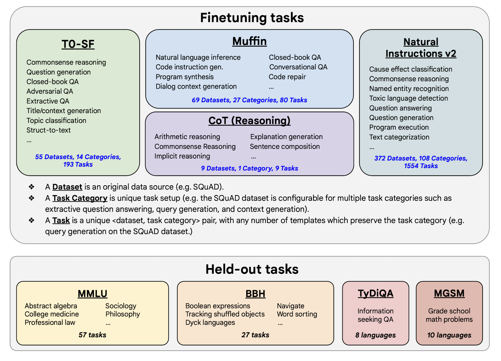

Flan Models
=========

## Introduction

- In “Scaling Instruction-Finetuned Language Models”, researchers propose an LLM fine-tuning strategy that focus on using dataset in form of instructions with other tricks like (1) scaling the number of tasks, (2) scaling the model size, and (3) finetuning on chain-of-thought data. 
- The resulting models were called `Flan-{source_model}` like Flan-T5 and Flan-PaLM which showcase enhanced performance when compared with their namesakes. 

<figure markdown> 

<figcaption>Flan models are finetuned on ~1.8k tasks w & w/o CoT and exemplars (zero shots and few shots) and evaluated on unseen tasks.</figcaption>
</figure>

!!! Note
    All Flan models like Flan-T5 are only finetuned and not trained from scratch.

## Dataset

- The Flan models were finetuned on 1836 tasks. Here are some definitions, 
  - “**Dataset”** is an data source *(ex: SQuAD)*, 
  - “**Task category**” is a unique task setup like query generation or question answering.
  - “**Task**” is unique combinations of `<dataset, task category>`. This is possible because a single dataset can be used for different task categrory *(ex: SQuAD for query generation or QA or context generation)*. 
- Combining 473 datasets and 146 task category we end up with 1836 different tasks. 

<figure markdown> 

<figcaption>Dataset, Task Category and Task details of finetuning and held out data.</figcaption>
</figure>

## Finetuning process

- Instruction finetuning was performed for T5, PaLM and U-PaLM, where the model sizes span from Flan-T5-small *(80M parameters)*, to PaLM and U-PaLM *(540B parameters)*. 
- Same training procedure was used for each model except for a few hyperparameters like learning rate, batch size, dropout, and finetuning steps. Constant learning rate schedule was used to finetune using the Adafactor optimizer. 
- Notably, the amount of compute used for finetuning is only a small fraction relative to the training compute, as shown in the table below.

<figure markdown> 

<figcaption>All Flan models only use a fraction of compute for finetuning that was used for model training, with max usage going only upto 1.6%.</figcaption>
</figure>

## Results

<figure markdown> 

<figcaption>Instruction finetuning (Flan) showcased improved performance across multiple models and dataset, sometimes going as far as double digit improvements!
</figcaption>
</figure>

## Code

- The code of inference and finetuning Flan models are very similar to the original models. Below we will show inference code for Flan-T5, which is similar to the [T5 inference](../natural_language_processing/T5.md#t5-inference). 
- Similarly, if you want to further finetune Flan-T5 for your use case, you can refer [T5 finetuning code](../natural_language_processing/T5.md#t5-finetuning). If you are using HuggingFace, then all you need to do is replace the model name to `google/flan-t5-{size}`, where size could be `small`, `base`, `large`, `xl` and `xxl`. 

### Flan-T5 Inference

- The following code is referenced from the HuggingFace Flan-T5 page [2]

``` python linenums="1"
# import
from transformers import AutoModelForSeq2SeqLM, AutoTokenizer

# load the model and tokenizer
model = AutoModelForSeq2SeqLM.from_pretrained("google/flan-t5-small")
tokenizer = AutoTokenizer.from_pretrained("google/flan-t5-small")

# run on sample input
inputs = tokenizer("A step by step recipe to make bolognese pasta:", return_tensors="pt")
outputs = model.generate(**inputs)
print(tokenizer.batch_decode(outputs, skip_special_tokens=True))
```

## References

[1] Scaling Instruction-Finetuned Language Models - [Paper](https://arxiv.org/abs/2210.11416)

[2] [FlanT5 - HuggingFace](https://huggingface.co/docs/transformers/model_doc/flan-t5)