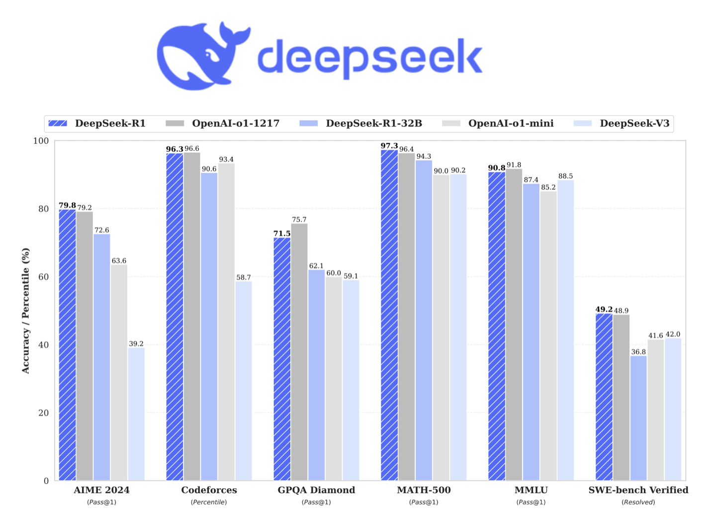
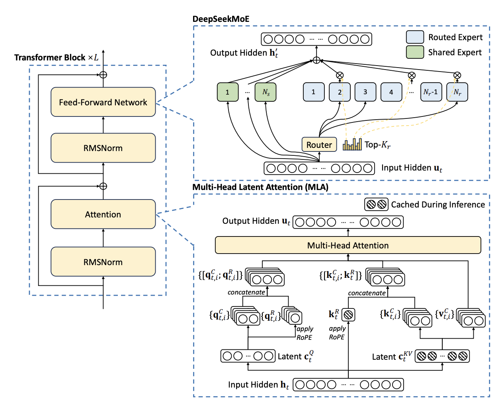
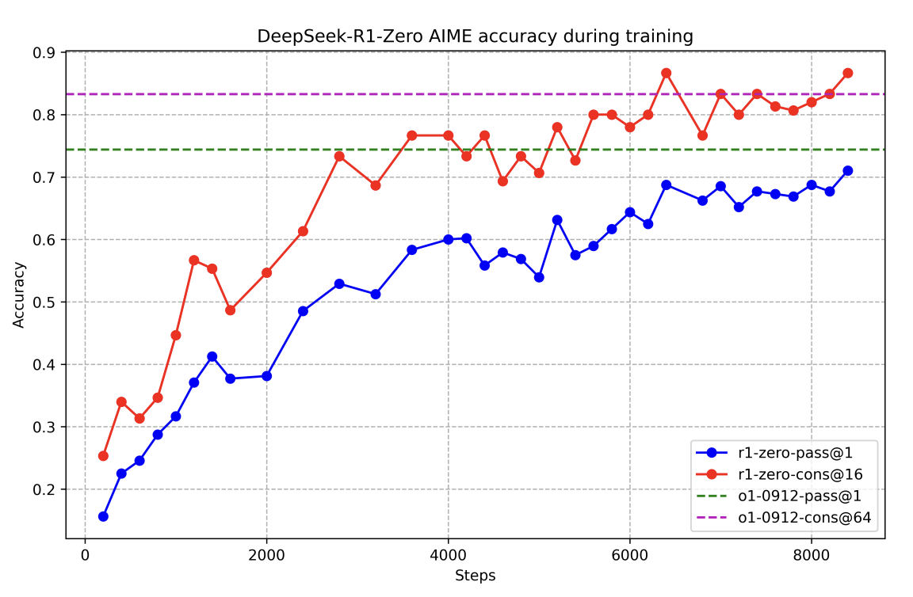
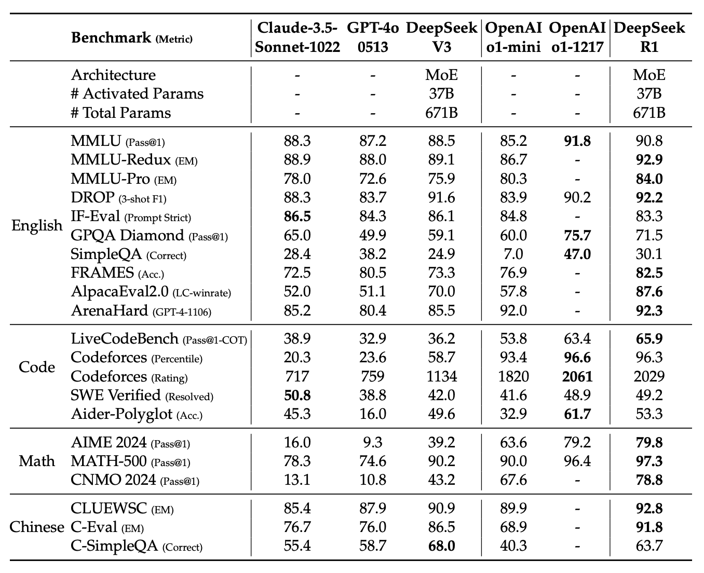
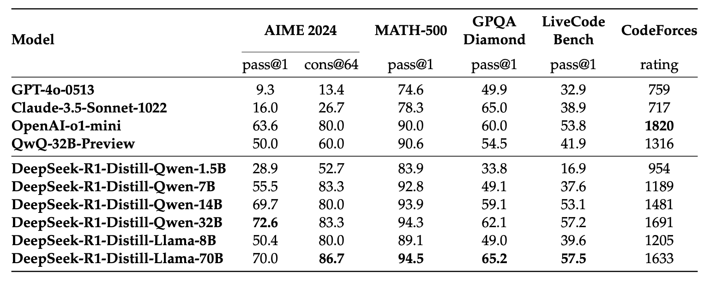

DeepSeek-R1: Advancing Reasoning Capabilities in Large Language Models

## Introduction

In recent years, Large Language Models (LLMs) have undergone rapid evolution, arguably inching closer to Artificial General Intelligence (AGI). A critical component in this progress has been post-training, which enhances reasoning capabilities, aligns models with social values, and adapts them to user preferences. DeepSeek-R1, developed by DeepSeek, represents a significant leap forward in this domain, showcasing the potential of reinforcement learning (RL) to dramatically improve LLMs' reasoning abilities. And the best part, it's open-source! 

The journey to DeepSeek-R1 began with DeepSeek-R1-Zero, a model trained using large-scale RL without any supervised fine-tuning (SFT). This approach demonstrated that LLMs could develop remarkable reasoning capabilities through pure RL. Building on this foundation, DeepSeek-R1 incorporates multi-stage training and cold-start data to address challenges like poor readability and language mixing, while further enhancing reasoning performance.

<figure markdown> 
    
    <figcaption>Benchmark performance of DeepSeek-R1 [1]</figcaption>
</figure>


## Architecture

DeepSeek-R1 builds upon the architectural foundations of DeepSeek-V3, which serves as its base model. It utilizes a Mixture of Experts (MoE) architecture, which allows for efficient scaling of model capacity. The model activates 37 billion parameters during inference, while its total parameter count reaches an impressive 671 billion. This architecture enables DeepSeek-R1 to handle complex reasoning tasks with high efficiency and effectiveness.

<figure markdown> 
    
    <figcaption>Illustration of the basic architecture of DeepSeek-R1 based on DeepSeek-V3 [1] [2]</figcaption>
</figure>

### Mixture of Experts (MoE) Framework
DeepSeek-R1 inherits DeepSeek-V3's MoE architecture featuring:

- 671B total parameters with 37B activated per token during inference
- 128,000 token context window for long-context understanding
- Hierarchical expert structure with:

  - Shared experts: 8 always-active generalist modules handling common patterns
  - Routed experts: 128 specialized modules activated based on input content

!!! Hint
    If you want to learn more about the MoE framework and models, you can refer this [article](https://newsletter.maartengrootendorst.com/p/a-visual-guide-to-mixture-of-experts).

<!-- ### Key Architectural Innovations
1. **Multi-Head Latent Attention (MLA)**
   - Compresses key-value cache into latent vectors (16x smaller than standard attention)
   - Achieves 48% faster inference compared to traditional attention mechanisms
   - Maintains 98.7% of original attention performance while reducing memory usage

2. **FP8 Mixed Precision Training**
   - Utilizes 8-bit floating point for matrix multiplications
   - Implements fine-grained quantization with:
     - Dynamic scaling factors for numerical stability
     - 16-bit accumulation for precision-critical operations
   - Reduces memory consumption by 37% during training

3. **Auxiliary-Loss-Free Load Balancing**
   - Novel bias adjustment strategy prevents expert overload
   - Achieves 93.4% expert utilization rate vs 78% in conventional MoE
   - Eliminates performance degradation from balancing constraints

4. **Expert Choice Routing**
   - Implements two-level selection process:
     - Each expert selects top-k tokens (k=2)
     - Each token selects top-2 experts from those that chose it
   - Achieves 4.2x better load balance than traditional routing

### Enhanced Training Infrastructure
- **Multi-Token Prediction Objective**
  - Predicts 6 future tokens simultaneously
  - Reduces training steps required by 27%
  - Improves code generation accuracy by 15%

- **Sparse MoE Layers**
  - Replaces 80% of dense FFN layers with MoE blocks
  - Achieves 4.9x higher throughput than dense architectures -->

### Performance Optimization
| Metric                     | DeepSeek-V3 | Conventional MoE |
|----------------------------|-------------|------------------|
| Training Efficiency (TFLOPS)| 180         | 154              | [5]
| Memory Usage per Token      | 0.83MB      | 1.42MB           | [9]
| Expert Utilization Rate     | 93.4%       | 78.1%            | [5]
| Context Processing Speed    | 12.8k t/s   | 8.4k t/s         | [15]

This architectural foundation enables DeepSeek-R1 to handle complex reasoning chains while maintaining operational efficiency. The MoE structure allows specialized expert networks to focus on different aspects of problem-solving, with the routing mechanism dynamically assembling teams of experts for each query. Combined with the reinforcement learning enhancements described in the original paper, this creates a powerful framework for advanced reasoning tasks.

## Methods

The development of DeepSeek-R1 involved several innovative approaches:

### 1. DeepSeek-R1-Zero: Pure Reinforcement Learning

The initial model, DeepSeek-R1-Zero, was trained using Group Relative Policy Optimization (GRPO), a RL algorithm that foregoes the critic model to save training costs. The reward system primarily consisted of accuracy rewards for correct answers and format rewards to enforce proper structuring of the reasoning process. While the model performed surprisingly well in reasoning tasks it encounters challenges such as poor readability, and language
mixing.

<figure markdown> 
    
    <figcaption>AIME accuracy of DeepSeek-R1-Zero during training. For each question, [author] sample 16 responses and calculate the overall average accuracy to ensure a stable evaluation. [1]</figcaption>
</figure>

### 2. Cold Start for DeepSeek-R1

To address the limitations of DeepSeek-R1-Zero, the researchers collected a small amount of long Chain-of-Thought (CoT) data to fine-tune the base model. This approach improved readability and provided a better starting point for subsequent RL training.

### 3. Reasoning-oriented Reinforcement Learning

After the cold start, DeepSeek-R1 underwent large-scale RL training focused on enhancing reasoning capabilities in areas such as coding, mathematics, science, and logical reasoning. A language consistency reward was introduced to mitigate language mixing issues.

!!! Note
    So apparently, DeepSeek R1 was nerfed to reason in only one language.

    During training, DeepSeek R1 CoT used to often mix languages particularly when RL prompts were multilingual. Researchers added a language consistency reward in RL training to reduce this, measuring the proportion of target language words. While this slightly reduced performance, it was done as it aligns with human preferences for readability. [Refer](https://www.linkedin.com/posts/imohitmayank_so-apparently-deepseek-r1-was-nerfed-activity-7291644014682869760-jf0L?utm_source=share&utm_medium=member_desktop)

### 4. Rejection Sampling and Supervised Fine-Tuning

Upon convergence of the reasoning-oriented RL, the researchers collected new Supervised Fine-Tuning (SFT) data through [rejection sampling](../machine_learning/interview_questions.md#what-is-rejection-sampling-in-machine-learning). This data included both reasoning and non-reasoning tasks, enhancing the model's general capabilities.

### 5. Reinforcement Learning for All Scenarios

The final stage involved another round of RL, this time aimed at improving the model's helpfulness and harmlessness while refining its reasoning abilities. This stage utilized a combination of rule-based rewards for reasoning tasks and reward models for general scenarios.

### 6. Distillation to Smaller Models

To make the advanced reasoning capabilities more accessible, the researchers distilled DeepSeek-R1's knowledge into smaller dense models based on Qwen and Llama architectures. For distilled models, authors apply only SFT and do not include an RL stage, even though incorporating RL could substantially boost model performance. 

!!! Note
    There is a major takeaway from this analysis regarding the efficiency of Distillation on different technique GRPO vs SFT: Transferring knowledge from advanced AI models to smaller versions ("distillation") often works better than training compact models (< 3B models) with resource-heavy reinforcement learning (RL), which demands massive computing power and still underperforms.

    In short, if your model is <3B parameters and you have sufficient data, consider supervised finetuning over RL based training.

## Experiments

The researchers conducted extensive evaluations of DeepSeek-R1 across a wide range of benchmarks, including:

1. **Knowledge and reasoning:** MMLU, MMLU-Redux, MMLU-Pro, GPQA Diamond, SimpleQA
2. **Mathematics:** AIME 2024, MATH-500, CNMO 2024
3. **Coding:** LiveCodeBench, Codeforces, SWE-Bench Verified, Aider
4. **Language understanding:** DROP, IF-Eval, FRAMES
5. **Open-ended generation:** AlpacaEval 2.0, ArenaHard
6. **Chinese language tasks:** CLUEWSC, C-Eval, C-SimpleQA

The evaluation setup included a maximum generation length of 32,768 tokens and used pass@k evaluation with non-zero temperature sampling to ensure reliable performance estimates.

## Results

DeepSeek-R1 demonstrated impressive performance across various benchmarks:

- **Reasoning tasks:** On AIME 2024, DeepSeek-R1 achieved a 79.8% Pass@1 score and for MATH-500, it attained a remarkable 97.3% score slightly surpassing OpenAI-o1-1217.

- **Coding tasks:** DeepSeek-R1 showed expert-level performance in code competition tasks, achieving a 2,029 Elo rating on Codeforces, outperforming 96.3% of human participants.

- **Knowledge benchmarks:** The model significantly outperformed its predecessor, DeepSeek-V3, on tasks like MMLU (90.8%), MMLU-Pro (84.0%), and GPQA Diamond (71.5%).

- **Open-ended generation:** DeepSeek-R1 excelled in creative writing and general question answering, achieving an 87.6% win-rate on AlpacaEval 2.0 and a 92.3% win-rate on ArenaHard.

- **Long-context understanding:** The model demonstrated outstanding performance on tasks requiring comprehension of extended contexts, substantially outperforming DeepSeek-V3.

<figure markdown> 
    
    <figcaption>Comparison between DeepSeek-R1 and other representative models [1]</figcaption>
</figure>


- **Distilled models:** Smaller models distilled from DeepSeek-R1 also showed impressive results. For instance, DeepSeek-R1-Distill-Qwen-7B achieved 55.5% on AIME 2024, surpassing the much larger QwQ-32B-Preview.

<figure markdown> 
    
    <figcaption>Comparison of DeepSeek-R1 distilled models and other comparable models on reasoning-related benchmarks [1]</figcaption>
</figure>

## Code

DeepSeek-R1-Zero exhibits an “aha moment” during training. This happened during the RL training phase wherein the model allocates more thinking time to a problem by reevaluating its initial approach. This behavior showcases the model’s growing reasoning abilities and the unexpected sophistication of reinforcement learning outcomes. The algorithm credited to this is Group Relative Policy Optimization (GRPO). Based on this, there has been several attempts to replicate similar moment using much smaller models. 

In Mini-R1 [3], the author ([Philipp Schmid](https://www.philschmid.de/)) wanted to recreate the small "aha moment" of DeepSeek-R1 using Group Relative Policy Optimization (GRPO) and the Countdown Game. The aim was to train an open model (`Qwen-2.5-3B`) using reinforcement learning trying to teach it self-verification and search abilities all on its own to solve the Countdown Game. For context, the Countdown game is a numbers puzzle where players use a set of randomly drawn numbers and basic arithmetic operations (+, -, ×, ÷) to reach or get as close as possible to a target number. At the end, the author was able to achieve 50% accuracy by 450th step of training. One interesting point to note is that in the experiment, GRPO with two rule-based rewards demanded a lot of power: 4 H100 GPUs for 6 hours over 450 training steps on a 3-billion-parameter model. This illustrates the hefty compute required for scaling reinforcement learning—remember, DeepSeek a 671-billion model gained its performance after training over 8000 steps!

In [another attempt](https://gist.github.com/willccbb/4676755236bb08cab5f4e54a0475d6fb), author ([Will brown](https://gist.github.com/willccbb)) tried to fine-tune `Qwen2.5-1.5B-Instruct` model on school math word problem dataset, which was optimised for Google Colab by [Anton](https://x.com/abacaj) for `Qwen-2.5-0.5B` base model [here](https://colab.research.google.com/drive/1bfhs1FMLW3FGa8ydvkOZyBNxLYOu0Hev?usp=sharing#scrollTo=PYykgnUJ0BdB). This increased the base model's performance on by 10% from 41.6% to ~51% via GRPO. 

GRPO code is available on `trl` python package and the process to finetune your model is as simple as shown below, [3]

```python linenums="1"
# install the packages
!pip install trl 

# import the packages
from trl import GRPOConfig, GRPOTrainer, get_peft_config, ModelConfig
 
# define the reward function 
# NOTE - this is a dummy reward function, you should code this as per your training requirement. 
def dummy_reward_func(completions, target, nums, **kwargs):
    for completion in completions:
        if "<think>" in completion and "</think>" in completion:
            return 1.0
        else:
            return 0.0

# define the model
model_config = ModelConfig(
    model_name_or_path="Qwen/Qwen2.5-0.5B-Instruct", # you can even use base model
    torch_dtype="bfloat16",
    attn_implementation="flash_attention_2",
    use_peft=True,
    load_in_4bit=True,
)
 
# set the hyperparameter
training_args = GRPOConfig(
    output_dir="qwen-r1",
    lr_scheduler_type="cosine",
    logging_steps=10,
    max_steps=100,
    max_prompt_length=256,
    max_completion_length=1024,
)

# create the trainer
trainer = GRPOTrainer(
    model=model_config.model_name_or_path,
    reward_funcs=[dummy_reward_func],
    args=training_args,
    train_dataset=train_dataset, # after loading the train dataset
    eval_dataset=test_dataset, # after loading the test dataset
    peft_config=get_peft_config(model_config),
)

# start the training
trainer.train()
```

And that's it! It is recommended to refer to [3] for more specific details about training and remember to continue training *(by increasing the steps)* until the model converges. Do save intermediate checkpoints while training. 

!!! Hint
    All of the DeepSeek models are open-sourced and can be downloaded from the [DeepSeek page](https://huggingface.co/deepseek-ai) on HuggingFace.

## Limitations

While the DeepSeek-R1 model will be considered a benchmark in AI open-source history, the researchers did acknowledge some limitations of the model. Here are four key factors to keep in mind before using it: [(refer)](https://www.linkedin.com/posts/imohitmayank_ai-deeplearning-promptengineering-activity-7291704402740977664-Xz0G?utm_source=share&utm_medium=member_desktop)

- **General Capability:** DeepSeek-R1 currently lags behind DeepSeek-V3 in tasks like function calling, multi-turn conversations, complex role-playing, and structured JSON output. If your use case heavily relies on these advanced features, maybe reconsider.

- **Language Mixing Challenges:** DeepSeek-R1 is optimized for Chinese and English. However, this can lead to language mixing issues when handling queries in other languages. For example, it may default to reasoning or responding in English, even if the query is in a different language. Keep this in mind if your application favors xAI by exposing the reasoning to users.

- **Prompt Engineering Sensitivity**: Unlike some models that thrive on few-shot prompting, DeepSeek-R1 performs best with zero-shot settings. Overloading it with examples or overly complex prompts can degrade its performance. For optimal results, keep prompts simple and directly specify the desired output format. 

- **Software Engineering Limitations**: DeepSeek-R1 has not yet shown significant improvements over DeepSeek-V3 for software engineering tasks due to inefficiencies in reinforcement learning (RL) processes. Future models might address this through techniques like rejection sampling and asynchronous evaluations, but for now, expect limited performance in this domain. 

## Conclusion

DeepSeek-R1 represents a significant advancement in the field of LLMs, particularly in enhancing reasoning capabilities through reinforcement learning. The model's performance across various benchmarks demonstrates its potential to revolutionize AI applications in fields such as education, creative writing, data analysis, etc.

Key contributions of this research include:

1. Demonstrating the effectiveness of pure RL in developing reasoning capabilities without relying on supervised fine-tuning.
2. Introducing a multi-stage training pipeline that combines RL with carefully curated cold-start data to improve model performance and readability.
3. Successfully distilling advanced reasoning capabilities into smaller, more efficient models, making these capabilities more accessible to the broader research community.

As the field of AI continues to evolve, DeepSeek-R1 stands as a testament to the power of reinforcement learning in pushing the boundaries of what large language models can achieve. Its open-source nature and the availability of distilled smaller models promise to accelerate further research and development in artificial intelligence.

## References
[1] [DeepSeek-R1: Incentivizing Reasoning Capability in LLMs via Reinforcement Learning](https://arxiv.org/abs/2501.12948)

[2] [DeepSeek-V3 Technical Report](https://arxiv.org/pdf/2412.19437v1)

[3] [Mini-R1: Reproduce Deepseek R1 „aha moment“ a RL tutorial](https://www.philschmid.de/mini-deepseek-r1)