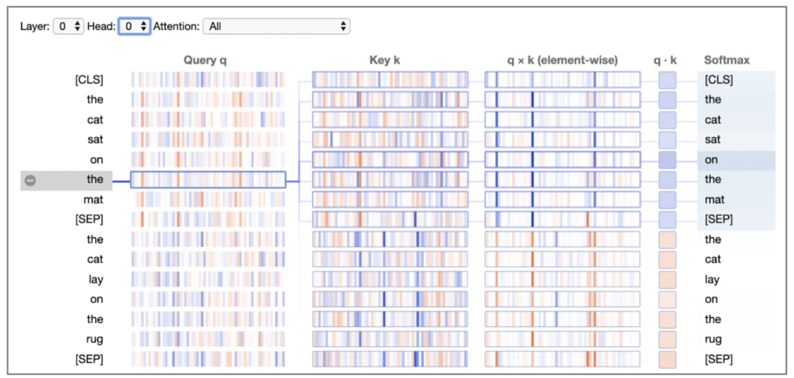

# Explainable AI: Language Models

> Hold your large language models accountable by learning how to "explain" the predictions.

<!-- <figure markdown> 
    
    <figcaption>Art generated with AI [By Author]</figcaption>
</figure> -->

## Introduction

Just like a coin, explainability in AI has two faces - one it shows to the developers (who actually build the models) and the other to the users (the end customers). The former face (IE i.e. intrinsic explainability) is a technical indicator to the builder that explains the working of the model. Whereas the latter (EE i.e. extrinsic explainability) is proof to the customers about the model's predictions. While IE is required for any reasonable model improvement, we need EE for factual confirmation. A simple layman who ends up using the model's prediction needs to know why is the model suggesting something. This article provides a brief introduction and famous techniques used to infer both types of explainabilities, with a focus on large language models.

## Large Language models

As the name suggests, language models (LMs) try to model a language by creating probability distribution over the sequence of tokens (that can be words). This can be applied to the text generation task, as once the model is good enough with the probability, it can start predicting the next words provided some contextual words (prompts). This idea forms the basis of the research in deep learning-based (DL) Natural Language Processing (NLP), where newer and SotA models are becoming better with the probability distribution. And recently several powerful models like GPT-3 are able to generate text which is very hard to distinguish from human-written text!

<figure markdown> 
    
    <figcaption>GPT-3 is used to predict the next words for the prompt "To be or not to be". The output is quite impressive! [By Author]</figcaption>
</figure>

LLMs are leading the scoreboard for several tasks in NLP. But one existing problem with them (or any DL model in fact) is that they are inherently black boxes i.e. it becomes extremely difficult to explain the predictions. Let us try to shine some grey lights on these black boxes!

## Intrinsic explainability
Intrinsic explainability tries to provide technical clarity on why the model made some predictions. Large LMs (LLMs) are mostly DL-based models and while they become better with predictions given more data or network parameters, it comes with a cost of explainability. They are not straight forward explainable and we need to derive ways to infer why a model made the prediction. Below let's briefly go through some of those ways.

### Attention-based
The recent LLMs utilize Transformer-based architecture for enhanced performance. What makes Transformers unique is the presence of multiple attention layers and heads to capture bidirectional and context-aware token representation. Each attention head learns certain patterns that could help in language modeling. These patterns could be positional (attend to the previous word) or lexical (attend to acronyms, synonyms, etc) in nature. And when we combine multiple such heads in multiple layers, the overall model is able to capture sophisticated patterns and provide accurate predictions.

These kinds of internal and low-level patterns can be observed by using attention score visualization tools like bertviz [1]. There could be two major types of visualizations, (1) Attention head visualization - which could be helpful to see how the model attends to certain words with another word in context, and (2) Neuron visualization - which could be used to connect the model behaviors to neuron values.

For the Attention head visualization, you can select the model, the layer, and the head to explore the different attention patterns. One example is shown below. 

<figure markdown> 
    
    <figcaption>Example of Attention head view to detect association of words in the model. Also useful to detect gender biases. [1]</figcaption>
</figure>

Here the layer 5 and 11th head of the model (2nd last blue color box from the color palette) seems to incorporate the gender-specific patterns (lexical) in the language. That is why, the attention score for gender-related words (She, girl), (He, boy), (He, Bob), etc is high. As such, this head could be used to identify gender bias as well, which is evident from the associations -  (nurse, She) and (doctor, He). Similar biases can be identified from other heads.

The neuron view is useful to drill down even deeper into the attentions scores to identify the specific neuron leading to certain behaviors in the model. One such example is shown below,

<figure markdown> 
    
    <figcaption>Neuron view of GPT-2 for layer 1, head 10 [1]</figcaption>
</figure>

Here, for layer 1 and head 10, some of the neurons' value decreases with an increase in distance. This showcases that the particular neurons have incorporated distance patterns!

### Saliency methods

Attention presents a very myopic view as they are limited to a certain part of language models. As such they just provide the behavior for that part of the model. As an analogy, it's like explaining just one line of the complete code. This ideation has led to a debate on whether attention really presents the true explainability of the complete model?! To mitigate these concerns, there has been renewed interest in old, tried, and tested saliency methods [2]. These are,

- **Gradient-based:** where we compute the gradient of the neural network's outcome with respect to the input. The idea is quite simple -  as we compute gradients of the output wrt to the different parameters to find the importance and magnitude of correction needed for the parameters, why not do the same but for the inputs? This computation  provides us a holistic view of the importance of each input wrt to the output.
- **Propagation-based:** Gradient-based approach is a plain vanilla approach where backpropagation happens without additional computation at any layer i.e. it's a simple inverse (not mathematically) of the forward pass. In the propagation-based approach, we perform relevance-based modifications at each layer. It can be thought of as an enhanced version of the gradient-based approach. 
- **Occlusion based:** where we measure the importance of input on the output by erasing the input and estimating the effect on the output. It  can be done by either recomputing output with the particular input missing or a mask in its place. Intuitively, the variation in the output will be high in case the input is important, and close to zero otherwise.

There are several open-source packages like Ecco, that provide the option to visualize the saliency measure. One example is shown below,

<figure markdown> 
    
    <figcaption>Gradient-based method to visualize the importance of the input words for the next word prediction (India) [By Author]</figcaption>
</figure>

Here, for the input "New Delhi is the capital of", LLM returned "India" which is factually correct. But intuitively, we would like to know which certain part of the input motivated the model to make such a prediction. The important measure is highlighted with color in the image, and as visible it gave a high score to "New Delhi" and "capital"!

## Extrinsic explainability

The intrinsic measures fall short of covering the "needs" of explainability due to two reasons. Firstly, while it may help the model developer with access to internal metrics, it becomes quite difficult for the stakeholders on the other end of the spectrum to make sense of these complicated numbers. We are talking about the end-user of the model who could be a doctor in healthcare, engineers in mechanical, sales executive in the sales domain, and so on. They care more about factual correctness than the reason behind a model's prediction. Secondly, even the model developers will be concerned if the internal metrics make sense but the output doesn't (output is incorrect).

The problem with the existing language models is that they contain all their knowledge within the parameters. GPT-3 is made up of 175 Billion parameters and it has been shown to work on a large number of downstream tasks. It generates the text based on the information it learned and stored in its parameters during the training and fine-tuning phase. Take one task of question answering as an example, where the question is "Who is the Prime Minister of India?". While the model may answer it correctly now, how about after the next election? The answer is obvious, it will fail. This is because the information gained is constant and would need re-training to calibrate constantly with the latest events in the world (which is a costly affair [3]).

Because of all these reasons, there has been a research interest in enhancing the language models by complimenting them with a connection to a dynamic knowledge base - that is kept up to date just like any other database.
Some examples by the leading AI teams in the world are as follows,

- **GopherCite** [4] from DeepMind is an enhancement of their language model named Gopher. It was created to solve the existing problem of "hallucinations" in the Gopher model. In their terms, hallucination of the model leads to incorrect, sometimes nonsensical, text generations. Because of this, humans are required to not take the output for granted and perform proof checks. GopherCite removes that human dependency to some extent by using Google search to find relevant quotes as proof for its prediction. In case no such high probable proofs are found, it even admits defeat instead of providing a wrong answer!

<figure markdown> 
    { width="500" }
    <figcaption>Gradient-based method to visualize the importance of the input words for the next word prediction (India) [By Author]</figcaption>
</figure>

- **WebGPT** *[5]* from OpenAI is an attempt by the creators of GPT-3 to solve the hallucination problem. They complimented GPT with an additional model that interacts with text-based web browsers to find the most relevant web pages for the asked question. For this, the model learned basic commands like "Search …", "Find in page: …", or "Quote: …". The model goes through web pages to find passages and then uses these to compose an answer. The final output contains references to the source web pages as an attempt to legitimize the results.

<figure markdown> 
    { width="500" }
    <figcaption>Final output generated by WebGPT for the question "How do neural networks work?". Note the presence of References at the bottom. Taken from the blog.</figcaption>
</figure>

- **LaMDA** [6] from Google is a language model for dialog-based interactions. A lot of times, the conversation could become complicated (involving non-fictional characters or real entities), and then it becomes imperative that the model knows the correct context and background knowledge. Based on the conversation, LaMDA can call an external information retrieval system to improve the factual groundedness of its responses.

<figure markdown> 
    { width="500" }
    <figcaption>Example of a conversation with Mt. Everest using LaMDA. Taken from blog.</figcaption>
</figure>

## References

[1] [A Multiscale Visualization of Attention in the Transformer Model](https://arxiv.org/abs/1906.05714)

[2] [Why use attention as explanation when we have saliency methods?](https://arxiv.org/pdf/2010.05607.pdf)

[3] [Cost of training GPT-3 | Reddit](https://www.reddit.com/r/MachineLearning/comments/hwfjej/d_the_cost_of_training_gpt3/)

[4] [Teaching language models to support answers with verified quotes](https://arxiv.org/abs/2203.11147)

[5] [WebGPT: Browser-assisted question-answering with human feedback](https://arxiv.org/abs/2112.09332)

[6] [LaMDA: Language Models for Dialog Applications](https://arxiv.org/abs/2201.08239)

Cheers.