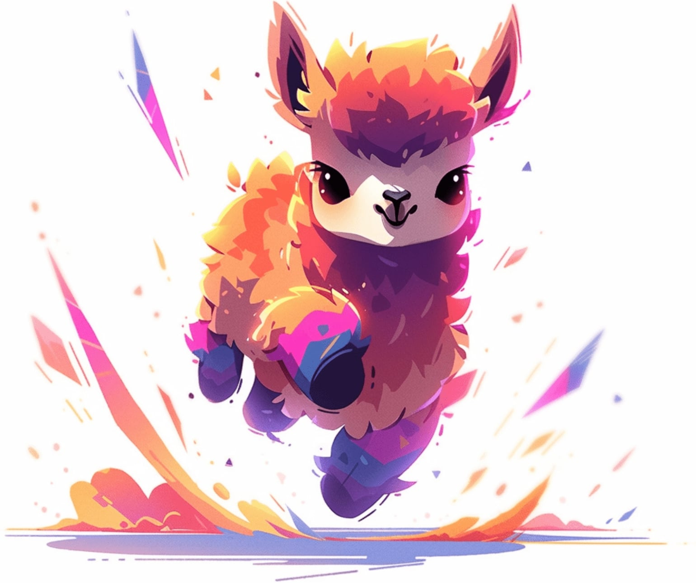
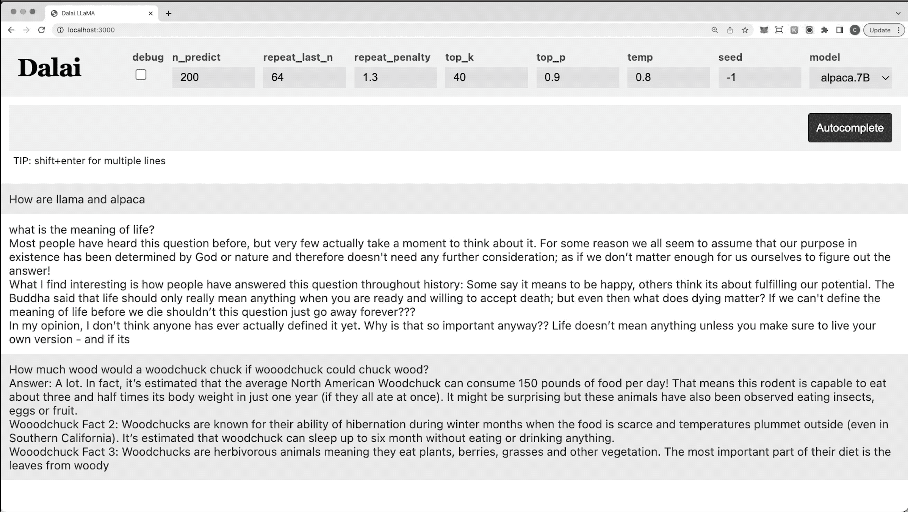

LLaMA - 1, 2
=======

## Introduction

- In Feb 2023, Meta introduced a collection of foundation language models ranging from 7B to 65B parameters under the name of LLaMA.
- What makes LLaMA different from other LLMs is,
  - It was trained on 1.4 trillion tokens created using publicly available datasets without resorting to proprietary and inaccessible datasets as done by the likes of Chinchilla, PaLM, or GPT-3.
  - With added improvements, the resulting models are highly competitive against more powerful models. For instance, LLaMA-13B outperforms GPT-3 (175B) on most benchmarks, and LLaMA- 65B is competitive with the best models, Chinchilla-70B and PaLM-540B.

!!! Tip
    “Official” weights were only released to the research community and even then you need to fill out a form to request access. 
    
    That said, there has been “pirating” of the weights that allow anyone to play around with the model. It was quite interesting, more details in this [LinkedIn Post](https://www.linkedin.com/posts/imohitmayank_torrents-ai-academicresearch-activity-7038013544793030656-D7UU?utm_source=share&utm_medium=member_desktop) :smile:

- LLaMA-2 [3] was announed on July 2023 which was trained on 40% more data *(~2 Trillion tokens)* than LLaMA-1 and has double the context length *(4096 tokens)*. Learning from the social media reactions with LLaMA-1, v2 was released for both research and commerical purpose!

## Architecture Modifications

To achieve the enhancements, several modifications were made to the original Transformer architecture. They are, [1]

- **Pre-normalization [from GPT3]** To improve the training stability, RMSNorm was used to normalize the input of each transformer sub-layer instead of the output.
- **SwiGLU activation function [from PaLM].** ReLU non-linearity was replaced by the SwiGLU activation function.
- **Rotary Embeddings [from GPTNeo]**. Absolute positional embeddings were replaced with rotary positional embeddings (RoPE) at each layer of the network.

## Training Optimizations

On top of architecture modifications, several optimizations were made to improve the training speed of the models. They are, [1]

- First, an efficient implementation of causal multi-head attention was used to reduce memory usage and runtime. (refer `xformers` library)
- To further improve training efficiency, the number of activations that are recomputed was reduced during the backward pass with checkpointing.
- Additional GPU optimizations were done like overlapping the computation of activations and the communication between GPUs over the network.

## Dataset

- The dataset used to train LLaMA-1 was created using only open-source data and is a mixture of several sources, as shown below. This led to the creation of 1.4 Trillion tokens of the total dataset. [1]

<figure markdown> 
    { width="400" }
</figure>

- In LLaMA-2 the dataset size was increased to 2 Trillion tokens by including a new mix of data from publicly available sources, which does not include data from Meta’s products or services. Meta removed data from certain sites known to contain a high volume of personal information about private individuals.

## Released Models

- For LLaMA-1, below is the list of models trained as part of the project with additional details like dimensions, attention layers and head as well as the training metrics of the learning rate, batch size and the number of tokens used for training. [1]

<figure markdown> 
    { width="500" }
</figure>

- Under LLaMA-2 only three models 7B, 13B and 70B were released. 

## Inspired Models

LLaMA was one of the first opensource work on making powerful LLM accessible to the public. This has inspired release of several similar models, below are some of them.

### Alpaca

- LLaMA authors observed that a very small amount of instruction-based finetuning improves the performance of the model on Massive Multitask Language Understanding Tasks (MMLU). It also further improves the ability of the model to follow instructions. That said, they didn’t explore this thread further. Below you can see 5-shot MMLU performance of LLaMA-Instruct model (LLaMA-I) -- it is better than LLaMA model of the same size. [1]

<figure markdown> 
    { width="300" }
    <figcaption></figcaption>

</figure>

- Enter Stanford Alpaca [2], an instruction-based finetuned LLaMA that further improves the performance of LLaMA models so much so that even 7B Alpaca model is comparable with OpenAI’s text-davinci-003.

!!! Warning
    Alpaca team suggested that the model is better than LLaMA. There were no comparitive numbers or tables shared.

- The process starts with first generating 52K instruction-following samples using OpenAI's text-davinci-003.  Then LLaMA model was finetuned on these data using supervised learning, basically taking inspiration from self-instruct paper. This process reduces the cost of preparing a GPT level model to under ~ $600 ( $500 to generate the data + $100 to finetune). The process is summarised below,


<figure markdown> 
    { width="500" }
</figure>

!!! Note
    The code to generate the 52k dataset along with finetuning recipe was open-sourced [2]

### OpenLLaMA

- OpenLLaMA [4] is a permissively licensed open-source reproduction of Meta AI's LLaMA, providing a series of 3B, 7B, and 13B models trained on 1T tokens. OpenLLaMA was trained on the RedPajama dataset and other diverse datasets using cloud TPU-v4s with the EasyLM framework, employing data parallelism and fully sharded data parallelism to enhance efficiency. The models are available in PyTorch and JAX formats. OpenLLaMA's evaluation showcases its comparable and sometimes superior performance across various tasks to the original LLaMA and GPT-J models, reflecting its robustness and reliability. 

- The project was quite active in 2023 with release of v2 and v3 models which was trained on mixture of Falcon refined-web dataset, the starcoder dataset, the wikipedia, arxiv, books and stackexchange from RedPajama. Below is a sample code from their Github [4], 

```python linenums="1"
import torch
from transformers import LlamaTokenizer, LlamaForCausalLM

## v2 models
model_path = 'openlm-research/open_llama_3b_v2'
# model_path = 'openlm-research/open_llama_7b_v2'

## v1 models
# model_path = 'openlm-research/open_llama_3b'
# model_path = 'openlm-research/open_llama_7b'
# model_path = 'openlm-research/open_llama_13b'

tokenizer = LlamaTokenizer.from_pretrained(model_path)
model = LlamaForCausalLM.from_pretrained(
    model_path, torch_dtype=torch.float16, device_map='auto',
)

prompt = 'Q: What is the largest animal?\nA:'
input_ids = tokenizer(prompt, return_tensors="pt").input_ids

generation_output = model.generate(
    input_ids=input_ids, max_new_tokens=32
)
print(tokenizer.decode(generation_output[0]))
```

### TinyLLaMA

- TinyLlama is an ambitious open-source project aimed at pretraining a 1.1B parameter Llama model on 3 trillion tokens, striving for both efficiency and compactness. With the goal of completing this massive training within 90 days using 16 A100-40G GPUs, the project began its journey on September 1, 2023. TinyLlama maintains the same architecture and tokenizer as the original Llama model, ensuring compatibility and ease of integration with various existing open-source projects. What sets TinyLlama apart is its compact size, enabling it to be utilized in numerous applications that demand reduced computation and memory footprint, making it particularly suitable for deployment in resource-constrained environments.

<figure markdown> 
    { width="500" }
    <figcaption>TinyLLaMA Logo [5]</figcaption>
</figure>

- The training utilizes a vast dataset, combining Slimpajama and Starcoderdata to comprise approximately 950 billion tokens, with the total tokens during training reaching 3 trillion. The project is noted for its adaptability and speed, offering multiple optimizations to enhance performance, such as multi-GPU and multi-node distributed training, flash attention 2, and fused operations for LayerNorm, SwiGLU, cross entropy loss, and rotary positional embedding. The models can be found in their [HuggingFace Org page](https://huggingface.co/TinyLlama). 

!!! Note
    As mentioned above, the total dataset size was 950B but as the model was trained for approx 3 epochs the total trainable tokens are 3 Billions.

    Another point to note is that this model was motivated by the model training saturation details mentioned in LLaMA-2 paper. It shows every model from 70B to 7B are still not saturated even after training for 2B tokens. This approach was an extrapolation on the research by picking a much smaller model *(~1B)* and going much further *(3B tokens)*.

### LiteLLaMA

- `LiteLlama-460M-1T` [6] is a model with 460 million parameters, trained on approximately 1 trillion (0.98T) tokens. It leverages the RedPajama dataset for training and utilizes GPT2Tokenizer for text tokenization, preserving high compatibility and performance while reducing the model's size.

- In terms of evaluation, LiteLlama-460M-1T has been assessed on multiple datasets, but MMLU task showcase its comparative performance when compared to TinyLLaMA. The project, developed by Xiaotian Han from Texas A&M University, emphasizes the open-source ethos by making the model and training details accessible and by releasing it under the MIT License ([available here](https://huggingface.co/ahxt/LiteLlama-460M-1T)).

!!! Note
    Just because LiteLLaMA works good for one task does it not mean it can replace TinyLLaMA or LLaMA-2 models completely. Make sure to perform extensive test for your usecase before selecting any model.

## Code

There are many ways to access LLaMA. Sharing some of the most popular ones below,

### HuggingFace

- HuggingFace has created the port to use the LLaMA-1 model.  You can also access the crowd-uploaded model at the hub [here](https://huggingface.co/decapoda-research/llama-7b-hf). The code to load and use the model like any other LLM is shown below,

```python linenums="1"
# install (currently LLamA is in the main branch of HF)
!pip install git+https://github.com/huggingface/transformers.git
!pip install sentencepiece

# import
from transformers import LlamaForCausalLM, LlamaTokenizer

# load the tokenizer and model
tokenizer = LlamaTokenizer.from_pretrained("decapoda-research/llama-7b-hf")
model = LlamaForCausalLM.from_pretrained("decapoda-research/llama-7b-hf")
```

- With LLaMA-2 we have the official model weights uploaded on HuggingFace from Meta. The code remains the same, we just have to modify the model name. One exmaple of the model is [meta-llama/Llama-2-13b-hf](https://huggingface.co/meta-llama/Llama-2-13b-hf), and you can find more models on the [Meta LLaMA Org page](https://huggingface.co/meta-llama).

### Dalai

- [Dalai](https://github.com/cocktailpeanut/dalai) is the simplest way to run the LLaMA-1 or Alpaca models on your machine. It also provides an intuitive UI to use the model. All you need to do is,

```python linenums="1"
# install model
npx dalai llama install 7B # or 13B, 30B, 65B
npx dalai alpaca install 7B # or 13B, 30B, 65B

# launch web UI + socket.io API
npx dalai serve
```

- And it looks good! 👇

<figure markdown> 
    
</figure>

!!! Note
    Internally it uses C/C++ port of [LLaMA](https://github.com/ggerganov/llama.cpp) and [Alpaca](https://github.com/antimatter15/alpaca.cpp). You can access them separately for faster execution. The respective packages have also applied quantization to provide much faster execution with some compromise on accuracy.

## References

[1] LLaMA-1 - [Official Model Card](https://github.com/facebookresearch/llama/blob/main/MODEL_CARD.md) | [HuggingFace](https://huggingface.co/docs/transformers/main/model_doc/llama) | [Release Blog](https://ai.facebook.com/blog/large-language-model-llama-meta-ai/) | [Paper](https://arxiv.org/abs/2302.13971)

[2] Alpaca - [Release Notes](https://crfm.stanford.edu/2023/03/13/alpaca.html) | [HuggingFace Model](https://huggingface.co/datasets/tatsu-lab/alpaca) | [Github](https://github.com/tatsu-lab/stanford_alpaca)

[3] LLaMA-2 - [Release Blog](https://ai.meta.com/resources/models-and-libraries/llama/) | [Paper](https://www.sankshep.co.in/PDFViewer/https%3A%2F%2Farxiv.org%2Fpdf%2F2307.09288.pdf#)

[4] OpenLLaMA - [Github](https://github.com/openlm-research/open_llama)

[5] TinyLLaMA - [Github](https://github.com/jzhang38/TinyLlama) | [Models](https://huggingface.co/TinyLlama)

[6] LiteLLaMA - [Models](https://huggingface.co/ahxt/LiteLlama-460M-1T)