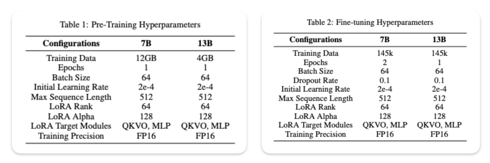

# Making LLM Multi-lingual

## Introduction

Current Large Language Models (LLMs) show impressive linguistic capabilities but are predominantly skewed towards English, limiting their effectiveness in truly multilingual contexts. To bridge this gap, initiatives like OpenHathi's adaptation of LLaMa-2 are pivotal, aiming to create genuinely multilingual *(or bilingual in OpenHathi's case)* models that can process and understand multiple languages with equal proficiency. This article delves into why and how we should move towards multilingual LLMs, expanding the horizons of AI's linguistic abilities.

## Challenges

Creating a multilingual model presents various challenges. Firstly, there is the issue of data imbalance, where languages like English dominate available datasets, while others are underrepresented. Another challenge is linguistic diversity; languages vary significantly in syntax, semantics, and structure, requiring models to adapt to a wide range of linguistic rules. Additionally, cultural nuances and contextual understanding are vital for accuracy in translation and comprehension, further complicating the task. These challenges necessitate innovative approaches to model training and architecture.

## Examples

### OpenHathi for Hindi

- [Sarvam.ai](www.sarvam.ai) announced the OpenHathi series of work to encourage innovation in Indian language AI. This was built under a partnership with AI4Bharat *(academic partners)* who contributed language resources and benchmarks. Below are the highlights of their process of finetuning existing LLaMa-2 *(to create a base model)* into a bilingual LLM:

  1. **Modifying the Tokenizer:** A custom tokenizer was developed to handle Hindi text efficiently by integrating new tokens into the LLaMa-2's embedding layer. This modification was crucial for accurately processing and representing Hindi language nuances within the model. This also substantially reduced the overall token consumptions for inference and training *(sometimes even 4x!)*.

    <figure markdown> 
        { width="500" }
        <figcaption>Reduction in token consumpting by token modification done for OpenHathi for Hindi text</figcaption>
    </figure>

  2. **Dataset:** They used multiple approaches to procure Hindi content like using the Sangraha corpus or scraping existing Hindi articles from Wikipedia (~150k) or translate English articles to Hindi using AI4Bharat's [IndicTrans2 model](https://ai4bharat.iitm.ac.in/indic-trans2/). This diverse dataset enabled effective bilingual next-token prediction training, a key step for the model's bilingual capabilities.

  3. **Training Process:** The model underwent a specialized bilingual language modeling process, where sentences alternated between Hindi and English. This method was instrumental in enhancing the model's ability to understand and align both languages effectively. The hypothesis here was that by alternating different language sentences, Hindi words from one sentence will attend to English words from previous sentence, overall helping in world knowledge building for Hindi tokens.

    <figure markdown> 
            { width="500" }
            <figcaption>Bilingual training is more efficient than only monolingual training, even if we use 5x more data!</figcaption>
    </figure>

  4. **Trained a PEFT Adapter:** They used a low-rank adapter (LoRA) throughout the process of training to enhance the training and inference efficienly. 

- Finally the trained base model was finetuned for different downstream usecases and its performance was better than GPT-3.5 for some Hindi content oriented tasks like content moderation or writing in Hindi. On top of it, the token consumption was substantially less due to modified tokenizer. This makes OpenHathi the go-to AI model for Hindi or Romanised Hindi (Hinglish) tasks.

### Tamil-LLaMa for Tamil

- Another example is Tamil-LLaMA [2] which was created by [Abhinand Balachandran](https://www.linkedin.com/in/abhinand-05/), wherein he released 7B and 13B models. Here are the finer details, 
  1. **Modifying the Tokenizer**: The open-source LLaMA 2 model was modified with 16,000 new Tamil tokens, aiming to achieve superior text generation and comprehension in Tamil. This lead to new model only requiring 20%-25% of the tokens for Tamil text generation when compared to original LLaMA tokeniser.

  2. **Datasets**: For the initial pre-training phase of LLaMA 2, author used the CulturaX dataset which is a combination of many popular datasets. To manage high cost, only 600k documents *(out of the 4.72 million documents in CulturaX)* were used. For Instruction finetuning, a translated version of the Stanford Alpaca dataset comprising 52,000 instructions was used. Concurrently, author also integrated a specialized no-code section from the OpenOrca dataset, which consists of around 93,000 instructions. Note, Google Translation API service was used for all translation purpose.

  3. **Trained a PEFT Adapter:** The LoRA methodology was strategically employed for efficient model training on a comprehensive Tamil corpus, ensuring computational feasibility and model robustness. Here are the finer details on the data used for indiviudal training step.

  <figure markdown> 
        
        <figcaption>Training details of Tamil-LLaMa [2]</figcaption>
  </figure>

## Reference

[1] [OpenHathi Series Release Notes](https://www.sarvam.ai/blog/announcing-openhathi-series)

[2] தமிழ் Llama - [Article](https://analyticsindiamag.com/meet-the-creator-of-tamil-llama/) | [Paper](https://www.sankshep.co.in/PDFViewer/https%3A%2F%2Farxiv.org%2Fpdf%2F2311.05845.pdf)