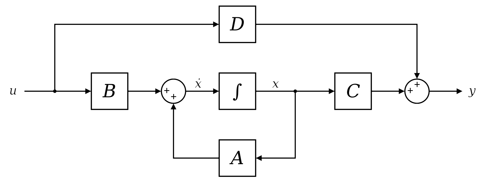
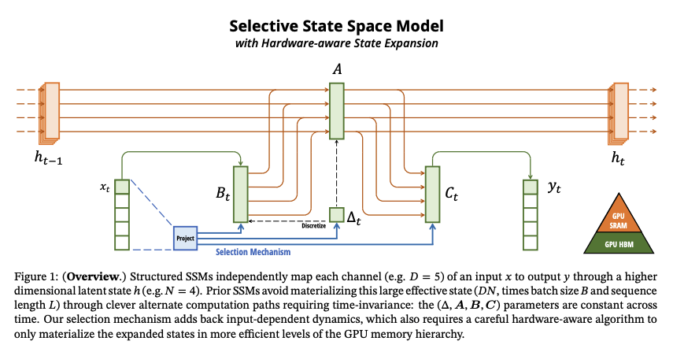
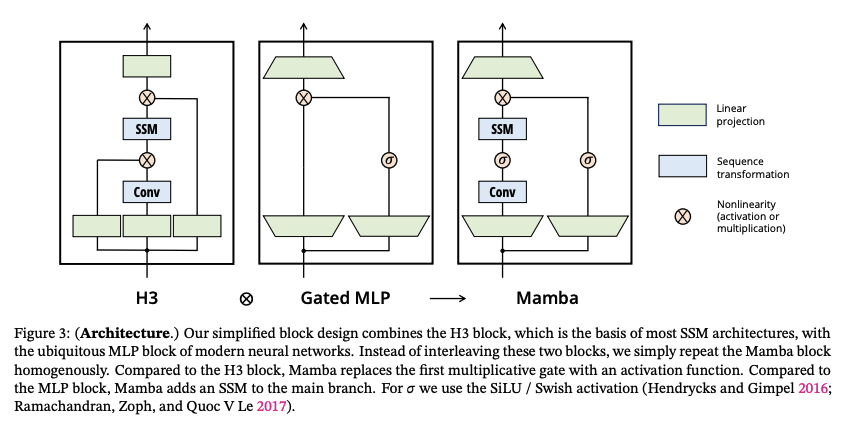
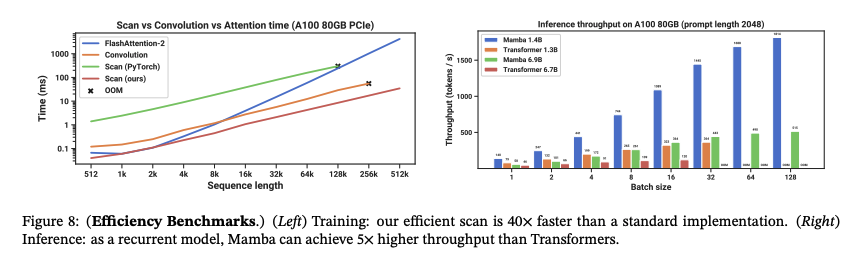
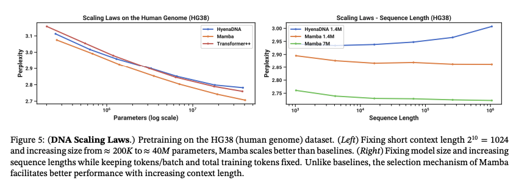
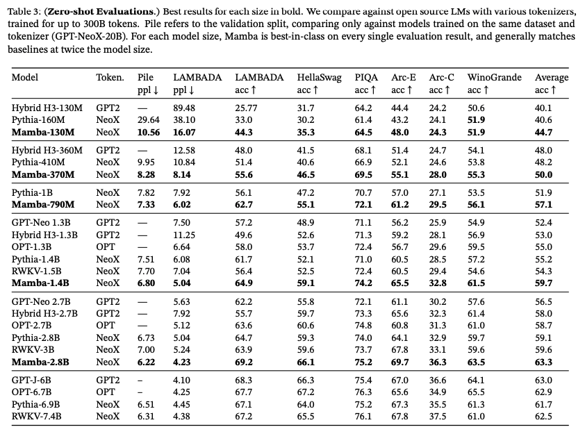

## Introduction

Mamba is a new architecture designed to address a longstanding challenge in sequence modeling: the trade-off between efficiency and accuracy. Sequence modeling tasks involve analyzing ordered sequences of data, such as text, audio, or video.  These sequences can vary greatly in length, and processing them effectively requires models that are both powerful and computationally efficient.

Traditionally, [recurrent neural networks (RNNs)](./lstm_gru_rnn.md) were the go-to architecture for sequence modeling. However, RNNs suffer from limitations, like they struggle to capture long-range dependencies between elements in the sequence. This leads to accuracy problems.

Transformers emerged as a powerful alternative to RNNs, addressing some of their shortcomings. Transformers employ an attention mechanism that allows them to focus on specific parts of the sequence, improving their ability to capture long-range dependencies. However, Transformers come with their own drawbacks as they can be computationally expensive and memory-intensive, especially for very long sequences.

Mamba builds upon State Space Models (SSMs), a less common type of architecture for sequence modeling. SSMs offer advantages in terms of speed and memory usage compared to Transformers. However, they haven't been able to match the accuracy of Transformers on various tasks. Mamba addresses this accuracy gap by introducing several innovations to SSMs, making them competitive with Transformers while retaining their efficiency benefits.

## State Space Models (SSMs)

<figure markdown> 
        
        <figcaption>View of a continuous, time-invariant SSM *(Source: https://en.wikipedia.org/wiki/State-space_representation)* [3]</figcaption>
</figure>

In working, SSMs are quite similar to RNN as they are a type of architecture specifically designed for sequence modeling tasks. They work in a step-by-step fashion, iteratively processing each element (token) in a sequence. At each step, SSMs consider two pieces of information:

* The previous token's hidden state: This hidden state represents a compressed representation of all the information processed so far in the sequence. It captures the context of the sequence up to the current token.
* The current input token's embedding: An embedding is a dense vector representation of the token. It encodes the meaning of the individual token within a specific vocabulary.

By combining these two pieces of information, SSMs can learn how the current token relates to the preceding tokens in the sequence. This allows the model to build up a deeper understanding of the sequence as it processes it element by element.

As part of core components, SSMs rely on four sets of matrices and parameters ($\text{Delta}$, $A$, $B$, and $C$) to handle the input sequence. Each matrix plays a specific role in transforming and combining information during the processing steps:

- $\text{Delta}$ ($\Delta$): This parameter controls the discretization step, which is necessary because SSMs are derived from continuous differential equations.
- $A$ and $B$: These matrices determine how much information is propagated from the previous hidden state and the current input embedding to the new hidden state, respectively.
- $C$: This matrix transforms the final hidden state into an output representation that can be used for various tasks.
  
Here's a breakdown of the processing steps within SSMs:

* **Discretization Step:** A crucial step in SSMs involves modifying the $A$ and $B$ matrices using a specific formula based on the $\text{Delta}$ parameter. This discretization step is necessary because SSMs are derived from continuous differential equations. The mathematical conversion from continuous to discrete form requires adjusting these matrices to account for the change in how information is processed. In simpler terms, discretization essentially chops up the continuous flow of information into discrete chunks that the model can handle more efficiently.
  
  $$
  \overline{A} = \exp(\Delta A); 
  \overline{B} = (\Delta A)^{-1} (\exp(\Delta A) - I) \cdot \Delta B
  $$

* **Linear RNN-like Processing:** Similar to recurrent neural networks (RNNs), SSMs process tokens one by one. At each step, they use a linear combination of the previous hidden state and the current input embedding to compute a new hidden state. This hidden state captures the essential information about the sequence seen so far. Unlike traditional RNNs, which can struggle with vanishing or exploding gradients in long sequences, SSMs are designed to address these issues and can handle longer sequences more effectively.
* **Final Representation:** The final representation for each token is obtained by multiplying the hidden state with another matrix (C). This final representation can then be used for various tasks, such as predicting the next word in a sequence or classifying a DNA sequence. 

While SSMs offer advantages in terms of speed and memory efficiency, particularly when dealing with long sequences, their inflexibility in processing inputs limits their accuracy. Unlike Transformers that can selectively focus on important parts of the sequence using attention mechanisms, regular SSMs treat all tokens equally. This can hinder their ability to capture complex relationships within the sequence data.

## Selective State Space Models (SSSMs)

Mamba builds upon SSMs by introducing Selective SSMs. This innovation allows the model to prioritize specific elements within the sequence.  Imagine selectively focusing on important words in a sentence while processing it.  Regular SSMs apply the same processing logic *(read same $\text{Delta}$, $A$, $B$ and $C$)* to every element, while Selective SSMs can learn to pay closer attention to crucial parts of the sequence.

<figure markdown> 
        
        <figcaption>Source: [1]</figcaption>
</figure>

Selective SSMs achieve this selective focus by dynamically adjusting the processing based on the current element. They employ additional trainable parameters that determine how much weight to assign to each element in the sequence. This weighting mechanism can be thought of as an attention mechanism, similar to what is found in Transformers. However, unlike Transformers, which rely on computationally expensive self-attention calculations, Selective SSMs achieve a similar effect through a more efficient linear operation.

Here's a deeper dive into how Selective SSMs work:

1. **Linear Layers:** Separate linear layers are introduced to compute these element-wise weights. Each element in the sequence is passed through a dedicated linear layer, resulting in a weight specific to that element.
2. **Weighting:** The calculated weights are then used to modulate the influence of each element on the hidden state. Elements deemed more important by the model will have a greater impact on how the hidden state evolves.
3. **Learning the Importance:** Through the training process, the model learns to identify the elements that are most informative for the task at hand. This allows the model to focus its processing power on the crucial parts of the sequence, while efficiently handling less important elements.

## Mamba's Architecture

A Mamba layer consists of several components that work together to achieve efficient and accurate sequence modeling:

<figure markdown> 
        
        <figcaption>Source: [1]</figcaption>
</figure>

* **Increased Dimensionality:** The input is first projected to a higher dimensional space using a linear layer. This increases the network's capacity to learn complex relationships between elements in the sequence. A higher dimensional space allows for more intricate feature representations, enabling the model to capture richer information from the data.
* **Convolution Layer:** This layer facilitates information flow between different dimensions within the higher-dimensional space. Convolutional operations are adept at capturing local patterns and dependencies between elements. In the context of Mamba, the convolution layer helps the model identify how nearby elements in the sequence relate to each other and influence the hidden state.
* **Selective SSM Module:** This core component processes the sequence using the Selective SSM approach described earlier. The selective SSM module dynamically computes weights for each element, allowing the model to focus on the most informative parts of the sequence. This selective processing contributes to Mamba's efficiency, particularly for long sequences.
* **Gated Multiplication:** This step modulates the influence of the current element on the hidden state based on its similarity to the hidden state itself. A gating mechanism essentially controls the flow of information. In Mamba, the gated multiplication amplifies the impact of elements that are similar to the current state of the model's understanding of the sequence, while reducing the influence of elements that are dissimilar. This helps the model refine its understanding of the sequence in a targeted manner.
* **Dimensionality Reduction:** The final output of a Mamba layer is projected back to the original dimension using another linear layer. This reduces the dimensionality of the representation to a more manageable size for subsequent layers in the network architecture.

## Mamba's Impact and Results

Mamba demonstrates promising results, particularly for long sequences:

* **Speed:** Mamba achieves super fast speed which becomes even better with increase in sequence length and batch sizes.

    <figure markdown> 
            
            <figcaption>Source: [1]</figcaption>
    </figure>

* **Performance:** Mamba outperforms Transformers based models *(even 2x bigger ones!)* on various tasks.
    <figure markdown> 
            
            <figcaption>Source: [1]</figcaption>
    </figure>

    <figure markdown> 
            
            <figcaption>Source: [1]</figcaption>
    </figure>

!!! Hint
    As Mamba performs quite well on long sequences *(evident from its performance on DNA dataset)*, there is an interesting space of work in MambaByte [4] which is a token-free adaptation of the Mamba SSM trained auto-regressively on byte sequences. This model is able to achieve state-of-the-art performance on byte-level language modeling tasks.

## Conclusion

Mamba's emergence demonstrates the continuous evolution of deep learning architectures. With its focus on speed, memory efficiency, and scalability for long sequences, Mamba offers a compelling alternative to Transformers and paves the way for further exploration in sequence modeling techniques. That said, Mamba is a relatively new architecture, and further research is needed to fully understand its capabilities compared to Transformers. Nevertheless, Mamba's innovative approach to sequence modeling holds promise for a wide range of applications, particularly those involving long sequences of data.

## References

[1] Original Paper - [Mamba: Linear-Time Sequence Modeling with Selective State Spaces](https://www.sankshep.co.in/PDFViewer/https%3A%2F%2Farxiv.org%2Fpdf%2F2312.00752.pdf)

[2] Video by [AI Coffee Break with Letitia](https://www.youtube.com/@AICoffeeBreak) -- [MAMBA and State Space Models explained | SSM explained](https://www.youtube.com/watch?v=vrF3MtGwD0Y)

[3] [Introduction to State Space Models (SSM)](https://huggingface.co/blog/lbourdois/get-on-the-ssm-train)

[4] Paper - [MambaByte: Token-free Selective State Space Model](https://arxiv.org/abs/2401.13660)