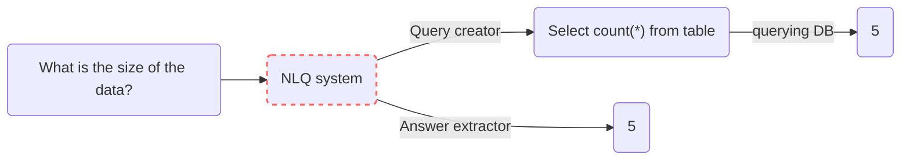

## Introduction

- Natural Language Querying (NLQ) is the process of querying DBs not in their official querying language but using natural language text. One example could be to fetch results from a SQL table for question - `"Who is the Prime Minister of India?"` by just using the text and not some technical query like `select name from pm_table where country = "India"`.  
- There are two main reasons that makes this task important for any IaaS *(Information as a service)* product or SaaS,
  - Each DB has its own specific querying language. This is a nightmare even for developers, as they will have to gain expertise in mulitple DB languages.
  - Looking at a product from users perspective, it makes sense to let the user query in the language they prefer and not the technical query languages suitable for each DBs.

## Different Approaches

- Usually there are two approaches to create a NLQ system, 
  - **Query creator:** this is a multi-step process where we first convert the natural text to DB specific language query. This step in itself could have multiple sub steps where we identify entities and intent from the query and then match them with the available data in table. Later we execute the query on the DB and get the data. 
  - **Answer extractor:** this is a single step process, usually built completely of neural networks, where the data and question are passed to the network and output is returned. Think of it like closed-book QA systems in NLP, where we pass the context (here the DB table) and the question (query) and the model returns us the answer. We could add wrapper on the output to handle complex queries with COUNT, AVERAGE, etc.




!!! Note
    NLQ, as a topic, is DB agnostic, and in reality NLQ systems are built for different DBs like SQL, SPARQL, MongoDB QL, etc. In fact, we can even see NLQ system for programming language data types like [PandasAI](https://github.com/gventuri/pandas-ai) for [Pandas](https://pandas.pydata.org/) DataFrame in Python.


## Code

- Let us explore the different ready made solutions for NLQ.

### Large Language Models (LLMs)

-  While LLMs have been proven to work well for a lot of NLP related downstream tasks, will it work for NLQ? Let's think about it, due to huge training data LLMs might have already seen a lot of SQL queries and their respective descriptions. So in fact they have "some idea" on the relationship between a SQL query *(or other query language for that matter)* and its respective natural language query. Some might even say that it understands the fundamentals of Text-to-SQL task. But what LLM doesn't know is your Database/Table's schema and how you are storing the data. So hypothetically, if we provide these details it should work, right? The answer is yes!
- In paper [4], authors took this idea further and evaluated multiple LLMs to answer two questions, 
  - **Which LLM is best for Text-to-SQL task?** Considering only inference, Codex based models like `code-davinci-001`  were the top perfomers. If we can finetune the models, `T5-3B + PICARD` was better.
  - **Which prompt is best for Text-to-SQL task?** Apart from the instructions, the prompt should also contain the schema of the table *(with `CREATE TABLE` command containing column name, type, column reference and keys)* along with a couple of rows as example. Below is an example of just the additional data [3]
  ```sql
  # schema
  CREATE TABLE "Track" (
    "TrackId" INTEGER NOT NULL,
    "Name" NVARCHAR(200) NOT NULL,
    "AlbumId" INTEGER,
    "MediaTypeId" INTEGER NOT NULL,
    "GenreId" INTEGER,
    "Composer" NVARCHAR(220),
    "Milliseconds" INTEGER NOT NULL,
    "Bytes" INTEGER,
    "UnitPrice" NUMERIC(10, 2) NOT NULL,
    PRIMARY KEY ("TrackId"),
    FOREIGN KEY("MediaTypeId") REFERENCES "MediaType" ("MediaTypeId"),
    FOREIGN KEY("GenreId") REFERENCES "Genre" ("GenreId"),
    FOREIGN KEY("AlbumId") REFERENCES "Album" ("AlbumId")
    )
  # examples
  SELECT * FROM 'Track' LIMIT 3;
    TrackId	Name	AlbumId	MediaTypeId	GenreId	Composer	Milliseconds	Bytes	UnitPrice
    1	For Those About To Rock (We Salute You)	1	1	1	Angus Young, Malcolm Young, Brian Johnson	343719	11170334	0.99
    2	Balls to the Wall	2	2	1	None	342562	5510424	0.99
    3	Fast As a Shark	3	2	1	F. Baltes, S. Kaufman, U. Dirkscneider & W. Hoffman	230619	3990994	0.99
  ```
- If all of this seems too tedius, we can use [LangChain](https://python.langchain.com/en/latest/) that does all of the heavy lifting for us so that we can just do the fun stuff i.e. ask questions :wink:. Here, we will connect SQLite database with LLM model. *(Script inspired from [SQLite example](https://python.langchain.com/en/latest/modules/chains/examples/sqlite.html))*

    ``` python linenums="1"
    # import
    from langchain import OpenAI, SQLDatabase, SQLDatabaseChain

    # connect to SQLite DB
    db = SQLDatabase.from_uri("sqlite://all_employees.db")

    # connect to the OpenAI Davinci GPT-3 model
    llm = OpenAI(temperature=0)

    # create SQLDatabaseChain
    db_chain = SQLDatabaseChain(llm=llm, database=db, verbose=True)

    # run the code
    db_chain.run("How many employees are there?")
    # output
    >> SELECT COUNT(*) FROM Employee;
    >> SQLResult: [(8,)]
    >> Answer: There are 8 employees.
    ```

- Let's talk about what happened with the code above. First, LangChain create a prompt template and fills the variables automatically using the DB we plugin with the chain. The variables are `{dialect}` *(here SQL)*, `{table_info}` *(the additional data we talked about above)* and `{input}` *(the question)*. The template looks as follow, 

  ```
  Given an input question, first create a syntactically correct {dialect} query to run, then look at the results of the query and return the answer. Unless the user specifies in his question a specific number of examples he wishes to obtain, always limit your query to at most {top_k} results. You can order the results by a relevant column to return the most interesting examples in the database.

  Never query for all the columns from a specific table, only ask for a the few relevant columns given the question.

  Pay attention to use only the column names that you can see in the schema description. Be careful to not query for columns that do not exist. Also, pay attention to which column is in which table.

  Use the following format:

  Question: "Question here"
  SQLQuery: "SQL Query to run"
  SQLResult: "Result of the SQLQuery"
  Answer: "Final answer here"

  Only use the tables listed below.

  {table_info}

  Question: {input}
  ```

- Once done, it runs the LLM on the formatted prompt to get the SQL output. Then it execute the query on the connected DB to fetch the result. Finally, it also formats the results into a proper natural language output. All of this with just some prompt engineering! :fire:

!!! Note
    While the results are quite impressive, do remember that we need to use powerful *(read costly)* LLMs for it work with respectable accuracy. As we are formatting the prompt with DB schema, the prompt size might become huge if your DB or Table is big. It is hence recommended to create custom prompts when possible. Be also aware of the respective LLM costs if you are using 3rd party LLMs like GPT-4 or Cohere.

### PandasAI

- [PandasAI](https://github.com/gventuri/pandas-ai) follows on the above [LLM based approach](#large-language-models-llms) to create an advanced NLQ system that can answer questions on [Pandas](https://pandas.pydata.org/) DataFrame in Python. 
- It does that by generating intermediate python code that are executed on the loaded dataframe. This way, it follows the Query creator approach using Python language. As it generates python script, it also supports additional functionalities like generating graphs on the data! Let's see the package in action by asking question on a dataframe, 

``` python linenums="1"
## Install
!pip install BeautifulSoup4
!pip install pandasai

## Import
import pandas as pd
from pandasai import SmartDataframe
from pandasai.llm import OpenAI

## let's create a dummy data -- remove this incase you have your own data
# Create a dictionary with dummy data
data = {
    'Name': ['Alice', 'Bob', 'Charlie', 'David', 'Eva'],
    'Age': [25, 30, 22, 35, 28],
    'City': ['New York', 'Los Angeles', 'Chicago', 'Houston', 'Miami']
}

# Create a pandas DataFrame
df = pd.DataFrame(data)

## setup the LLM and DF
llm = OpenAI(api_token="...") # put your OpenAI token here
df = SmartDataframe(df, config={"llm": llm})

## chat (run one by one)
df.chat('What is the data size?') ## Answer - "The data size is 5 rows and 3 columns."
# df.chat('Plot a chart of people\'s ages')
# df.chat("What is the Age of Alice?")
# df.chat("Are there anyone with age more than 50?")

## See the logs
# df.logs
```    

- While PandasAI performs extensive data, prompt and output cleaning and formatting, let's have a bird's eye view of what is happening inside. First, given the dataframe, a prompt is created that provides some details about the dataframe and asks to modify an existing python function *(with existing function definition - interesting!)*. The modified python function on execution will return the output we need. Below is the input prompt for our example, 

!!! Note
    - You can explore the steps performed by PandasAI by looking into the `df.logs` after executing the `df.chat()`.
    - The `dataframe` section in the prompt contains size details and 5 rows *(randomly selected)* from the dataframe.


```
Using prompt: 
You are provided with the following pandas DataFrames:

<dataframe>
Dataframe dfs[0], with 5 rows and 3 columns.
This is the metadata of the dataframe dfs[0]:
Name,Age,City
Alice,25,New York
Bob,30,Los Angeles
Charlie,22,Chicago
David,35,Houston
Eva,28,Miami
</dataframe>

<conversation>
User 1: What is the size of the data?
</conversation>

This is the initial python code to be updated:
``````python
# TODO import all the dependencies required
import pandas as pd

def analyze_data(dfs: list[pd.DataFrame]) -> dict:
    """
    Analyze the data
    1. Prepare: Preprocessing and cleaning data if necessary
    2. Process: Manipulating data for analysis (grouping, filtering, aggregating, etc.)
    3. Analyze: Conducting the actual analysis (if the user asks to plot a chart save it to an image in temp_chart.png and do not show the chart.)
    At the end, return a dictionary of:
    - type (possible values "string", "number", "dataframe", "plot")
    - value (can be a string, a dataframe or the path of the plot, NOT a dictionary)
    Examples: 
        { "type": "string", "value": "The highest salary is $9,000." }
        or
        { "type": "number", "value": 125 }
        or
        { "type": "dataframe", "value": pd.DataFrame({...}) }
        or
        { "type": "plot", "value": "temp_chart.png" }
    """
``````

Using the provided dataframes (`dfs`), update the python code based on the last question in the conversation.

Updated code:
```

- Now once we run the above prompt on the LLM of our choice, we get the following modified function as output, 

```
Code generated:
```````
# TODO import all the dependencies required
import pandas as pd

def analyze_data(dfs: list[pd.DataFrame]) -> dict:
    """
    Analyze the data
    1. Prepare: Preprocessing and cleaning data if necessary
    2. Process: Manipulating data for analysis (grouping, filtering, aggregating, etc.)
    3. Analyze: Conducting the actual analysis (if the user asks to plot a chart save it to an image in temp_chart.png and do not show the chart.)
    At the end, return a dictionary of:
    - type (possible values "string", "number", "dataframe", "plot")
    - value (can be a string, a dataframe or the path of the plot, NOT a dictionary)
    Examples: 
        { "type": "string", "value": "The highest salary is $9,000." }
        or
        { "type": "number", "value": 125 }
        or
        { "type": "dataframe", "value": pd.DataFrame({...}) }
        or
        { "type": "plot", "value": "temp_chart.png" }
    """
    # Get the size of the data
    size = dfs[0].shape
    size_str = f"The data has {size[0]} rows and {size[1]} columns."
    
    return {"type": "string", "value": size_str}
```````
```

- PandasAI then exectes the code on the input dataframe and returns the ouput! 

!!! Warning
    The above shown prompt is just one example of how PandasAI works *(part of their `generate_python_code` script)*. The package has added multiple fallbacks and advanced logic to make the system more robust and accurate. It is open-source so have a look at their codebase, there are lots of things to learn. :wink:

### TaPaS

- [TaPas](https://huggingface.co/google/tapas-base-finetuned-wtq) follows Answer extractor based approach to perform NLQ that utilizes specially trained BERT like transformer. Tapas takes the question and table in the format inspired from BERT like `[CLS] Question [SEP] Flattened table [SEP]`. The answer is selected from the table based on the question.
- The model was first pre-trained using unlabeled data on tasks like Masked Language modeling and Sentence-Table support/refute prediction. Later, it was finetuned on datasets like WikiSQL, WTQ and other to perform NLQ. 

<figure markdown> 
    { width="500" }
    <figcaption>Illustration of the TaPas model for one example ([TaPas paper](https://arxiv.org/abs/2004.02349))</figcaption>
</figure>

- One interesting differentiator of TaPas is the unique formatting and encoding of the query and the table. As a table contains values spread across columns and rows, special column, rows and segment embeddings are added to the input to make the model learn the proper context. One example is shown below, 
  
<figure markdown> 
    
    <figcaption>Encoding process of sample query and table in TaPas ([TaPas paper](https://arxiv.org/abs/2004.02349))</figcaption>
</figure>

!!! Note
    As TaPas was pre-trained using self-supervised learning on unlabled data, it learned the concept of relationship between text and table. Hence, it can be used (finetuned) for other table-text related downstream tasks as well like refute or support the text based on content in table, etc.


- Let's get started with the code part. For TAPAS to work, we need to install `torch-scatter`. For this, we first install pytorch using `pip install torch` and then get the version of torch using `torch.__version__`. Next we install `torch-scatter` by replacing the version of torch in  `pip install torch-scatter -f https://pytorch-geometric.com/whl/torch-1.12.0+cu102.html`

``` python linenums="1"
# install required packages
!pip install -q transformers==4.4.2 torch pandas
!pip install torch-scatter -f https://pytorch-geometric.com/whl/torch-1.12.0+cu102.html

# import
import pandas as pd
from transformers import pipeline

# load pipeline
nlq_tapas = pipeline(task="table-question-answering", 
                     model="google/tapas-base-finetuned-wtq")

# load the data
data = pd.read_csv("../data/pm_table.csv") # use your table here
data = data.astype(str)

# query the table
query = "Who is the Prime Minister of India?"
answer = nlq_tapas(table=data, query=query)['answer']
print(answer)
# Output: "Narendra Modi" (at the time of writing)
```

!!! tip
    Personal opinion - TAPAS's accuracy is quite good wrt TableQA, but the major drawback is that it only works for small tables. Hence, forget about using it for industry use case with larger tables.

### TableQA

- [TableQA](https://github.com/abhijithneilabraham/tableQA) follows Query creator approach to build an AI tool for querying natural language on tabular data. While the approach was released rather recently *(Jan 2022)*, it's performance is comparable or worse than TaPas. As per the authors, TableQA shines when it comes to NLQ on large tables and complex queries.
- It is more of a framework consisting of mulitple modules. The complete process consists of components like table selector, known fields extractor, unknown fields extractor, and agreegator function classifer and SQL generator.


<figure markdown> 
    { width="600" }
    <figcaption>System architecture of TableQA ([TableQA paper](https://arxiv.org/abs/2202.00454))</figcaption>
</figure>

- Let's get TableQA running with following code, 

``` python linenums="1"
# install required packages
!pip install -q tableqa nltk

# import packages
import nltk
import pandas as pd
from tableqa.agent import Agent

# download nltk data
nltk.download('omw-1.4')

# load a CSV
df = pd.read_csv("my_csv_file.csv")

# create an agent
agent = Agent(df)

# create query
query = "how many data points in 2011?"
# get the SQL query
agent.get_query(query)
# get the answer
agent.query_db(query)
```

## Additional materials

- [How to Talk to Your Database - Salesforce](https://blog.salesforceairesearch.com/how-to-talk-to-your-database/)
- [Stack Exchange: Natural Language to SQL query](https://datascience.stackexchange.com/questions/31617/natural-language-to-sql-query)
- [LangChain Blog: LLMs and SQL](https://blog.langchain.dev/llms-and-sql/)
- [Evaluating the Text-to-SQL Capabilities of Large Language Models](https://arxiv.org/pdf/2204.00498.pdf)

Cheers :wave: