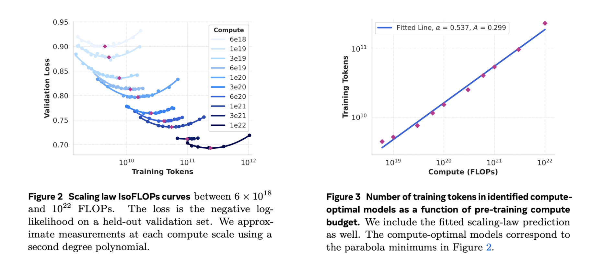
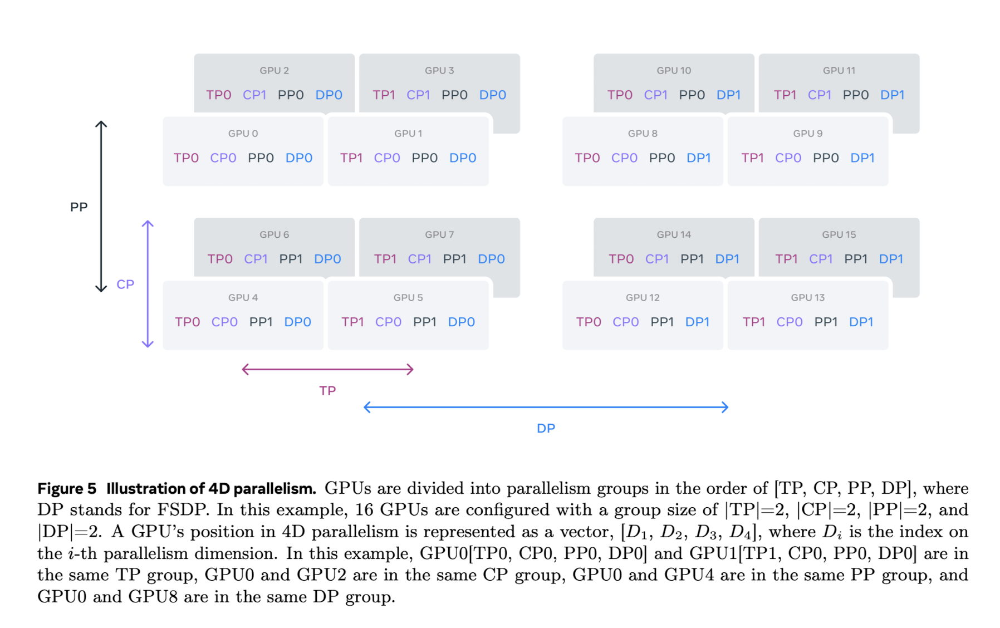
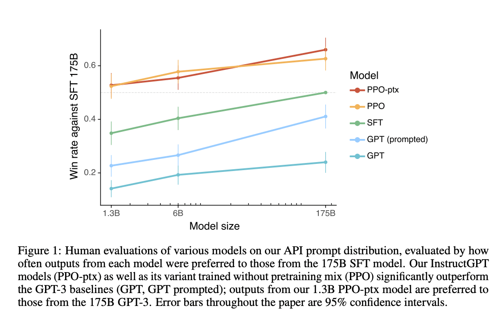
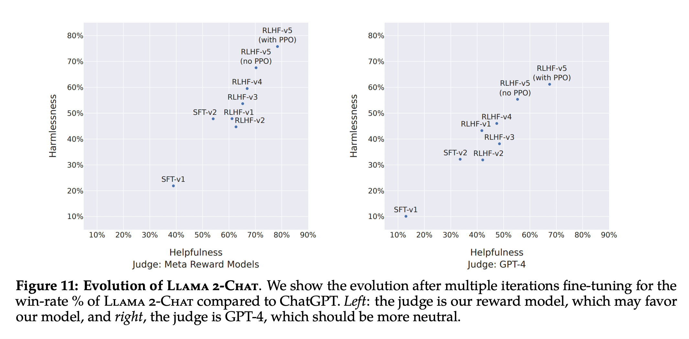

## Introduction

Large Language Models (LLMs) are a type of artificial intelligence system designed to process and understand human language. They are capable of generating text, completing sentences, summarizing content, answering questions, and more, with remarkable accuracy. The accuracy of LLMs stems from their ability to learn patterns and structures from vast amounts of text data, which enables them to make predictions about the next word or sequence of words.

Training LLMs is a complex process that requires a deep understanding of the underlying concepts and techniques. This article provides a comprehensive overview of the process of training LLMs.

<figure markdown> 
    { width="500" }
</figure>

## Stages of Training LLMs

The process of training a Large Language Model (LLM) consists of two distinct stages.

- **Language model pre-training.** We start by converting a large, multilingual text corpus to discrete tokens and pre-training a large language model (LLM) on the resulting data to perform next-token prediction. In the language model pre-training stage, the model learns the structure of language and obtains large amounts of knowledge about the world from the text it is “reading” *(or training on)*.  This is further divided into,
  
  1. the curation and filtering of a large-scale training corpus *(i.e. datasets)*,
  2. the development of model architecture and corresponding scaling laws for determining model size,
  3. the development of techniques for efficient pre-training at large scale, and
  4. the development of a pre-training recipe.
  
- **Language model post-training.** The pre-trained language model has a rich understanding of language but it does not yet follow instructions or behave in the way we would expect an assistant to. We align the model with human feedback in several rounds, each of which involves supervised finetuning (SFT) on instruction tuning data and [Direct Preference Optimization (DPO)](../machine_learning/dpo.md). At this post-training stage, we also integrate new capabilities, such as tool-use, and observe strong improvements in other areas, such as coding and reasoning. Finally, safety mitigations are also incorporated.

Let's dive into these stages in more details.

## Pre-Training

To refresh, pre-training stage is the first stage of LLM training and deals with making the LLM aware of the structure of language by training it on a large corpus of text curated from the internet. Let's discuss the intermediate stages of pre-training.

### Data Curation

To train a Large Language Model (LLM), we first need to collect a large amount of text data.

The data collection for language model pre-training involves curation and filtering of web data to create a diverse and large quantity of dataset. This dataset is then processed and optimized to extract high-quality text. The dataset is filtered to remove domains that contain personal information, harmful content, or adult content. Additionally, the dataset is de-duplicated to remove duplicate lines and documents. Heuristics and model-based quality filters are used to remove low-quality documents and excessive repetitions.

The data mix for pre-training is determined by classifying the types of information in the web data and using scaling law experiments to determine the best data mix. In LLaMa-3.1, the data mix contains roughly 50% of tokens corresponding to general knowledge, 25% of mathematical and reasoning tokens, 17% code tokens, and 8% multilingual tokens. [1]

### Model Architecture

Once we have the dataset ready, the next step is to design the model architecture. Transformer based architectures has been the defacto choice for many LLMs since its inception in 2017 [2]. That said, the complete system consists of several independent components that can be altered to further enhance the accuracy and performance. Let's discuss some of these components.

- **Base Design**: Original Transformer paper [2] consists of an encoder and decoder block. While the encoder block is good for encoding the contextual information of the input sequence, decoder block is responsible for decoding the output sequence in auto-regressive manner. Over time there has been a general conceptual shift from encoder-decoder to decoder-only architecture for LLMs. As an example, Llama 3 uses a standard decoder-only transformer architecture similar to Llama and Llama 2 [1].

  !!! Hint
      Refer paper ["Decoder-Only or Encoder-Decoder? Interpreting Language Model as a Regularized Encoder-Decoder"](https://arxiv.org/abs/2304.04052) [6] for a holistic comparison of the different architectures.

- **Attention Layer**: Attention layers were made popular with original Transformer paper [2] and is useful for updating the token embeddings wrt the context in the input sequence. As per the name, it makes the embedding of one token *(say "Bank")* "attend" to other words in the sequence as the meaning of the word changes wrt the context *("Bank" in "West Bank" is different from "Money Bank")*. Over time, researchers have developed different versions of attention mechanisms which provide higher performance with reduction in computation costs. For example, in LLaMA-3.1, researchers used Grouped Query Attention as it improves inference speed and reduces memory usage during decoding. [1]

- **Vocabulary:** Deciding the vocabulary size depends on a lot of factors like,
  - **model size**: Large vocab equals large embedding matrix and hence larger model,
  - **training data**: Model trained for single language needs less vocab than the one trained for multiple languages. Adding support for programming languages would further warrant increase in vocabulary, and
  - **compute budget**: Even if you have certain idea on the above points, in the end it all comes down to how much you can affort for training. Training a big model *(with huge vocab)* on less compute budget, in most case can lead to poor performance.
  
  As an example, LLaMa-3.1 uses a 128K token vocabulary with better compression for English, non-English languages and even several programming languages. [1]

  !!! Hint
      Research has shown that optimizing the vocabulary size of a language model can have a significant impact on its inference efficiency. For example, a model trained on a limited vocabulary of English language tokens and some special tokens may be able to generate code in certain programming languages, but will be highly inefficient during inference. This is because the model will have to generate more tokens to represent a given code snippet, which can lead to slower inference times. Optimizing the vocabulary size to include programming language specific keywords and tokens can help to mitigate this issue, but this needs to be done while avoiding an explosion in the overall vocabulary size.

- **Position Encoding**: Positional embeddings are vectors that are added to token embeddings in transformer models to incorporate information about the order and position of tokens in the input sequence. Since transformers process tokens in parallel and don't inherently capture sequence order like recurrent neural networks, positional embeddings are crucial for modeling the position of each token. Over time researchers have developed different types of positional embeddings such as Absolute Positional Embedding, Relative Positional Embeddings, Rotary Positional Embeddings (RoPE), etc. LLaMA-3.1 uses RoPE as it improves handling of longer contexts. [1]

  !!! Hint
      Not all position encodings are adding directly to the token embeddings during input processing. While absolute positional embeddings are added to the input token embeddings directly, relative positional embeddings are introduced in the attention layer.

### Scaling Laws

Scaling laws are used to estimate the relationship between the performance of large language models (LLMs) and the resources used to train them, such as model size, dataset size, and computational budget. This is an important step in training LLMs as it helps to approximate the optimal size and training regime for your model. There are two ways to do this, first is to follow one of the several reputed scaling laws like Chinchilla Scaling, and second is to perform an estimation on your own.

<figure markdown> 
    
    <figcaption>Source [1]</figcaption>
</figure>

Below are the steps LLaMA-3.1 researchers used to create their own scaling law estimations [1]. This can act as a reference if you want to create your own scaling laws.

1. Conduct pre-training runs using a range of compute budgets and model sizes. Note, both of the ranges should be much less than *(just a fraction of)* the final intended budget. For example, LLaMa-3.1 researchers trained models with compute budgets ranging from 6 × 10^(18) FLOPs to 10^(22) FLOPs *(overall budget was ~10^(25) FLOPs)* and model sizes ranging from 40M to 16B parameters *(final model was ~400B)*.

2. For each compute budget, fit a second-degree polynomial to the curve of validation loss versus training tokens. This will identify the compute-optimal model, which corresponds to the minimum of the parabola. *(as shown in the left side of above image)*

3. Compute-optimal models are used to identify the optimal number of training tokens for a specific compute budget. For this, fit a power-law function to extrapolate to larger compute budgets. This will allow you to predict the optimal number of training tokens for a specific compute budget. *(as shown in the right side of above image)*

!!! Hint
    LLaMA-3.1 researchers further used the compute-optimal models to predict downstream task performance by correlating the negative log-likelihood of the correct answer on the benchmark task with the training FLOPs. Then, they established a sigmoidal relation between the log-likelihood and accuracy using both the scaling law models and older models trained with higher compute FLOPs. This helped researchers in predicting the final performance of the model. Interesting fact - they were able to do this with high accuracy, in fact the predictions were only a slight underestimations of the final performance [1].

### Infrastructure and Efficiency

Once we have a basic understanding of the what we want to achieve, we can proceed to estimate the hardware and infrastructure needed to train our model. This includes arranging computes, storage and setting up proper network for the training. Some things to consider are,

- **Memory**: To begin with it is important to know the memory requiredments to train your model. A rough estimation of how much memory is required for inference of a model of a particular size is provided in [4] and shown below. Here, `M` is the memory required for the model, `P` is the number of parameters in the model *(in billions)*, `4` is the number of bytes, and `Q` is the number of bits that should be used for loading the model. The memory required for model training could be 2x to 4x of the memory required for inference, as gradients and activations are also stored in memory.

  $$M_{\text{inference}} = \frac{(P * 4)}{(32/Q)}*{1.2}$$
  
  $$M_{\text{training}} \approx 3 * M_{\text{inference}}$$

  !!! Note
      Models are usually trained on half-precision i.e. `Q = 16 bits` or full-precision i.e. `Q = 32 bits`. The denominator in the above equation can be updated based on the precision used in the model training regime.

- **GPU Hours**: GPU hours refer to the total time a GPU is engaged in processing tasks. For instance, if one GPU runs for 5 hours, that accounts for 5 GPU hours. If multiple GPUs are used simultaneously, the total GPU hours are the sum of the hours each GPU operates. To calculate GPU hours for training LLMs, you can use a simplified formula that considers key factors such as model size, data size, and GPU performance. [5]

  $$\text{GPU Hours} = \frac{(\text{Model Parameters} \times \text{Training Tokens} \times \text{Computations Per Token})}{\text{GPU Speed}}$$

  Let's consider one example where we want to train a model of 7 billion parameters over 1 trillion tokens, with 6 computations per token, and a GPU with a speed of 10 TFLOPS. The calculations will look something as shown below, 

  $$\text{GPU Hours} = \frac{(7,000,000,000 \times 1,000,000,000,000 \times 6)}{10^{13}} = \frac{42,000,000,000,000,000}{10^{13}} = 4200 \text{ hours}$$

  This means you would need approximately 4200 GPU hours to complete the training under these conditions.

  !!! Note
      It's important to consider the GPU utilization rate *(percentage of the theoretical peak FLOPS that was achieved on average during training)*, which can significantly affect the actual GPU hours required. A typical utilization rate for LLM training might range from 30% to 50% depending on the efficiency of the training process and the architecture used.

- **Storage**: Large language model training requires a significant amount of storage space, which is mainly used for saving model checkpoints at regular intervals. According to [1], during the training of LLaMa-3.1, each checkpoint was between 1MB to 4GB per GPU, which was saved at frequent intervals. It is also important to ensure that the storage system is fast enough to quickly read and write the checkpoints, as slow storage can lead to GPUs idling for extended periods while waiting for the IO operations to complete.
- **Parallelism**: To enhance efficiency, LLMs can be trained in parallel using multiple GPUs. To further enhance the utilization rate, LLaMA-3.1 researchers applied 4D parallelism as discussed below,
  - **Tensor Parallelism (TP):** Splits individual weight tensors into multiple chunks and distributes them across different GPUs. It reduces the memory footprint on each GPU, allowing for larger models to be trained.
  - **Pipeline Parallelism (PP):** Divides the model into stages (layers) and processes these stages in parallel on different GPUs. It increases throughput by overlapping the computation of different stages.
  - **Context Parallelism (CP):** Splits the input context (sequence) into segments and processes them in parallel. It reduces memory requirements for very long sequences.
  - **Data Parallelism (DP):** Distributes the data across multiple GPUs and processes each batch in parallel. It increases throughput by processing multiple batches simultaneously.
      
  <figure markdown> 
    
    <figcaption>Source [1]</figcaption>
  </figure>

### Training Recipe

Once all of the above considerations are made, we can move on to the training process. Usually, the pre-training of a LLM consist of a single step wherein the model is trained on the corpus of text with some variables like learning rate, batch size, data mix, etc, changing over time. Data Scientists can either predefine the change *(ex: using cosine learning rate schedule)* or modify the values based on model performance *(ex: add more non-English data if multilingual performance of current model is not satisfatory)*.

Recently there has been a surge in requirement of LLMs to support higher context length. For this, after the initial pretraining, the model can be trained on longer sequences to expand its context window. This can be done incrementally to allow the model to adapt to the increased length. It is important to only proceed with further increment after ensuring that the model performance on short contexts has recovered and it is perfectly solving "needle in a haystack" tasks up to that length. In Llama 3 405B [1], the context length was increased in six stages, from 8K to 128K, using approximately 800B training tokens.

## Post-Training

Post-training of LLMs is a crucial phase that enhances the capabilities of models that have already undergone pre-training. It is assumed that during pre-training, the model is trained on a large corpus of text *(in a [self-supervised](../machine_learning/introduction.md#self-supervised-learning) manner)* and has learned the structure of the language. Now the model can be fine-tuned on specific use cases or capabilities expected out of the model. This phase typically consists of two main components:

### Supervised Finetuning (SFT)

Supervised finetuning is an essential step that builds upon the foundational knowledge acquired during pre-training. In this phase, the model is trained on a curated dataset with high-quality reference outputs, focusing on a specific task or set of tasks. The objective is to refine the model's ability to generate appropriate and contextually relevant responses.

During supervised finetuning, the model learns to mimic the style and format of responses within the provided dataset. This process is often referred to as instruction tuning, where the model is explicitly trained to follow instructions and respond to specific requests, enhancing its interactivity and usefulness. Studies have shown that this phase significantly improves the model's performance on unseen tasks, making it more adept at generalizing beyond its training data.

!!! Hint
    Modern approaches to supervised finetuning also emphasize efficiency. Techniques such as Low-Rank Adaptation (LoRA) allow for parameter-efficient finetuning, where only a small number of task-specific parameters are adapted while keeping the majority of the pretrained weights fixed. This method drastically reduces memory overhead and simplifies the deployment process, enabling practitioners to finetune LLMs with less computational power and resources.

### Human Alignment Training

Following supervised finetuning, human alignment training further refines the model's outputs based on human feedback. This phase is critical for ensuring that the model aligns with human values and preferences, making it safer and more effective for real-world applications.

Human alignment training typically involves [reinforcement learning from human feedback (RLHF)](../reinforcement_learning/rlhf.md), where the model's responses are evaluated by human annotators. These evaluators provide preference labels that guide the model's learning process, helping it to produce responses that are more aligned with user expectations. Recently there has been a shift towards using [DPO](../machine_learning/dpo.md) instead of RLHF as it provides better performance along with better efficiency during training.

The integration of human feedback into the training loop not only improves the quality of the model's outputs but also helps in addressing ethical considerations by ensuring that the model behaves in a manner consistent with human values. This iterative feedback process is essential for developing LLMs that are not only technically proficient but also socially responsible.

<figure markdown> 
    
    <figcaption>PPO model trained with RLHF outperforming SFT and base models by OpenAI. Source [9]</figcaption>
</figure>

### Additional Techniques

In addition to the techniques mentioned above, there are other practical techniques that can be applied to further refine the post-training process. These techniques can be used to improve the performance of the model on specific tasks or to make the model more robust in general. Some examples of these techniques are discussed below.

#### Reward Modeling

While training a reward model is a requirement for RLHF, it is no longer required for DPO. Nevertheless, data scientists can train a reward model for data generation process. This is done because SFT requires large quantity of high quality dataset which is not always available and is very time consuming to create. 

Reward model is trained on the available set of human annotated dataset. To create this dataset, first a diverse set of input prompts are generated and a model *(usually the best checkpoint pre-trained model)* is used to generate several responses *(say A, B, C, ... N)* on the generated prompts. Then the humans are asked to rank the responses *(ex: A > B > C...)*. After this "N choose 2" pairs of datasets are created that looks like (Prompt, A, B), (Prompt, B, C), (Prompt, C, D), etc. The idea here is to have the prompt, one preferred response and one non-preferred response for each dataset example. This can be used to train the reward model with following loss function, [7]

$$\mathcal{L}=-\log \left(\sigma\left(r_\theta\left(x, y_c\right)-r_\theta\left(x, y_r\right)\right)\right)$$

where $r_θ(x,y)$ is the scalar score output for prompt $x$ and the generated response $y$, $y_c$ and $y_r$ are the preferred and rejected responses chosen by the human annotators, and $σ$ is the logistic sigmoid function.

#### Rejection Sampling

To create a high quality dataset for SFT or DPO, we can use human annotators or the trained reward model to reject poor responses. The idea is quite simple, use the best pre-trained model to generate multiple responses and use the reward model to rank the responses. Based on the ranking, only the top ranked responses can be used to create the dataset.

#### Iteration Training

Instead of doing one round of SFT or DPO, we can do multiple iterations to improve the quality of the model's outputs. LLaMa-3.1 paper [1] performed 6 iterations and LLaMa-2 paper [8] performed 5 iterations of post-training process that greatly enhanced the model's performance as shown below.

<figure markdown> 
    
    <figcaption>Increasing performance of the model with each iteration of post-training on the LLaMa-2 model. Source [8]</figcaption>
</figure>

<!-- ## Capabilities

Modern LLMs require a set of essential capabilities to be effective. While the list of capabilities is not exhaustive and may vary depending on the specific use case, there are certain common practices that data scientists can follow to train models for these capabilities. In this section, we will explore the various capabilities of LLMs and how to train their model to learn them. -->

## Conclusion

In closing, training Large Language Models (LLMs) is a complex yet rewarding process. By following the two distinct stages of pre-training and post-training, we can equip these models with the ability to understand and generate human language at a remarkable level. Pre-training focuses on building a strong foundation by exposing the model to vast amounts of text data, allowing it to learn the structure and patterns of language. Post-training then refines the model's capabilities through techniques like supervised finetuning and human alignment training, ensuring it aligns with human values and performs well on specific tasks.

The field of LLM training is constantly evolving, with researchers pushing the boundaries of what's possible. As we continue to develop more sophisticated techniques and leverage the power of ever-increasing datasets, LLMs hold the potential to revolutionize various aspects of our lives, from communication and content creation to scientific discovery and problem-solving.

## References

[1] [The Llama 3 Herd of Models - Paper](https://ai.meta.com/research/publications/the-llama-3-herd-of-models/)

[2] [Attention Is All You Need - Paper](https://arxiv.org/abs/1706.03762)

[3] [A General Survey on Attention Mechanisms in Deep Learning - Paper](https://arxiv.org/abs/2203.14263)

[4] [Calculating GPU memory for serving LLMs](https://www.substratus.ai/blog/calculating-gpu-memory-for-llm)

[5] [Estimating Training Compute of Deep Learning Models](https://epochai.org/blog/estimating-training-compute)

[6] [Decoder-Only or Encoder-Decoder? Interpreting Language Model as a Regularized Encoder-Decoder](https://arxiv.org/abs/2304.04052)

[7] [LLM Training: RLHF and Its Alternatives](https://magazine.sebastianraschka.com/p/llm-training-rlhf-and-its-alternatives)

[8] [Llama 2: Open Foundation and Fine-Tuned Chat Models - Paper](https://arxiv.org/abs/2307.09288)

[9] [Training language models to follow instructions with human feedback - Paper](https://arxiv.org/abs/2203.02155)