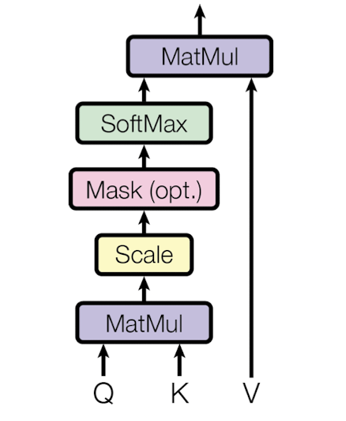

Transformers
===============
## Introduction

- "Attention Is All You Need" paper [1] introduced the concept of "Transformers" and it revolutionalized the complete domain of Deep Learning. So much so that in 2022 we have Transformers has become multi-disiplinary and is used across NLP, CV, RL, Graphs, and more! In NLP, Transformers variants are still state of the art! *(even after 5 years)*.
- As the paper's name suggests, the authors showcase how only using multiple stacks of attention layers provides enough learning power to the architecture to improve the SotA in multiple tasks. Quoting the paper, *"Transformer is the first transduction model relying entirely on self-attention to compute representations of its input and output without using sequence-aligned RNNs or convolution."*
- Let's try to understand the fundamentals of Transformers by going through each components in detail. 

!!! Hint
    Transduction is a broad term but in nearly all aspect it means converting data, signal or object from one format to another. Transformers **transforms** input data from one format to another *($x_i$ in encoder leads to $y_i$ in decoder)*, so it is transductive model. Hence the name "Transformers" :wink:

<figure markdown> 
        
        <figcaption>Transformer architecture. Left part is the encoder and right part is the decoder part [1]</figcaption>
</figure>

- At a high level, the architecture can be divided into two modules, 
  - **Encoder:** the component resonsible to learn representation of the input prompt. It process each token of the input parallely in one iteration and generates attention aware representations for each token. The encoder layer consists of 6 identical blocks with output dimension of $d_{model} = 512$.
  - **Decoder:** the component reposible for generating the output. The execution strategy depends on the scenario. During training as ground truth is also available, complete processing happens in one iteration using teacher forcing and masked attention. During inference multiple iterations are run where one output is generated in one go. Decoder layer also consists of 6 identical blocks.

## Components of Transformers

### Self-Attention 

- Probably the most important component of Transformer is the Attention Layer. The intuition here is that the context matters. For example in a sentence, meaning of a word like "bank" could vary based on if it is "river bank" or "financial bank". Similarly, pronouns like He, She, It, etc could also *attend* to certain other words in the sentence *(name of the person or object)*. With this in mind, a true meaning *(representation)* of a word can only be identified by attending to all the other words in context. Self-Attention is just one way to do that.

<figure markdown> 
        { width="300" }
        <figcaption>Scaled dot product attention [1]</figcaption>
</figure>


- Compared to previous approaches like RNN or Word2Vec that were used to create representations of the words, Attention models modifies the representation for each input based on the context. Word2Vec had a fixed context and worked at word level, so "bank" will have 1 representation word embedding. RNN on the other hand only considered sequential context that lead to forgetting the context of the past *(words far on the left)*.
  
!!! Note
    The smallest unit of input in Transformer are called tokens which could be at sub-word or words level. And attention could span over a phrase, a sentence, a paragraph or a complete article. 

- The process of self-attention is quite simple. For each token, 
  1. find the importance score of every token in the context *(including the token in question)*, and
  2. using the score, do a weighted sum of the every token's representations to create the final token representation.

- And thats it :smile: Well at least from 10k feet :airplane:. Looking at the technicalities, the process drills down to,
  - Every token is not used as-it-is, but first converted to key, value and query format using linear projections. We have key, value and query weights denoted as $W_k$, $W_v$ and $W_q$. Each input token's representation is first multipled with these weights to get $k_i$, $v_i$ and $q_i$.
  - Next the query of one token is dot product with the keys of all token. On applying softmax to the output, we get a probability score of importance of every token for the the given token.
  - Finally, we do weighted sum of values of all keys with this score and get the vector representation of the current token.
- It is easy to understand the process while looking at one token at a time, but in reality it is completely vectorized and happens for all the tokens at the same time. The formula for the self-attention is shown below, where Q, K and V are the matrices you get on multiplication of all input tokens with the query, key and value weights.
  
$$ 
Attention(Q, K, V) = softmax(\frac{QK^T}{\sqrt{d_k}})V 
$$

!!! Note
    Authors introduced the scaling factor to handle potential vanishing gradient problem. In their words, *"We suspect that for large values of $d_k$, the dot products grow large in magnitude, pushing the softmax function into regions where it has extremely small gradients. To counteract this effect, we scale the dot products by $\frac{1}{\sqrt{d_k}}$"*

### Multi-head Attention

- Instead of performing the complete attention computation in a single layer, the authors divided the computation into muliple heads or parts. This is done quite intuitively, let's take an example where we want to have say 8 heads in each layer. In this case the projections weights ($W_k$, $W_v$ and $W_q$) downsize the token embedding into $\frac{1}{8}$ the size. This can be done by making the dimension of the weights `token_dim * token_dim/8` . After this we repeat the complete process as discussed in self-attention. 

<figure markdown> 
        { width="300" }
        <figcaption>Multi-Head Attention [1]</figcaption>
</figure>

- Now at the end we will have 8 outputs instead of one, i.e. 8 different partial representations for each token *(which is not strictly correct and not what we want)*. So to aggregate to get 1 output, authors concatenated the outputs and then apply a linear projection *(multiply with $W^o$)* to get the original sized 1 representation per token. The formulation is shown below, 

$$ 
\text{MultiHead}(Q, K, V) = \text{Concat}(head_1, head_2, ..., head_h) W^o 
$$

### Masked Attention

- As discussed before, during training, decoder use masked attention to prevent model from attending to the future tokens. This is done so that the model does not cheat while predicting the output. 

!!! Note
    Having bidirectional context on input is okay *(as done by encoder with normal attention)*, but in decoder we should only attend to what we have already seen and not the future. 

- The approach is also quite easy to understand, it is very similar to the normal attention where we compute the query, key and value vectors. The only difference is that while computing attention scores, we explicitly make the score of future tokens zero. This is done by making the score *(before softmax)* at the future places equal to large negative number. On applying Softmax, those values become zero.

### Position-wise Feed Forward Layers

- Encoder and Decoder contains fully connected feed-forward neural network that is applied to each position (token) separately and identically. It consists of two linear transformations with a ReLU activation in between. The formualtion is given below, 

$$
\text{FFN}(x)=max(0, xW_1 + b_1)W_2 + b_2
$$

!!! Note
    The parameters $W_1$, $W_2$, $b_1$ and $b_2$ are different in different layers.


<!-- ### Tokenizations and Embeddings -->

### Positional Embeddings

- For the model to consider the order of sequence for representation and prediction, authors injected a sense of relative or absolute position in the input by using positional embeddings. It is injected to each token separately and has the same embedding size as that of the token i.e $d_{model}$. For each token we have a position vector. 
- After modification, the token embedding will be a combination of two types of information -- positional *(injected by positional embedding)* and semantic *(learned by the model)*. While there are many choices for the position embedding, authors wanted to pick the one that does not compromise the semantic information by a lot. In the paper authors alternatively use sine and cosine functions *(at indices of vector)* of different frequencies, 

$$
\text{PE}_{pos, 2i} = sin(\frac{pos}{10000^{2i/d_{model}}})
$$

$$
\text{PE}_{pos, 2i+1} = cos(\frac{pos}{10000^{2i/d_{model}}})
$$

- Here `pos` is the position of the token in sequence and `i` is the index of the vector for a token. 
  
<figure markdown> 
        
        <figcaption>Position Encoding for 100 positions, each of 512 dimension size</figcaption>
</figure>

  
- Let's understand the process using an example sentence - "My name is Mohit" with words as tokens. So we have 4 tokens, and with dimension size of 4, each token could be represented as shown below, 

``` python
## Token Embedding
My = [0.1, 0.2, 1, 0.45]
Name = [0.15, 0.32, 13, 0.51]
is = [-0.1, 0.21, 0.65, 0.25]
Mohit = [0.1, -0.12, 0.33, -0.45]
```

- Now we will compute the positional embeddings using the above formulae, 

``` python
## Positional embedding
pos_1 = [ 0.          1.          0.          1.        ]
pos_2 = [ 0.84147098  0.54030231  0.09983342  0.99500417]
pos_3 = [ 0.90929743 -0.41614684  0.19866933  0.98006658]
pos_4 = [ 0.14112001 -0.9899925   0.29552021  0.95533649]
```

- Finally the modified embedding for the tokens will be addition of the original token embedding and positional embedding.

``` python
## Modified embedding
My = [0.1, 0.2, 1, 0.45] + [ 0.          1.          0.          1.        ]
Name = [0.15, 0.32, 13, 0.51] + [ 0.84147098  0.54030231  0.09983342  0.99500417]
is = [-0.1, 0.21, 0.65, 0.25] + [ 0.90929743 -0.41614684  0.19866933  0.98006658]
Mohit = [0.1, -0.12, 0.33, -0.45] + [ 0.14112001 -0.9899925   0.29552021  0.95533649]
```

!!! Note
    Some obvious alternatives for position encoding were not considered because of the their disadvantages. For example, using simple numbers like `0, 1, 2...N` would have led to unnormalized numbers in vector, which could have degraded the semantic representation of the token. On the other hand if we had used normalized numbers, that would have not made sense for variable length sentences. Similarly using binary numbers could be rejected as it is not continous. [4]

## References

[1] Attention Is All You Need - [Paper](https://arxiv.org/abs/1706.03762)

[2] The Illustrated Transformer - [Link](https://jalammar.github.io/illustrated-transformer/)

[3] What exactly are keys, queries, and values in attention mechanisms? - [Cross validated](https://stats.stackexchange.com/questions/421935/what-exactly-are-keys-queries-and-values-in-attention-mechanisms)

[4] Master Positional Encoding: Part I - [Medium Blog](https://towardsdatascience.com/master-positional-encoding-part-i-63c05d90a0c3) by [Jonathan Kernes](https://medium.com/@jmkernes)

:wave: Cheers.
