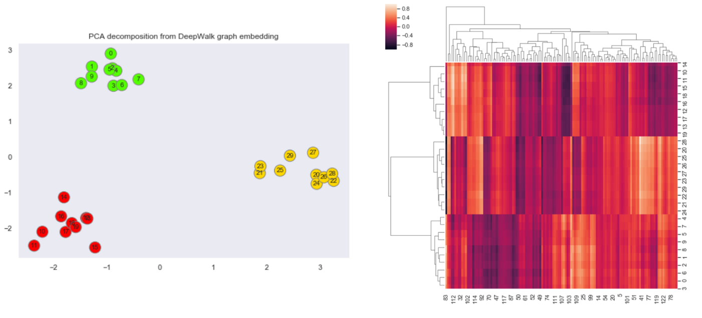

- DeepWalk [1] is a technique to create semantic embeddings of the nodes of a graph. For this, DeepWalk employs Skip-gram based technique of Word2Vec (w2v). For context, w2v is a word embedding technique, where we learn to embed words into a vector representation.
- In Skip-gram word embedding training procedure, the complete problem is transformed as a classification problem. The neural network tries to answer which word is most probable to be found in the context of a given word. Given a sequence of words that "naturally" appears in some sentence, the input could be any middle word and output could be any of the surrounding words (within some window). The training is done by creating a 1-layer deep neural network where the input word is fed as one-hot encoding and output is softmax applied with intention of getting large value for context word.

!!! Hint 
    For a brief introduction to Word2Vec, you can refer the [respective page in the Lazy Data Science Guide](../natural_language_processing/word2vec.md).

- But how to create training data that captures the notion of context in graphs? While intuitively it seems easy to create training data for w2v by using plethora of text available online, how can we do something similar for a graph? 
- As it happens, we can follow the same intuition for graphs by applying random walk technique. Here, we start from one node and randomly go to one of it's neighbors. We repeat this process $L$ time which is the length of the random walk. After this, we restart the process again. If we do this for all nodes (and $M$ times for each node) we have in some sense transformed the graph structure into a text like corpus used to train w2v where each word is a node and its context defines its neighbor.

### Code

#### Author's Implementation

- The DeepWalk authors provide a python implementation [here](https://github.com/phanein/deepwalk). Installation details with other pre-requisite are provided in the readme (windows user be vary of some installation and execution issues). The CLI API exposes several algorithmic and optimization parameters like,

  - `input` requires the path of the input file which contains graph information. A graph can be stored in several formats, some of the famous (and supported by the code) are — adjacency list (node-all_neighbors list) and edge list (node-node pair which have an edge).
  - `number-walks` The number of random walks taken for each node.
  - `representation-size` the dimension of final embedding of each node. Also the size of hidden layer in the skipgram model.
  - `walk-length` the length of each random walk.
  - `window-size` the context window size in the skipgram training.
  - `workers` optimization parameter defining number of independent process to spawn for the training.
  - `output` the path to output embedding file.

- Authors have also provided example graphs, one of which is Karate club dataset. It's stored in the format of the adjacency list. Now let’s read the graph data and create node embeddings by,

```
deepwalk --input example_graphs/karate.adjlist --number-walks 10
--representation-size 64 --walk-length 40 --window-size 5 
--workers 8 --output trained_model/karate.embeddings
```

- This performs start-to-end analysis by taking care of — loading the graph from the file, generating random walks, and finally training skip-gram model on the walk data. We can read the output embedding file which contains vector embedding for each node in the graph.

#### Karate Club Implementation

- A much simpler API is provided by python package called KarateClub [2]. To do the same set of actions, all we need to do is following.

``` python linenums="1"
# import libraries
import networkx as nx 
from karateclub import DeepWalk
# load the karate club dataset
G = nx.karate_club_graph()
# load the DeepWalk model and set parameters
dw = DeepWalk(dimensions=64)
# fit the model
dw.fit(G)
# extract embeddings
embedding = dw.get_embedding()
```

!!! Note
    The DeepWalk class also extends the same parameters exposed by the author's code and can be tweaked to do the desired experiment. Refer their [docs](https://karateclub.readthedocs.io/en/latest/index.html) for more details.

### Analysis

#### Seeing DeepWalk in Action

- To see DeepWalk in action, we will pick one graph and visualize the network as well as the final embeddings. For better understanding, I created a union of 3 complete graphs with some additional edges to connect each graph.

<figure markdown> 
        
        <figcaption>Union of 3 complete graphs. We can imagine 3 clusters with nodes 0 to 9 belonging to cluster 1; 10 to 19 to cluster 2 and 20 to 28 in cluster 3.</figcaption>
        </figure>

- Now, we will create DeepWalk embeddings of the graph. For this, we can use the KarateClub package and by running DeepWalk on default settings we get embeddings of 128 dimensions. To visualize this I use dimensionality reduction technique PCA, which scaled-down embeddings from R¹²⁸ to R². I will also plot the 128D heatmap of the embedding on the side.

<figure markdown> 
        
        <figcaption>Left — The PCA reduced (from 128D to 2D) node embeddings of the graph. Right — The heatmap of the original 128D embeddings.</figcaption>
        </figure>

- There is a clear segregation of nodes in the left chart which denotes the vector space of the embedding. This showcase how DeepWalk can transform a graph from force layout visualization to vector space visualization while maintaining some of the structural properties. The heatmap plot also hints to a clear segregation of graph into 3 clusters.

- Another important thing to note is when the graph is not so complex, we can get by with lower dimension embedding as well. This not only reduces the dimensions but also improves the optimization and convergence as there are fewer parameters in skip-gram to train. To prove this we will create embedding of only size 2. This can be done by setting the parameter in DeepWalk object `dw = DeepWalk(dimensions=2)` . We will again visualize the same plots.

<figure markdown> 
        
        <figcaption>he node embeddings (size=2) of the graph. Right: The heatmap of the embeddings.</figcaption>
        </figure>

- Both the plots again hint towards the same number of clusters in the graph, and all this by only using 1% of the previous dimensions (from 128 to 2 i.e. ~1%).

### Conclusion

- As the answer to this analogy `NLP - word2vec + GraphNeuralNetworks = ?` can arguably be DeepWalk (is it? 🙂 ), it leads to two interesting points,
  - DeepWalk's impact in GNN can be analogous to Word2Vec's in NLP. And it's true as DeepWalk was one of the first approaches to use NN for node embeddings. It was also a cool example of how some proven SOTA technique from another domain (here, NLP) can be ported to and applied in a completely different domain (here, graphs).
  - As DeepWalk was published a while ago (in 2014 - less than a decade but a lifetime in AI research), currently, there are lots of other techniques which can be applied to do the job in a better way like Node2Vec or even Graph convolution networks like GraphSAGE, etc. 
- That said, as to start learning Deep learning based NLP, word2vec is the best starting point, I think DeepWalk in the same is sense a good beginning for Deep Learning based graph analysis.

Cheers :wave:

### References

[1] DeepWalk — [Paper](https://arxiv.org/abs/1403.6652) | [Code](https://github.com/phanein/deepwalk)

[2] KarateClub — [Paper](https://arxiv.org/pdf/2003.04819.pdf) | [Code](https://karateclub.readthedocs.io/en/latest/index.html)


