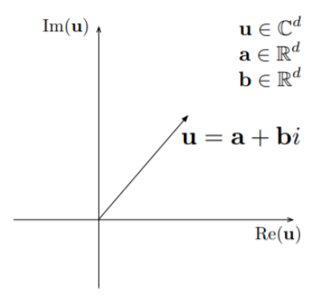
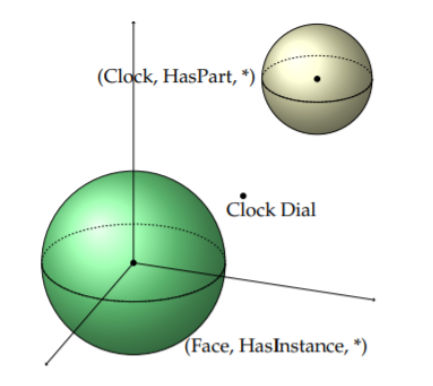
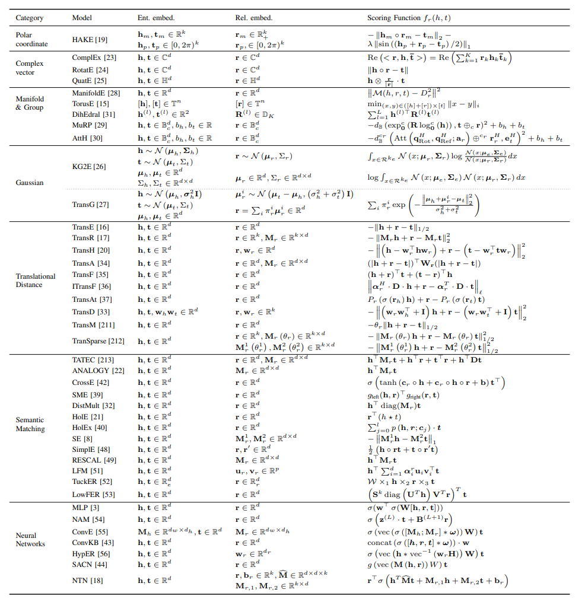

KG embedding algorithms
============================

- Before discussing individual algorithms, we will go through some high-level generalization of the embedding techniques which make each algorithm unique. This will help us differentiate and hence appreciate the individual algorithms.

## Generalization of embedding methods

- Embedding is the way of representing an object from its existing environment to another.

- Knowledge graph embedding includes representation of relations and entities into continuous space.

- Models for KG embedding can be categorised based on their answer for following questions, (*Ji_2021*)
  - What is the **representation space** in which the relations and entities are represented?
  - What is the **scoring function** for measuring the plausibility of factual triples?

### Representation space

#### Point-wise Euclidean space
- The most common representation space.
- Embedding space is Euclidean real valued vector or matrix space.
- Easy to understand; Not ideal for graphical (tree-like) structure.

<figure markdown> 
        
        <figcaption>Point-wise space (*Ji_2021*)</figcaption>
        </figure>

#### Complex vector space
- Entities and relations are represented in a complex space
- Taking head entity as an example, **h** has a real part Re(h) and an imaginary part Im(h), i.e., $\textbf{h}=Re(\textbf{h}) + i Im(\textbf{h})$
- Can capture anti-symmetric relations better than operations in Euclidean space.

<figure markdown> 
        
        <figcaption>Complex vector space (*Ji_2021*)</figcaption>
        </figure>

#### Gaussian distribution space
- Entities and relations are represented as probabilistic distribution
- Applicable if you want to capture uncertainties.

<figure markdown> 
        
        <figcaption>Gaussian distribution (*Ji_2021*)</figcaption>
        </figure>

#### Manifold space
- Entities and relations are represented in a well defined topological space
- Good for graphical (tree-like) structure.

<figure markdown> 
        
        <figcaption>Manifold space (*Ji_2021*)</figcaption>
        </figure>

### Scoring functions

#### Distance based
- Measure plausibility of facts by calculating the distance between the entities.
- Additive translation with relation is the most widely used method i.e.  $\textbf{h} + \textbf{r} \approx \textbf{t}$

<figure markdown> 
        
        <figcaption>Translational distancebased scoring of TransE (*Ji_2021*)</figcaption>
        </figure>

#### Similarity based
- Measure plausibility of the facts by semantic similarity matching
- Multiplicative formulation is most widely used method i.e. $\textbf{h}^T  \textbf{M}_r \approx \textbf{t}^T$	        , use relation matrix to transform head entity into tail entity.

<figure markdown> 
        
        <figcaption>Semantic similarity-based scoring of DistMult (*Ji_2021*)</figcaption>
        </figure>

## Algorithm Comparison

- A holistic comparison of different knowledge graph emebdding techniques w.r.t. category and scoring function is provided below, 

<figure markdown> 
        
        <figcaption>A comprehensive summary of knowledge representation learning models (*Ji_2021*)</figcaption>
        </figure>

--8<-- "includes/abbreviations.md"