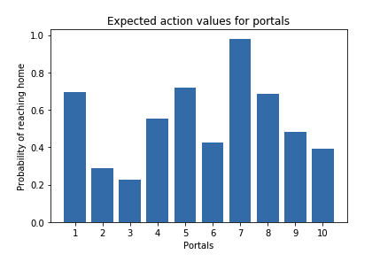
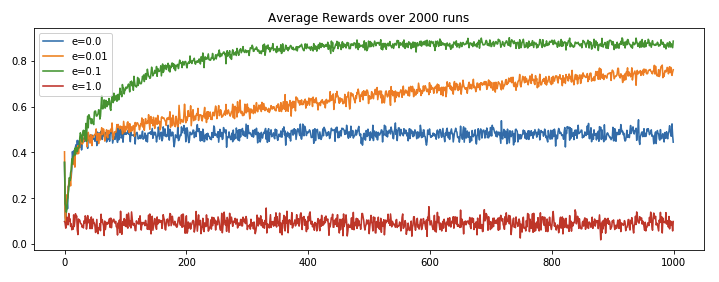
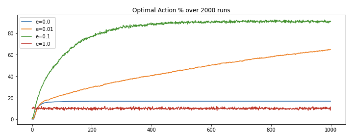
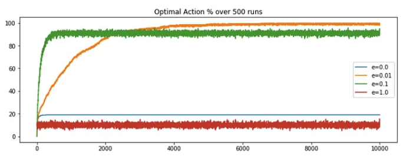
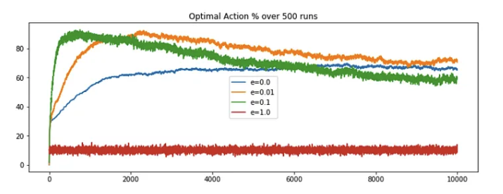
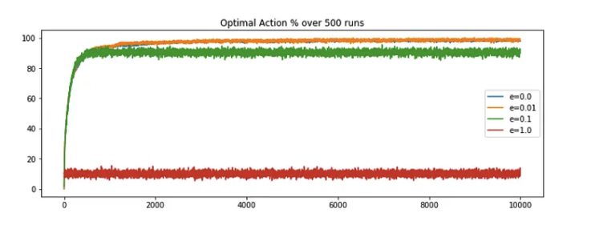

## Introduction

- The **bandit problem** deals with learning the best decision to make in a static or dynamic environment, without knowing the complete properties of the environment. It is like given a set of possible actions, select the series of actions which increases our overall expected gains, given you have no prior knowledge of the reward distribution. 
- Let's understand this with an example, suppose you found an teleportation portal *(Sci-fi fan anyone?)*, which opens up to either your home or middle of the ocean, where the *either* part is determined by some probability distribution. So if you step into the portal, there is some probability say `p`, of coming out at your home and probability `1-p`, of coming out at the middle of the ocean *(let's add some sharks in it :shark:)*. I don’t know about you guys, but I would like to go to the former. If we know, say that 60% of the time the portal leads to ocean, we would just never use it or if we land home 60% of the time, using portal might become a little more appealing. But what if we don’t have any such knowledge, what should we do?
- **REVIEW:** Now, suppose we found multiple (`n`) such portals, all with the same choices of destinations but different and unkown destination probability distribution. The n-armed or multi arm bandit  is used to generalize this type of problems, where we are presented with multiple choices, with no prior knowledge of their true action rewards. In this article, we will try to find a solution to above problem, talk about different algorithms and find the one which could help us converge faster i.e. get as close to the true action reward distribution, with least number of tries.

## Exploration vs Exploitation

- Consider this scenario - Given `n` portals, say we tried the portal #1, and it led to home. Great, but should we just name it as the home portal and use it for all of our future journeys or we should wait and try it out a few more times? Lets say, we tried it a few more times and now we can see 40% of the times it opens to home. Not happy with the results, we move on to portal #2, tried it a few times and it has 60% chance of home journey. Now again, should we stop or try out other portals too? Maybe portal #3 has higher chances of home journey or maybe not. This is the dilemma of exploration and exploitation. 
- The approach that favors exploitation, does so with logic of avoiding unnecessary loss when you have gained some knowledge about the reward distribution. Whereas approach of favoring exploration does so with logic of never getting biased with the action rewards distribution and keep trying every actions in order to get the true properties of the reward distribution.
- Ideally, we should follow a somewhat middle approach that explores to find more reward distribution and as well as exploits known reward distribution. Later in this article, we will see how to do that.

## The Epsilon-Greedy algorithms

- The greedy algorithm in reinforcement learning always selects the action with highest estimated action value. Its a complete exploitation algorithm, which doesn't care for exploration. It can be a smart approach if we have successfully estimated the action value to the expected action value i.e. if we know the true distribution, just select the best actions. But what if we are unsure about the estimation? The "epsilon" comes to the rescue.

- The epsilon in the greedy algorithm adds exploration to the mix. So counter to previous logic of always selecting the best action, as per the estimated action value, now few times *(with epsilon probability)* select a random action for the sake of exploration and the remaining times behave as the original greedy algorithm and select the best known action.

$$p_1 = \epsilon; \text{action selection is random};$$

$$p_2 = 1-\epsilon; \text{action selection is greedy}$$

!!! Hint
    A 0-epsilon greedy algorithm with always select the best known action and 1-epsilon greedy algorithm will always select the actions at random.


## Example - The Portal Game

Let's understand the concept with an example. But before that here are some important terms,

1. **Environment**: It is the container of agent, actions and reward; allows agent to take actions and assign rewards based on the action, following certain set of rules.
2. **Expected Action Value:** Reward can be defined as objective outcome score or value of an action. In that sense the expected action value can be defined as the expected reward for the selected action i.e. the mean reward when an action is selected. This is the true action reward distribution.
3. **Estimated Action Value**: This is nothing but the estimation of the Expected Action values which is bound to change after every learning iteration or episode. We start with an estimated action value, and try to bring it as close as possible to the true/expected action value. One way of doing it could be just taking the average of the rewards received for an action till now.

$$
Q_{t}(a) = \frac{\text{sum of reward when action `a` is taken prior to `t`}}{\text{number of times `a` taken prior to `t`}}
$$

Say we have 10 portals with the expected action value for favorable home journey given as a uniform distribution,

``` python linenums="1"
import numpy as np  

np.random.seed(123)  

expected_action_value = np.random.uniform(0 ,1 , 10)  
print(expected_action_value)
# Output ->
# array([0.69646919, 0.28613933, 0.22685145, 0.55131477, 0.71946897, 
# 0.42310646, 0.9807642 , 0.68482974, 0.4809319 , 0.39211752])
```

<figure markdown> 
    
    <figcaption>Plot of expected action value of the portal opening to location home</figcaption>
</figure>

With knowledge of expected action value, we could say always choose portal #7; as it has the highest probability of reaching home. But as it is with the real world problems, most of the times, we are completely unfamiliar with the rewards of the actions. In that case we make an estimate of the reward distribution and update it as we learn. Another interesting topic of discussion could be strategy to select optimial initial estimate values, but for now lets keep it simple and define them as 0.

``` python linenums="1"
estimated_action_value = np.zeros(10)  
estimated_action_value  
# Output ->
# array([0., 0., 0., 0., 0., 0., 0., 0., 0., 0.])
```

Lets also define the reward function. Going by our requirement, we want to land at home, so lets set reward of value 1 for landing at home and -1 for landing in the ocean.

``` python linenums="1"
def reward_function(action_taken, expected_action_value):  
    if (np.random.uniform(0, 1) <= expected_action_value[action_taken]):  
        return 1
    else:  
        return -1
```

Now lets define the bandit problem with estimate action value modification and epsilon-greedy action selection algorithm.

``` python linenums="1"
def multi_arm_bandit_problem(arms = 10, steps = 1000, e = 0.1, expected_action_value = []):  
    # Initialize lists to store rewards and whether the optimal actions for each step was taken or not
    overall_reward, optimal_action = [], []  

    # Initialize an array to keep track of the estimated value of each action
    estimate_action_value = np.zeros(arms)  

    # Initialize a count array to keep track of how many times each arm is pulled
    count = np.zeros(arms)  

    # Loop for the given number of steps
    for s in range(0, steps):  
        # Generate a random number to decide whether to explore or exploit
        e_estimator = np.random.uniform(0, 1)  

        # If the random number is greater than epsilon, choose the best estimated action, 
        # otherwise, choose a random action
        action = np.argmax(estimate_action_value) if e_estimator > e else np.random.choice(np.arange(10))  

        # Get the reward for the chosen action
        reward = reward_function(action, expected_action_value)  

        # Update the estimated value of the chosen action using the incremental formula
        estimate_action_value[action] = estimate_action_value[action] + (1/(count[action]+1)) * (reward - estimate_action_value[action])  

        # Record the received reward and whether the chosen action was the optimal one
        overall_reward.append(reward)  
        optimal_action.append(action == np.argmax(expected_action_value))  

        # Increment the count for the chosen action
        count[action] += 1  

    # Return the list of rewards and a list indicating if the optimal action was taken at each step
    return(overall_reward, optimal_action)
```

Now, let's simulate multiple game *(each with different epsilon values over 2000 runs)* and see the algorithm behaves.

``` python linenums="1"
def run_game(runs = 2000, steps = 1000, arms = 10, e = 0.1):  
    # Initialize arrays to store rewards and optimal action flags for each run and step
    rewards = np.zeros((runs, steps))  
    optimal_actions = np.zeros((runs, steps))  

    # Generate random expected action values for each arm
    expected_action_value = np.random.uniform(0, 1 , arms)  

    # Iterate over the number of runs
    for run in range(0, runs):  
        # Call the multi_arm_bandit_problem function for each run and store the results
        rewards[run][:], optimal_actions[run][:] = multi_arm_bandit_problem(arms = arms, steps = steps, e = e, expected_action_value = expected_action_value)  

    # After all runs are completed, calculate the average reward at each step
    rewards_avg = np.average(rewards, axis = 0)  

    # Calculate the percentage of times the optimal action was taken at each step
    optimal_action_perc = np.average(optimal_actions, axis = 0)  

    # Return the average rewards and the optimal action percentage
    return(rewards_avg, optimal_action_perc)
```

We ran `run_game` function for four different epsilon values *(e=0, 0.01, 0.1 and 1)* and got the following results.

<figure markdown> 
    
    <figcaption>e-greedy reward gained over 2000 runs, each with 1000 steps</figcaption>
</figure>
  
<figure markdown> 
    
    <figcaption>e-greedy optimal action selection over 2000 runs, each with 1000 steps</figcaption>
</figure>
 
We can observe, 

- Complete exploration (`e=1`) algorithm has its shortcoming as it never makes use of its leanings, it keep picking actions at random.
- Complete exploitation (`e=0`) algorithm has its shortcoming as it get locked on the initial best reward and never explore for the sake for better reward discovery.
- e(`0.01`)-greedy algorithm performs better than the extreme approaches, because of its minute inclination towards exploration and rest of the times going for the best known result. It improves slowly but maybe eventually *(too long?)* could outperform other approaches.
- e(`0.1`)-greedy algorithms stands out because it makes use of its learning and from time to time takes exploration initiatives with well distributed probabilities. It explores more and usually find the optimal action earlier than other approaches.

<!-- ## Conclusion


Complete code @ [Mohit’s Github](https://gist.github.com/imohitmayank/3b775bedb27a3ed1fbb6a2dbce12532b) -->

## Non-stationary problems

### Introduction

- Previously, we had defined some portals with fixed reward distribution and tried to bring our estimated action value closer to the expected action value or reward distribution. For non-stationary problems, the bulk of the definitions remains same, but we will just tweak the part of fixed reward distribution. In the original problem, we defined a reward distribution function whose values were not changing throughout the process, but what if they are? What if expected action value is not constant? In terms of the Home portal game, what if the home portal is slowly becoming an ocean one or vice versa or just fluctuating at the border line? In such cases, will our simple e-greedy algorithm work? Well, lets try to find out.

- First, let's re-run the original code for 10k steps and plot the optimal action selection percentage, the observation is nearly as expected. The epsilon value of 0.01 is out-performing the contrasting e = 0 or 1 but e = 0.01 is overtakes the other approaches around the 2k steps mark. Overtime the performance saturates, with no sign of decrease in the future.

<figure markdown> 
    
    <figcaption>Stationary Problem: e-greedy algorithm performance; increased the steps to 10k</figcaption>
</figure>

- Now, we need a slight modification to transform the stationary problem to non-stationary. As per the definition, the reward distribution is subject to change. Lets define the term of change, say after each step, and by a normal distribution with `mean = 0` and `deviation = 0.01`. So after each step, we will compute random numbers based on the defined normal distribution and add it to the previous expected action value. This will become the new reward distribution. This could be easily done adding few lines to the original code, and then we can compute the latest optimal action selection percentage.

``` python linenums="1"
# define a function to update the expected_action_value  
def update_expected_action_value(expected_action_value, arms):  
    expected_action_value += np.random.normal(0, 0.01, arms)   
    return(expected_action_value)
    
# inside the multi_arm_bandit_problem function add,   
estimate_action_value = update_estimate_action_value(estimate_action_value)
```

<figure markdown> 
    
    <figcaption>Non-Stationary Problem: e-greedy algorithm performance decreasing after initial peaks</figcaption>
</figure>

- On comparing, we could say the performance of the e-greedy algorithms started decreasing after a certain period. Note, even though `e=0.01` is still showing good results, but this drastic decrease in performance is visible even by a slight random increment (`deviation=0.01`), what if the change factor was of higher magnitude? Well as it turn out the decrease would have been more prominent. What is the problem here?

### Formulation

Try to recall the estimation function of the true reward distribution for stationary problem, it goes something like this,

$$Q_t(a) = \frac{\text{sum of rewards when } a \text{ taken up to } t}{\text{number of times } a \text{ taken up to } t} = \frac{\sum_{i=1}^{t-1} R_i \cdot \mathbb{1}_{\{A_t = a\}}}{\sum_{i=1}^{t-1} \mathbb{1}_{\{A_t = a\}}}$$

$$Q_{n+1} \doteq \frac{1}{n} \sum_{i=1}^{n} R_i$$

$$Q_{n+1} = Q_n + \frac{1}{n} \left[ R_n - Q_n \right]$$

where,

1. The first equation gives the formula for the estimated reward value for an action at `t` which is a simple average of all the rewards we received for that action till time `t-1`
2. The second equation is just a nice way of writing the same thing. It implies that the estimation of the reward for `n+1` step will be average of all the rewards till step `n`
3. The third equation is what you get when you expand the second equation and put in the formulae of $Q_n$ which is similar to the one of $Q_{n+1}$, just one step less (replace `n` with `n-1`). Here, $Q_{n+1}$ is the new estimation for the `n+1` steps, $Q_n$ is the old estimation i.e. estimation till step `n`, $R_n$ is the rewards for nth step and 1/n is step size by which we want to update the new estimation.

??? Hint "Derivation of 3rd equation"
    The second formula calculates the new average \( Q_{n+1} \) by summing all the rewards \( R_i \) from 1 to \( n \) and then dividing by \( n \). This is a direct computation of the average, which becomes computationally expensive as \( n \) grows because it requires summing over all previous rewards each time a new reward is added.

    To derive the third formula, we start by expanding the definition of \( Q_n \), which is the average of the rewards up to the \( n \)-th reward:

    \[ Q_n = \frac{1}{n-1} \sum_{i=1}^{n-1} R_i \]

    Multiplying both sides by \( n-1 \) gives us the total sum of rewards for \( n-1 \) actions:

    \[ (n-1) \cdot Q_n = \sum_{i=1}^{n-1} R_i \]

    When we receive the \( n \)-th reward, we can update the total sum of rewards by adding \( R_n \):

    \[ \sum_{i=1}^{n} R_i = \sum_{i=1}^{n-1} R_i + R_n \]

    Substituting the total sum of rewards up to \( n-1 \) with \( (n-1) \cdot Q_n \):

    \[ \sum_{i=1}^{n} R_i = (n-1) \cdot Q_n + R_n \]

    Now, to get the average \( Q_{n+1} \), we divide the total sum of rewards by \( n \):

    \[ Q_{n+1} = \frac{1}{n} \left[ (n-1) \cdot Q_n + R_n \right] \]

    Expand the right side of the equation:

    \[ Q_{n+1} = \frac{(n-1)}{n} \cdot Q_n + \frac{1}{n} \cdot R_n \]

    Recognize that \( \frac{(n-1)}{n} \) is equal to \( 1 - \frac{1}{n} \):

    \[ Q_{n+1} = Q_n \cdot \left( 1 - \frac{1}{n} \right) + \frac{1}{n} \cdot R_n \]

    Rearrange the terms to isolate \( Q_n \):

    \[ Q_{n+1} = Q_n + \frac{1}{n} \left( R_n - Q_n \right) \]

To be clear, as per this formulation, if a particular action was chosen say 5 times, then each of the 5 rewards *(n actions leads to n rewards)* will be divide by 1/5 and then added to get the estimation till step 5. If you look closer, you will see we are giving equal weights to all the rewards, irrespective of their time of occurrence, which means we want to say, every reward is equally important to us and hence the equal weights. This holds true for the stationary problems but what about the newer problem? With rewards distribution changing, isn’t the latest rewards better estimation of the true rewards distribution. So shouldn’t we just give more weight to the newer rewards and lesser to the old one?

Well this thought is definitely worth pursuing. And this would mean just changing the reward weights, which can be done by replacing the average reward estimation to exponential recency-weighted average. We can further make this process generic by providing an option of if the newer or older rewards should be given more weight or a middle workaround of decreasing weights with time. As it turns out this could be easily done by replacing the step function of `1/n` in the older formulation with a constant, say `𝛂`. This updates the estimation function to,

$$ Q_{n+1} = Q_n + \alpha \left[ R_n - Q_n \right]$$

$$= (1 - \alpha)^n Q_1 + \sum_{i=1}^{n} \alpha (1 - \alpha)^{n-i} R_i$$


where,

1. If `𝛂 = 1`; $R_n$ i.e. the very latest reward will have maximum weight of 1 and rest will have 0. So if your excepted action value’s deviation is too drastic, we could use this setting.
2. If `𝛂 = 0`; $Q_1$ i.e. the oldest reward estimation will have maximum weight of 1 and rest will have 0. We could use this when we only want to consider initial estimation values.
3. If `0 < 𝛂 < 1`; the weight decreases exponentially according to the exponent `1-𝛂`. In this case the oldest reward will have smaller weight and latest rewards higher. And this is what we want to try out.


### Example - The Portal Game v2

Lets formalize the solution by simply updating the code to replace the step size by an constant of value, say 0.1 and keeping rest of the parameters same. This will implement the exponential decreasing weight. Later we will compute the optimal action selection percentage and reflect on it.

``` python linenums="1"
# update the estimation calculation  
estimate_action_value[action] = \
    estimate_action_value[action] + \
    0.1 * (reward - estimate_action_value[action])
```

<figure markdown> 
    
    <figcaption>Non-Stationary Problem: e-greedy algorithm performance due to constant step-size</figcaption>
</figure>

And we are back in business! `e=0.01` is out-performing it's rival and the performance converges to maximum after some steps. Here we are not seeing any decrease in performance, because of our modified estimation function which factor the changing nature of reward distribution.

## Conclusion

There are multiple take aways from this post like understanding the importance of exploration/exploitation and why a hybrid (`0<e<1`) implementation outperforms contrast (`e=0,1`) implementations for the given problem. We also explored the stationary and non-stationary environment; the art of designing estimation functions by questioning and considering all the properties of the environment. And how sometimes minimal but intuitive changes could lead to maximum advancements in accuracy and performance. We still have some set of problems and improvements left which could lead to better accuracy and optimization, but later on that.

Cheers. :wave:

## Reference

[1] Reinforcement Learning — An Introduction; Richard S. Sutton and Andrew G. Barto

  