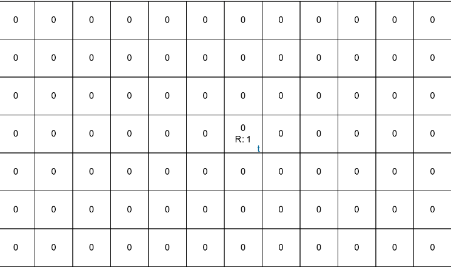

## Introduction


- Q-learning is a RL algorithm that computes an expected reward for taking an action from any given state. The expected reward is a composition of the immediate reward and the future rewards possible from the new transitioned state. It is an iteration based algorithm that adjusts the scores over time, and given infinite exploration time it can identify an optimal action-selection policy. 

!!! Note
    Q-learning does not requires to model the environment, hence it is model-free *(check [here](interview_questions.md) for more details)*. 

- To better grasp the intuition, let's understand it through a Grid world example before further complications creeps in. :wink:

## The Beer game in Grid world :beer:

- Think of Grid World as a `nD` world *(environment)* where an agent will live and traverse. The environment consists of multiple cells, where each cell denotes one state, and it could deliver certain reward *(positive or negative)* to reach that state. The agent at any given time, will only have the knowledge of the current state and the information it gained in previous episodes.
- Now imagine we drop an agent in a 2D grid world that contains a beer *(that we want to find)* and a pit *(that we want to avoid)*. The agent traverse the world until it either finds the beer or drops into the pit. If we make the agent play this game 1000s of times, how should the agent behave overtime?
- The answer seems simple -- at first the agent will have no knowledge of the world, so it will stumble across the env, like a person performing coin toss to decide his fate :coin:. Sometimes, it will find the beer or the pit, and at either points, it starts again. 
- The interesting part is, after each episode the agent will become more and more aware of the world. And after many episodes it would have developed a detailed map, that guides to the beer with details of the areas you should not go to *(as it contains the pit)* 😎

<figure markdown> 
    
    <figcaption>A technical recreation of The Beer Game with left most cell denoting the pit, the 7th cell contains beer and the rest of the cell denotes the expected reward if we move in the suggested direction. [1]
</figcaption>
</figure>

## Bellman's Equation

- The next question is how to capture the details of the map? That's where bellman's equation comes into the picture. Basically it learns Q (quality) scores, that represents expected reward, for taking an action $a$ from a state $s$. If we capture this for all the states and actions in the world then viola, we have the map!
- The formulation of Q-score is given below. 

$$Q(s_{t},a_{t}) = r_{t} + \gamma \cdot \max _{a}Q(s_{t+1},a)$$

- Here, $Q(s_{t},a_{t})$ is the Q-score for taking action $a_t$ in state $s_t$. $r_t$ is the reward we get to perform the action. $\gamma$ is the discount factor which is multiplied with the current reward estimation for the best possible action from the next step $s_{t+1}$. The discount factor *(range 0 to $\inf$)* is used to adjust the importance to be given to immediate reward *(low $\gamma$)* or future reward *(high $\gamma$)*. 

- The formulation to update the Q-score is given below, where $\alpha$ is the learning rate *(yes, like the Neural networks :smile:)*

$$Q^{new}(s_{t},a_{t}) = Q^{old}(s_{t},a_{t}) + \alpha \cdot (r_{t} + \gamma \cdot \max _{a}Q(s_{t+1},a) - Q^{old}(s_{t},a_{t}))$$

- Below is an example of a 2D grid world, where we have set the middle cell with a reward of +1 and we perform multiple iterations of the q-learning.

<figure markdown> 
    
    <figcaption>Agent performing Q learning over the 2D grid world. [1]</figcaption>
</figure>

!!! Hint
    If you want to create and play around with your 2D grid world, try this [Interactive Q-Learning playgorund](https://mohitmayank.com/blog/interactive-q-learning) by yours truly. [1] :sunglasses:

## Code

### Exploring MountainCar env

- Now let's get started with some action i.e. coding. We will train a RL agent using Q-learning to beat the game of [MountainCar](https://github.com/openai/gym/wiki/MountainCar-v0) available on OpenAI's [Gym package](https://www.gymlibrary.dev/) that provides a simple interface to represent and play with general RL problems.
- Before that, let's understand some fundamentals of the MountainCar game environment.
  - **Aim:** To get the car to reach the yellow flag
  - **Observation (states)**:
    - Position: -1.2 to 0.6
    - Velocity: -0.07 to 0.07
  - **Actions:**
    - Push left: 0
    - No push: 1
    - Right push: 2
  - **Reward:**
    - Reached yellow flag: +1
    - Other: -0.5
  - **Why is this difficult?** Bcoz a normal continous right push will not work, to win we need to oscillate as we need momentum from left.

<figure markdown> 
    { width="500" }
    <figcaption>Untrained agent in the MountainCar env</figcaption>
</figure>

- We can explore the same via code as shown below, 

```python linenums="1"
"""
Reference: https://blog.paperspace.com/getting-started-with-openai-gym/

Requirements; (don't forget to create new VE)
    pip install gym
    pip install "gym[box2d]"
    pip install "gym[other]"
"""

# import 
import gym

# create an env
env = gym.make("MountainCar-v0", render_mode="human")

# seed 
env.action_space.seed(42)

# Observation and action space 
obs_space = env.observation_space
action_space = env.action_space
print("The observation space: {}".format(obs_space))
print("The action space: {}".format(action_space))

# reset the space
observation, info = env.reset(seed=42)
print(f"Observation: {observation}")
print(f"Info: {info}")
print(f"Sample action; {env.action_space.sample()}")

## OUTPUT
# The observation space: Box([-1.2  -0.07], [0.6  0.07], (2,), float32)
# The action space: Discrete(3)
# Observation: [-0.4452088  0.       ]
# Info: {}
# Sample action; 0
```

### Training Agent using Q-learning

!!! Hint
    Before starting with this section, why not try to code up some basic logic to beat the game? You could try to always push right or oscillate left and right at certain intervals. Give it try, it will be fun :smile:

- The code shared below *(credits to [gkhayes](https://gist.github.com/gkhayes))* trains a Q-learning agent to play the MountainCar game. It tries to create a Q-table *(that contains Q-scores)* for all the combination of states and actions. As the states are continous *(they are in float)*, it is first discretized to make it a finite state problem. The final Q-table is of the shape `[19, 15, 3]`, with 19 possible states for position, 15 states for velocity and 3 actions.

```python linenums="1"
"""
Reference and Credit: https://gist.github.com/gkhayes/3d154e0505e31d6367be22ed3da2e955

Requirements; (don't forget to create new VE)
    pip install gym
    pip install "gym[box2d]"
    pip install "gym[other]"
    pip install numpy, matplotlib
"""
# import 
import numpy as np
import gym
import matplotlib.pyplot as plt

# Import and initialize Mountain Car Environment
env = gym.make('MountainCar-v0')
env.reset()

# Define Q-learning function
def QLearning(env, learning, discount, epsilon, min_eps, episodes):
    # Determine size of discretized state space
    num_states = (env.observation_space.high - env.observation_space.low)*\
                    np.array([10, 100])
    num_states = np.round(num_states, 0).astype(int) + 1
    
    # Initialize Q table
    Q = np.random.uniform(low = -1, high = 1, 
                          size = (num_states[0], num_states[1], 
                                  env.action_space.n))
    # Initialize variables to track rewards
    reward_list = []
    ave_reward_list = []
    
    # Calculate episodic reduction in epsilon
    reduction = (epsilon - min_eps)/episodes
    
    # Run Q learning algorithm
    for i in range(episodes):
        # Initialize parameters
        done = False
        tot_reward, reward = 0,0
        state = env.reset()
        
        # Discretize state
        state_adj = (state[0] - env.observation_space.low)*np.array([10, 100])
        state_adj = np.round(state_adj, 0).astype(int)
    
        while done != True:   
            # Render environment for last five episodes
            if i >= (episodes - 20):
                env.render()
                
            # Determine next action - epsilon greedy strategy
            if np.random.random() < 1 - epsilon:
                action = np.argmax(Q[state_adj[0], state_adj[1]]) 
            else:
                action = np.random.randint(0, env.action_space.n)
                
            # Get next state and reward
            state2, reward, done, info, _ = env.step(action) 
            
            # Discretize state2
            state2_adj = (state2 - env.observation_space.low)*np.array([10, 100])
            state2_adj = np.round(state2_adj, 0).astype(int)
            
            #Allow for terminal states
            if done and state2[0] >= 0.5:
                Q[state_adj[0], state_adj[1], action] = reward
                
            # Adjust Q value for current state
            else:
                delta = learning*(reward + 
                                 discount*np.max(Q[state2_adj[0], 
                                                   state2_adj[1]]) - 
                                 Q[state_adj[0], state_adj[1],action])
                Q[state_adj[0], state_adj[1],action] += delta
                                     
            # Update variables
            tot_reward += reward
            state_adj = state2_adj
        
        # Decay epsilon
        if epsilon > min_eps:
            epsilon -= reduction
        
        # Track rewards
        reward_list.append(tot_reward)
        
        if (i+1) % 100 == 0:
            ave_reward = np.mean(reward_list)
            ave_reward_list.append(ave_reward)
            reward_list = []
            
        if (i+1) % 100 == 0:    
            print('Episode {} Average Reward: {}'.format(i+1, ave_reward))
            
    env.close()

    # save the Q table
    np.save('MountainCar-v0-q-learning', Q)
    
    return ave_reward_list

# Run Q-learning algorithm
rewards = QLearning(env, 0.2, 0.9, 0.8, 0, 5000)

# Plot Rewards
plt.plot(100*(np.arange(len(rewards)) + 1), rewards)
plt.xlabel('Episodes')
plt.ylabel('Average Reward')
plt.title('Average Reward vs Episodes')
plt.savefig('rewards.jpg')     
plt.close()  
```

- Running the above code trains a RL agent for 5000 episodes and saves the Q-table as numpy array. It also computes the average reward vs episodes graph that is shown below. Do note how the agent is able to get more rewards over more training!
  
<figure markdown> 
    
    <figcaption>Increasing reward over time for the agent in training. The average rewards went up from -4300 to -250 under just 5000 episodes.</figcaption>
</figure>

### Inference of trained agent

- To run the trained model, we can use the saved Q-table to select the best action given any state in the game. Below is the code for the same,

```python linenums="1"
"""
Requirements; (don't forget to create new VE)
    pip install gym
    pip install "gym[box2d]"
    pip install "gym[other]"

    MountainCar-v0-q-table.txt.npy file that contains the modelled environment
"""

# import 
import gym
import numpy as np
from gym.utils import play

# load trained Q table
Q = np.load('MountainCar-v0-q-table.txt.npy')

# create an env
env = gym.make("MountainCar-v0", render_mode="human")

# seed 
env.action_space.seed(42)

observation, info = env.reset(seed=42)

# total number of steps
for s in range(200):
    
    state_adj = (observation - env.observation_space.low)*np.array([10, 100])
    state_adj = np.round(state_adj, 0).astype(int)
    
    # define the next step to take
    next_action = np.argmax(Q[state_adj[0], state_adj[1]]) 

    # perform one step
    observation, reward, terminated, truncated, info = env.step(next_action)
    print(s, observation, reward, terminated, truncated, info)

    # if the game ends, restart the game
    if terminated or truncated:
        observation, info = env.reset()

env.close()
```

<figure markdown> 
    
    <figcaption>Trained RL agent performing as expected :sunglasses:</figcaption>
</figure>

- There you go!! :wave:

## References

- [Interactive Q Learning - Mohit Mayank](https://mohitmayank.com/blog/interactive-q-learning)